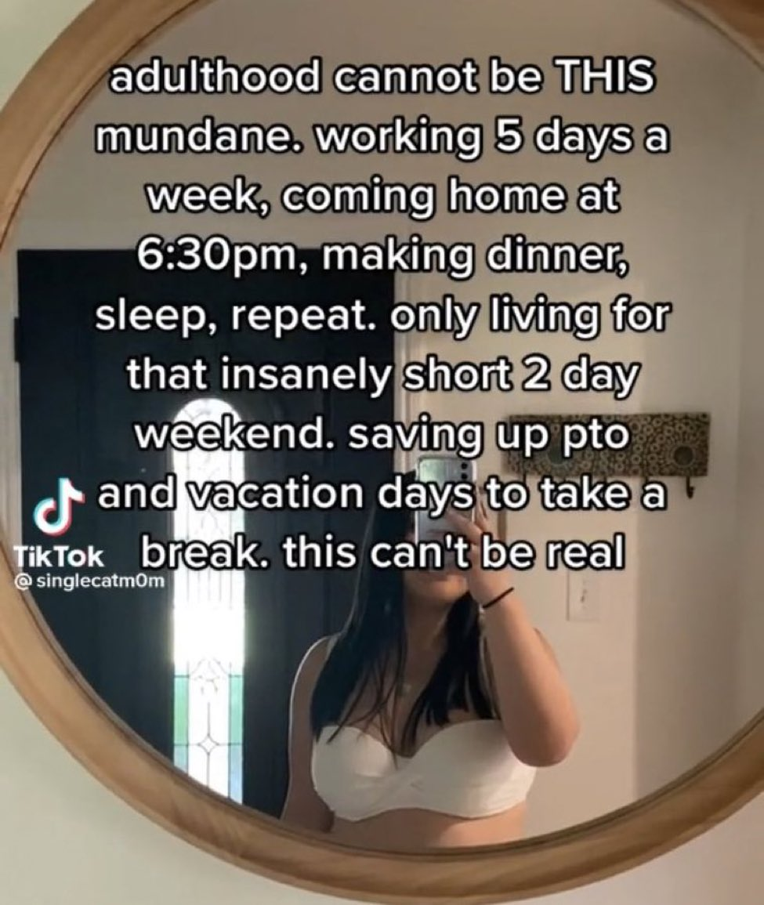
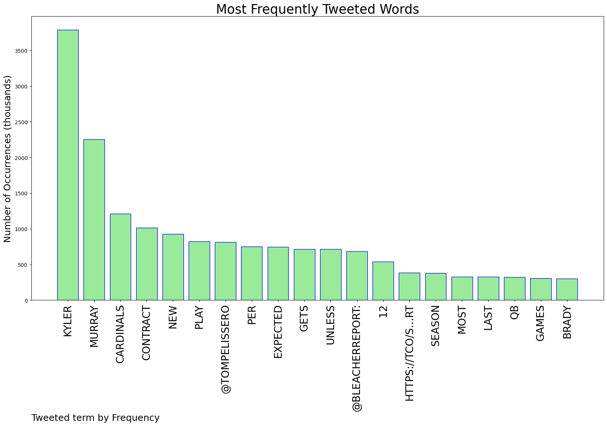
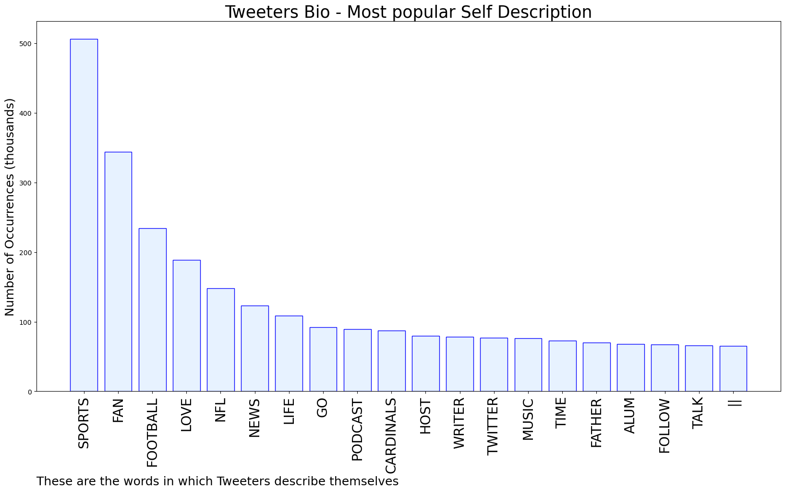

# MURCHIE85 TWITTER PROCESSING 
&#x1F34E; **TOPIC = "Kyler"**

## AUTOMATED RESEARCH SUMMARY

*note: Image pulled from web automatically, not connected to author.
  
<b> This report is AUTOMATED and not hand crafted, it is designed for pulling metrics on a given keyword or hashtag and performs a series of reporting and analysis.</b>

|                **Sample-Tweets**        |
| :-------------: |
| @thearcadio_ Same. lol |
| RT @DeafBaddie: I need a selfie like this… 🥺 https://t.co/O99WLjeef3 |
| RT @NFLonCBS: Most games with 65%+ comp pct last seasonMac Jones*         13Tom Brady          12Joe Burrow         12Kyler Murray… |

The most popular user is: **Kyler_K25**

 RT @elonmusk: @Alwaleed_Talal @Twitter @Kingdom_KHC Interesting. Just two questions, if I may. 

How much of Twitter does the Kingdom own,…

## RELATED METRICS 
| Metric | Value |
| ------------- | ------------- |
| #1 Most tweeted to  | **TomPelissero** |
| #2 Most tweeted to  | **BleacherReport** |
| #3 Most tweeted to  | **NFLonCBS** |
| NewProfiles (less than 10 days) | 0.96%  |
| Tweeters with < 10 followers  | 6.26%|
| Tweeters with > 1000000 followers  | 0.2%  |

## MOST POPULAR TWEET TERMS 

| Popularity Rank  | Term |
| ------------- | ------------- |
| first  | **KYLER**  |
| second  | **MURRAY**  |
| third  | **CARDINALS** |
| fourth  | **CONTRACT**  |
| fifth  | **NEW**  |

## Twitter Bio Analysis
### SENTIMENT ANALYSIS

VIEWS WERE : **SUBJECTIVE**  (53.33%) & **NEGATIVELY-SUBJECTIVE** (13.33%) **OBJECTIVE** (33.33%)

### TWEET SAMPLE 
| Random value picked from array |
| ------------- |
|RT @__23kirko: @1stat1day @TylerFFCreator Kyler |

### MOST RETWEETED 

| The most retweeted user is: **Kyler_K25**  |
| ------------- |
| RT @elonmusk: @Alwaleed_Talal @Twitter @Kingdom_KHC Interesting. Just two questions, if I may. How much of Twitter does the Kingdom own,… |

### CONCLUSION & EXTERNAL ANALYSIS

*This is my [Adam McMurchie`s] opinion on the data from the tweets, it serves as no objective truth.Since the tweets themselves are a mixture of fact & opinion. 
Authors analytical summary on request.
**RECOMMENDATIONS** WILL BE UPDATED IN NEXT  24 HOURS  