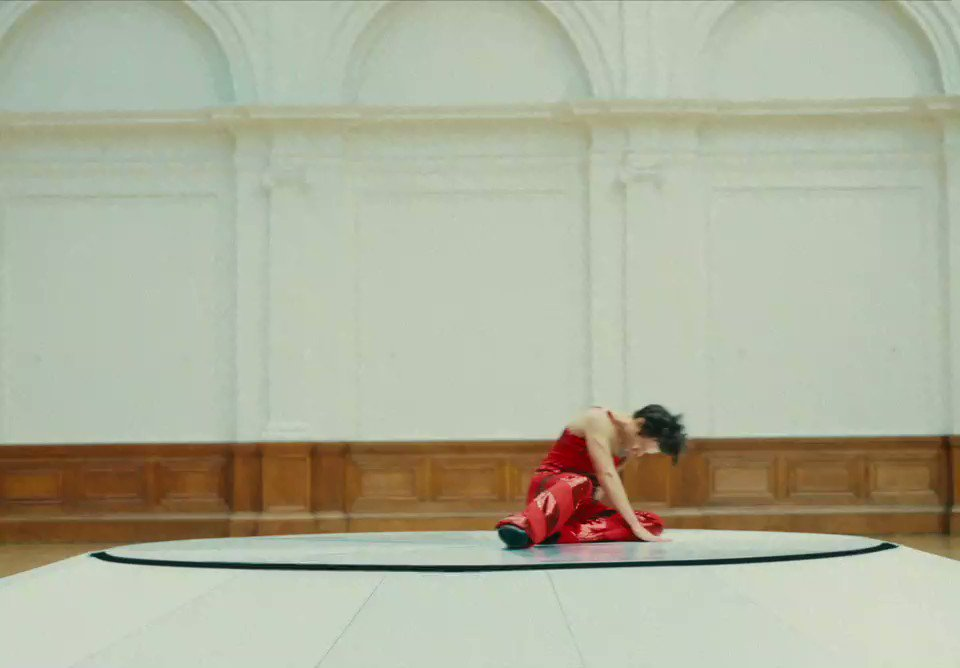
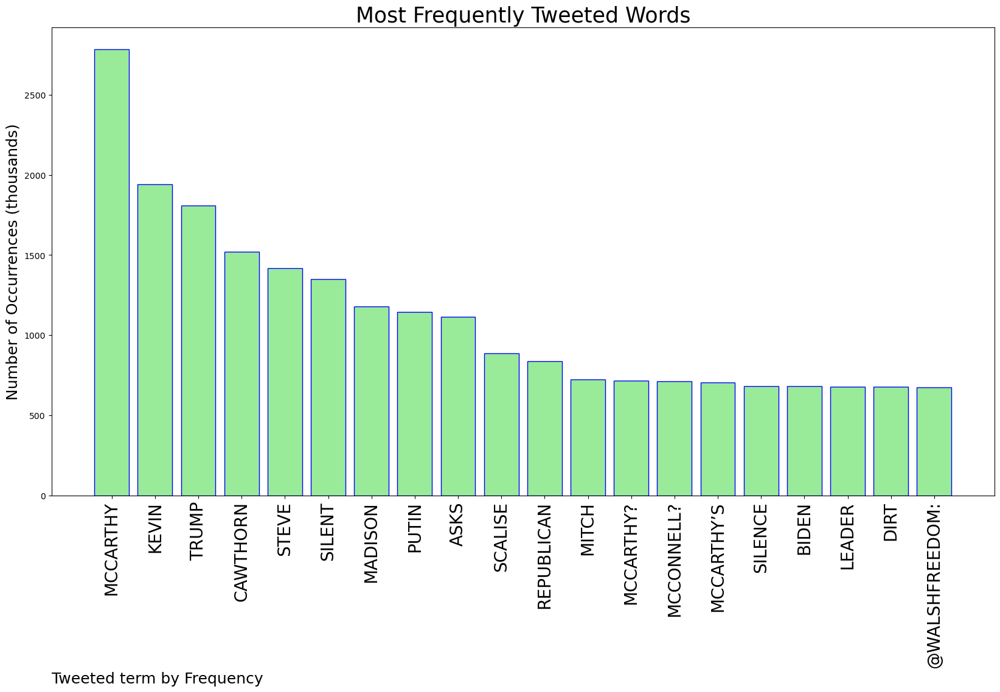

# MURCHIE85 TWITTER PROCESSING 
&#x1F34E; **TOPIC = "McCarthy"**

## AUTOMATED RESEARCH SUMMARY

*note: Image pulled from web automatically, not connected to author.
  
<b> This report is AUTOMATED and not hand crafted, it is designed for pulling metrics on a given keyword or hashtag and performs a series of reporting and analysis.</b>

|                **Sample-Tweets**        |
| :-------------: |
| #LongIsland saw 325 new #COVID19 cases on March 29, 2022, 53 more new cases than the day before and made up about 1… https://t.co/6tn3MMKwe8 |
| RT @antifaoperative: Someone needs to put Kevin McCarthy’s balls on a milk carton. |
| RT @WalshFreedom: Trump asks Putin for dirt on Biden. And Republican silence.Kevin McCarthy? Silent.Mitch McConnell? Silent.Steve Scali… |

The most popular user is: **mais_mccarthy**

 RT @Harry_Styles: As It Was. April 1. https://t.co/8RoI5sZP4T

## RELATED METRICS 
| Metric | Value |
| ------------- | ------------- |
| #1 Most tweeted to  | **Olivia_Beavers** |
| #2 Most tweeted to  | **WalshFreedom** |
| #3 Most tweeted to  | **ReallyAmerican1** |
| NewProfiles (less than 10 days) | 0.28%  |
| Tweeters with < 10 followers  | 2.28%|
| Tweeters with > 1000000 followers  | 0.16%  |

## MOST POPULAR TWEET TERMS 

| Popularity Rank  | Term |
| ------------- | ------------- |
| first  | **MCCARTHY**  |
| second  | **KEVIN**  |
| third  | **TRUMP** |
| fourth  | **CAWTHORN**  |
| fifth  | **STEVE**  |

## Twitter Bio Analysis
### SENTIMENT ANALYSIS

VIEWS WERE : **SUBJECTIVE**  (33.33%) & **NEGATIVELY-SUBJECTIVE** (20.0%) **OBJECTIVE** (46.67%)

### TWEET SAMPLE 
| Random value picked from array |
| ------------- |
|RT @antifaoperative: Someone needs to put Kevin McCarthy’s balls on a milk carton. |

### MOST RETWEETED 

| The most retweeted user is: **mais_mccarthy**  |
| ------------- |
| RT @Harry_Styles: As It Was. April 1. https://t.co/8RoI5sZP4T |

### CONCLUSION & EXTERNAL ANALYSIS

*This is my [Adam McMurchie`s] opinion on the data from the tweets, it serves as no objective truth.Since the tweets themselves are a mixture of fact & opinion. 
Authors analytical summary on request.
**RECOMMENDATIONS** WILL BE UPDATED IN NEXT  24 HOURS  