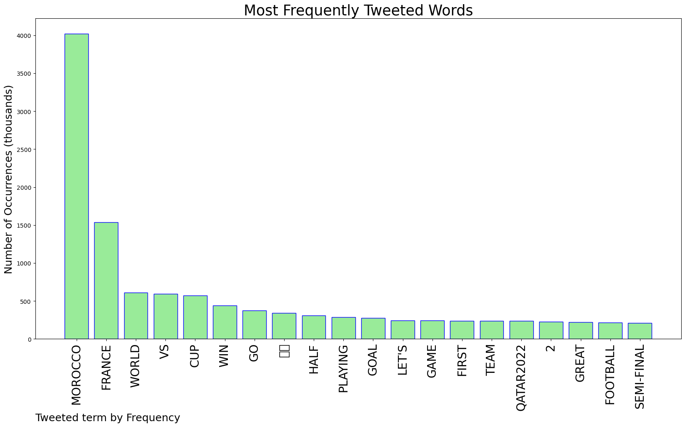
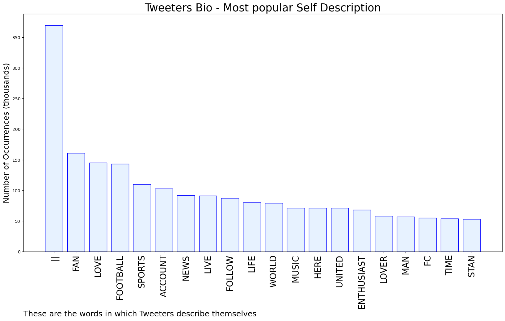
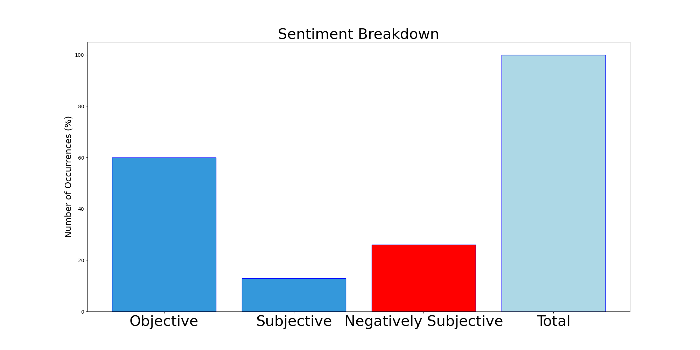

# MURCHIE85 TWITTER PROCESSING 
&#x1F34E; **TOPIC = "Morocco"**

## AUTOMATED RESEARCH SUMMARY

*note: Image pulled from web automatically, not connected to author.
  
<b> This report is AUTOMATED and not hand crafted, it is designed for pulling metrics on a given keyword or hashtag and performs a series of reporting and analysis.</b>

|                **Sample-Tweets**        |
| :-------------: |
| Had that Amallah bicycle gone in, the second half woulda been much more exciting. Morocco giving it their all. |
| i’m gonna need morocco to win this match |
| RT @btsportfootball: So close to one of the goals of the tournament 😮Centre back Jawad El Yamiq hits the woodwork for Morocco!#FIFAWorl… |

The most popular user is: **who_sabrina**

 RT @elonmusk: 🇲🇦🇲🇦 Congrats Morocco!! 🇲🇦🇲🇦

## RELATED METRICS 
| Metric | Value |
| ------------- | ------------- |
| #1 Most tweeted to  | **M10** |
| #2 Most tweeted to  | **TrollFootball** |
| #3 Most tweeted to  | **ESPNFC** |
| NewProfiles (less than 10 days) | 1.94%  |
| Tweeters with < 10 followers  | 7.88%|
| Tweeters with > 1000000 followers  | 0.18%  |

## MOST POPULAR TWEET TERMS 

| Popularity Rank  | Term |
| ------------- | ------------- |
| first  | **MOROCCO**  |
| second  | **FRANCE**  |
| third  | **WORLD** |
| fourth  | **VS**  |
| fifth  | **CUP**  |

## Twitter Bio Analysis
### SENTIMENT ANALYSIS

VIEWS WERE : **SUBJECTIVE**  (13.33%) & **NEGATIVELY-SUBJECTIVE** (26.67%) **OBJECTIVE** (60.0%)

### TWEET SAMPLE 
| Random value picked from array |
| ------------- |
|RT @waynojam: 🔴𝐆𝐨 𝐎𝐧 𝐋𝐢𝐯𝐞📺@fifaworldcupshdWatch 2022 FIFA World Cup Football/Soccer Match 2nd Semi-Finals Game Live Streams Online Free S… |

### MOST RETWEETED 

| The most retweeted user is: **who_sabrina**  |
| ------------- |
| RT @elonmusk: 🇲🇦🇲🇦 Congrats Morocco!! 🇲🇦🇲🇦 |

### CONCLUSION & EXTERNAL ANALYSIS

*This is my [Adam McMurchie`s] opinion on the data from the tweets, it serves as no objective truth.Since the tweets themselves are a mixture of fact & opinion. 
Authors analytical summary on request.
**RECOMMENDATIONS** WILL BE UPDATED IN NEXT  24 HOURS  