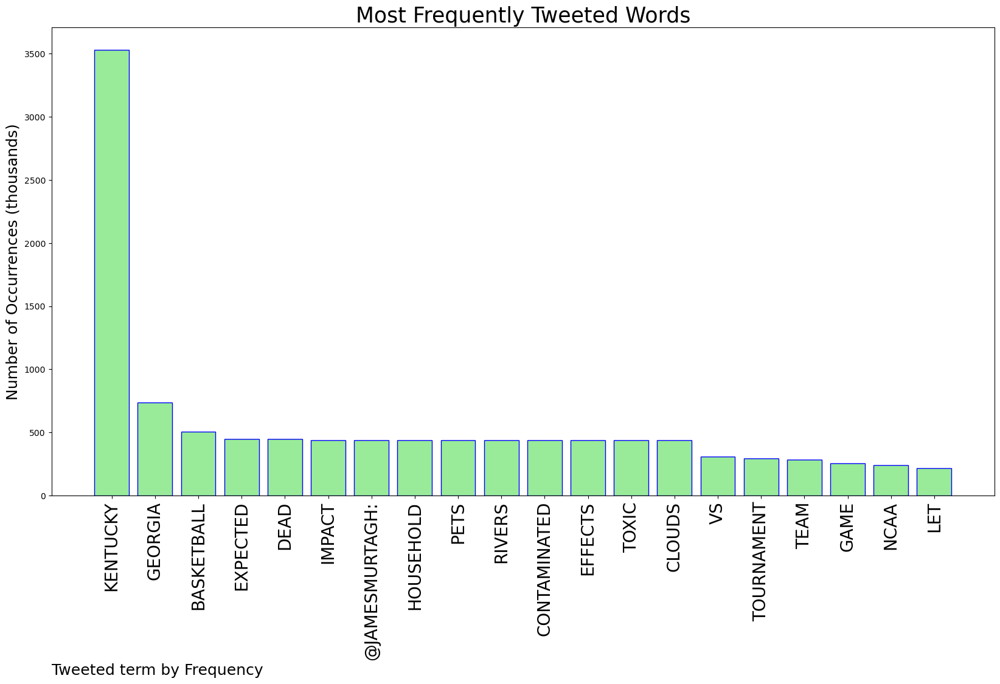
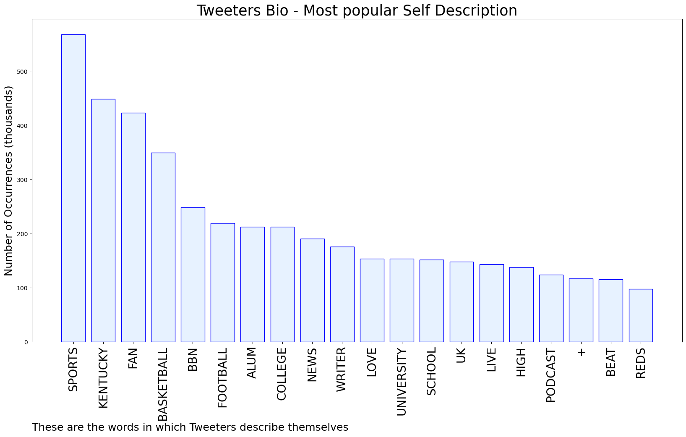
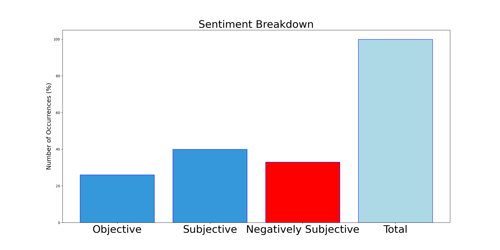

# MURCHIE85 TWITTER PROCESSING 
&#x1F34E; **TOPIC = "Kentucky"**

## AUTOMATED RESEARCH SUMMARY

*note: Image pulled from web automatically, not connected to author.
  
<b> This report is AUTOMATED and not hand crafted, it is designed for pulling metrics on a given keyword or hashtag and performs a series of reporting and analysis.</b>

|                **Sample-Tweets**        |
| :-------------: |
| RT @KyleTucker_ATH: Thanks to Covid (2020), a 9-16 season (2021) and Saint Peter's (2022), missing the dance this year would mean Kentucky… |
| Kentucky sorry dawg and it’s painful to watch smfh |
| @KySportsRadio I can't think of a more enjoyable time to be a Kentucky basketball fan! |

The most popular user is: **Fak3221**

 RT @Booker4KY: My name is Charles Booker and I am the Democratic nominee for United States Senate in Kentucky.

## RELATED METRICS 
| Metric | Value |
| ------------- | ------------- |
| #1 Most tweeted to  | **jamesmurtagh** |
| #2 Most tweeted to  | **drewtoothpaste** |
| #3 Most tweeted to  | **GoodmanHoops** |
| NewProfiles (less than 10 days) | 0.14%  |
| Tweeters with < 10 followers  | 3.92%|
| Tweeters with > 1000000 followers  | 0.06%  |

## MOST POPULAR TWEET TERMS 

| Popularity Rank  | Term |
| ------------- | ------------- |
| first  | **KENTUCKY**  |
| second  | **GEORGIA**  |
| third  | **BASKETBALL** |
| fourth  | **EXPECTED**  |
| fifth  | **DEAD**  |

## Twitter Bio Analysis
### SENTIMENT ANALYSIS

VIEWS WERE : **SUBJECTIVE**  (40.0%) & **NEGATIVELY-SUBJECTIVE** (33.33%) **OBJECTIVE** (26.67%)

### TWEET SAMPLE 
| Random value picked from array |
| ------------- |
|Kentucky and Providence early 👀👀 |

### MOST RETWEETED 

| The most retweeted user is: **Fak3221**  |
| ------------- |
| RT @Booker4KY: My name is Charles Booker and I am the Democratic nominee for United States Senate in Kentucky. |

### CONCLUSION & EXTERNAL ANALYSIS

*This is my [Adam McMurchie`s] opinion on the data from the tweets, it serves as no objective truth.Since the tweets themselves are a mixture of fact & opinion. 
Authors analytical summary on request.
**RECOMMENDATIONS** WILL BE UPDATED IN NEXT  24 HOURS  