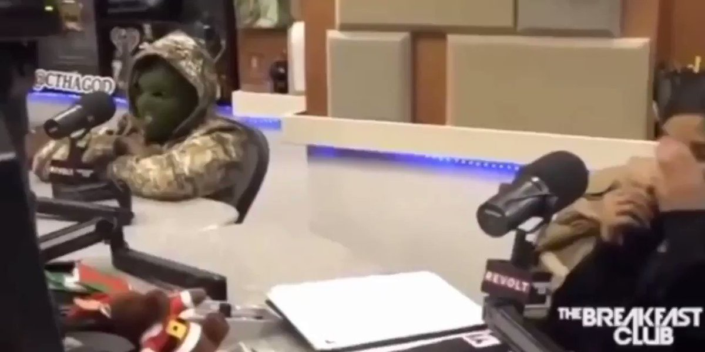
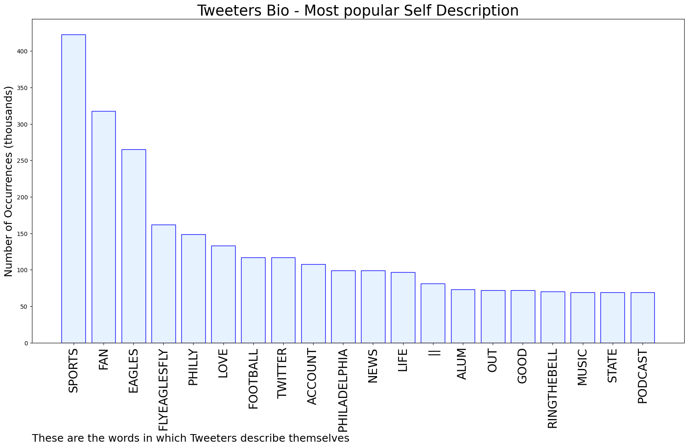

# MURCHIE85 TWITTER PROCESSING 
&#x1F34E; **TOPIC = "Eagles"**

## AUTOMATED RESEARCH SUMMARY

*note: Image pulled from web automatically, not connected to author.
  
<b> This report is AUTOMATED and not hand crafted, it is designed for pulling metrics on a given keyword or hashtag and performs a series of reporting and analysis.</b>

|                **Sample-Tweets**        |
| :-------------: |
| RT @Schultz_Report: Jalen Hurts knew ALL along! 🎥: @Eagles https://t.co/p2kalAPQjz |
| RT @RapSheet: 🚨 🚨 🚨 The #Eagles and Jalen Hurts agreed to terms on a 5-year, $255M contract extension that makes him the highest-paid pla… |
| RT @DailyLoud: Jalen Hurts gets record-breaking $255 million contract extension from Eagles. Making him the highest-paid player in NFL hist… |

The most popular user is: **TheRealPapaDoc**

 RT @AdamSchefter: Eagles and Jalen Hurts reached agreement on a five-year, $255 million extension, including $179.304 million guaranteed, p…

## RELATED METRICS 
| Metric | Value |
| ------------- | ------------- |
| #1 Most tweeted to  | **Eagles** |
| #2 Most tweeted to  | **AdamSchefter** |
| #3 Most tweeted to  | **RapSheet** |
| NewProfiles (less than 10 days) | 0.28%  |
| Tweeters with < 10 followers  | 5.96%|
| Tweeters with > 1000000 followers  | 0.16%  |

## MOST POPULAR TWEET TERMS 

| Popularity Rank  | Term |
| ------------- | ------------- |
| first  | **EAGLES**  |
| second  | **JALEN**  |
| third  | **HURTS** |
| fourth  | **EXTENSION**  |
| fifth  | **MILLION**  |

## Twitter Bio Analysis
### SENTIMENT ANALYSIS

VIEWS WERE : **SUBJECTIVE**  (33.33%) & **NEGATIVELY-SUBJECTIVE** (0.0%) **OBJECTIVE** (66.67%)

### TWEET SAMPLE 
| Random value picked from array |
| ------------- |
|RT @IAMANITABAKER: 🎉Congrats @JalenHurts @Eagles |

### MOST RETWEETED 

| The most retweeted user is: **TheRealPapaDoc**  |
| ------------- |
| RT @AdamSchefter: Eagles and Jalen Hurts reached agreement on a five-year, $255 million extension, including $179.304 million guaranteed, p… |

### CONCLUSION & EXTERNAL ANALYSIS

*This is my [Adam McMurchie`s] opinion on the data from the tweets, it serves as no objective truth.Since the tweets themselves are a mixture of fact & opinion. 
Authors analytical summary on request.
**RECOMMENDATIONS** WILL BE UPDATED IN NEXT  24 HOURS  