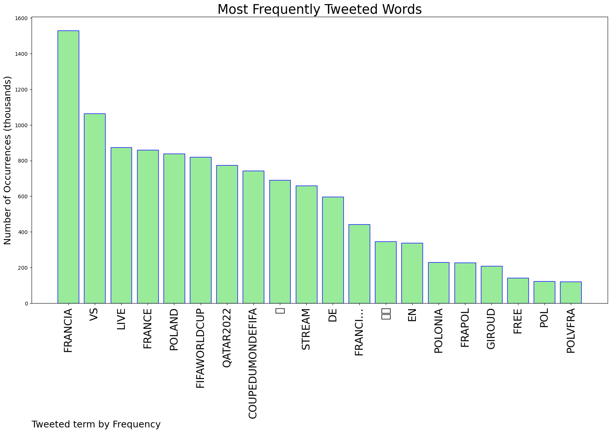
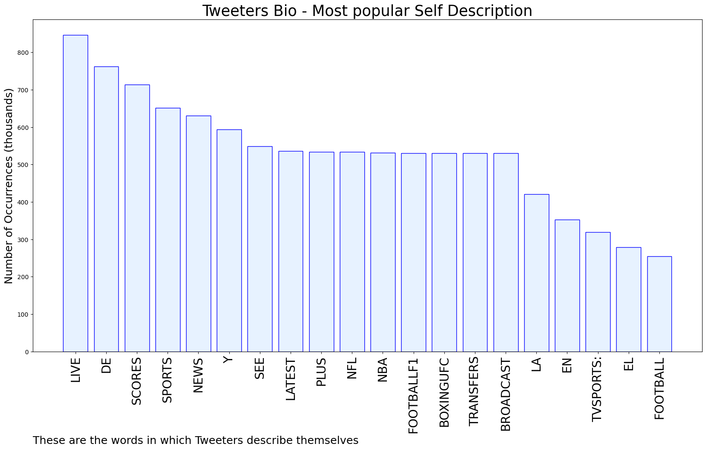

# MURCHIE85 TWITTER PROCESSING 
&#x1F34E; **TOPIC = "Francia"**

## AUTOMATED RESEARCH SUMMARY

*note: Image pulled from web automatically, not connected to author.
  
<b> This report is AUTOMATED and not hand crafted, it is designed for pulling metrics on a given keyword or hashtag and performs a series of reporting and analysis.</b>

|                **Sample-Tweets**        |
| :-------------: |
| #FRAPOL #FIFAWorldCup #Qatar2022 #CoupeDuMondeFIFAFrance vs Poland Live Stream👉 https://t.co/dsP6JsAwUbFranci… https://t.co/2fhYkNi0gA |
| @WUTangKids Give Bill Burr a medal! |
| 🏆QATAR 🇶🇦 2️⃣0️⃣2️⃣2️⃣FALTANDO UNA FECHA EN FASE DE GRUPOS,HAY 3 EQUIPOS CLASIFICADOS A 8VOS...PORTUGAL 🇵🇹BRAS… https://t.co/qB7u2ppvZ2 |

The most popular user is: **Francia_gdt**

 RT @elonmusk: This is a battle for the future of civilization. If free speech is lost even in America, tyranny is all that lies ahead.

## RELATED METRICS 
| Metric | Value |
| ------------- | ------------- |
| #1 Most tweeted to  | **BTS_twt** |
| #2 Most tweeted to  | **FinancialTimes** |
| #3 Most tweeted to  | **thenreport** |
| NewProfiles (less than 10 days) | 1.79%  |
| Tweeters with < 10 followers  | 22.06%|
| Tweeters with > 1000000 followers  | 0.25%  |

## MOST POPULAR TWEET TERMS 

| Popularity Rank  | Term |
| ------------- | ------------- |
| first  | **FRANCIA**  |
| second  | **VS**  |
| third  | **LIVE** |
| fourth  | **FRANCE**  |
| fifth  | **POLAND**  |

## Twitter Bio Analysis
### SENTIMENT ANALYSIS

VIEWS WERE : **SUBJECTIVE**  (0.0%) & **NEGATIVELY-SUBJECTIVE** (0.0%) **OBJECTIVE** (100.0%)

### TWEET SAMPLE 
| Random value picked from array |
| ------------- |
|@davidseymourii @JacksonStateU Thank you! |

### MOST RETWEETED 

| The most retweeted user is: **Francia_gdt**  |
| ------------- |
| RT @elonmusk: This is a battle for the future of civilization. If free speech is lost even in America, tyranny is all that lies ahead. |

### CONCLUSION & EXTERNAL ANALYSIS

*This is my [Adam McMurchie`s] opinion on the data from the tweets, it serves as no objective truth.Since the tweets themselves are a mixture of fact & opinion. 
Authors analytical summary on request.
**RECOMMENDATIONS** WILL BE UPDATED IN NEXT  24 HOURS  