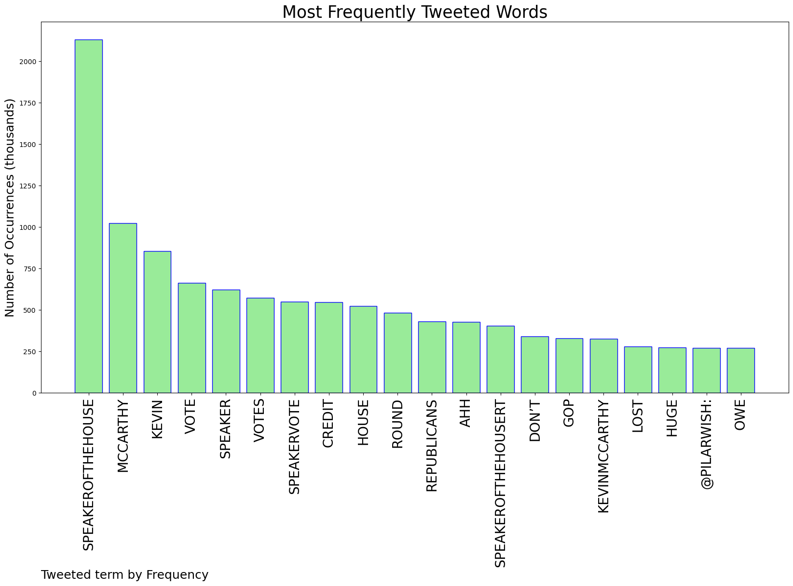
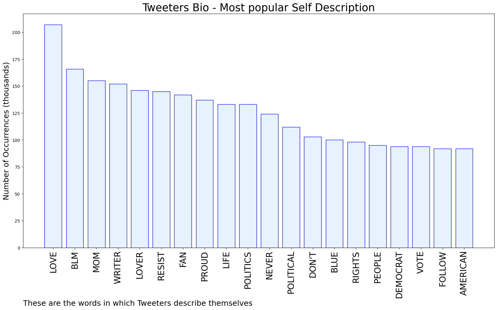
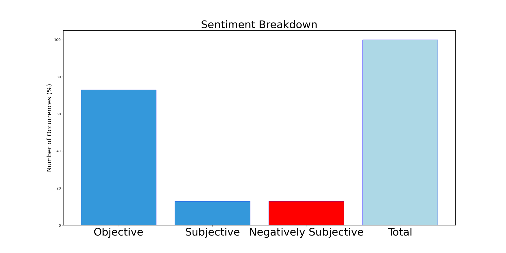

# MURCHIE85 TWITTER PROCESSING 
&#x1F34E; **TOPIC = "#Speakerofthehouse"**

## AUTOMATED RESEARCH SUMMARY

*note: Image pulled from web automatically, not connected to author.
  
<b> This report is AUTOMATED and not hand crafted, it is designed for pulling metrics on a given keyword or hashtag and performs a series of reporting and analysis.</b>

|                **Sample-Tweets**        |
| :-------------: |
| RT @pilarwish: I don’t know who to credit for this, but we owe them huge credit. #Speakerofthehouse https://t.co/JsjWsesZj3 |
| RT @BradBeauregardJ: Hearing Mike Gallagher whine about the Democrats eating popcorn while they watch the GOP clown show just made my day 😂… |
| Anyone else love to hear all these pronouns during Republican speaker nominations? @laurenboebert just said he and… https://t.co/UKuOUJIdI6 |

The most popular user is: **msr117**

 RT @pilarwish: I don’t know who to credit for this, but we owe them huge credit. #Speakerofthehouse https://t.co/JsjWsesZj3

## RELATED METRICS 
| Metric | Value |
| ------------- | ------------- |
| #1 Most tweeted to  | **pilarwish** |
| #2 Most tweeted to  | **GOP** |
| #3 Most tweeted to  | **tedlieu** |
| NewProfiles (less than 10 days) | 0.14%  |
| Tweeters with < 10 followers  | 2.84%|
| Tweeters with > 1000000 followers  | 0.02%  |

## MOST POPULAR TWEET TERMS 

| Popularity Rank  | Term |
| ------------- | ------------- |
| first  | **SPEAKEROFTHEHOUSE**  |
| second  | **MCCARTHY**  |
| third  | **KEVIN** |
| fourth  | **VOTE**  |
| fifth  | **SPEAKER**  |

## Twitter Bio Analysis
### SENTIMENT ANALYSIS

VIEWS WERE : **SUBJECTIVE**  (13.33%) & **NEGATIVELY-SUBJECTIVE** (13.33%) **OBJECTIVE** (73.33%)

### TWEET SAMPLE 
| Random value picked from array |
| ------------- |
|RT @GeekPrivateers: Albert Einstein: The definition of insanity is doing the same thing over and over and expecting different results.@Ho… |

### MOST RETWEETED 

| The most retweeted user is: **msr117**  |
| ------------- |
| RT @pilarwish: I don’t know who to credit for this, but we owe them huge credit. #Speakerofthehouse https://t.co/JsjWsesZj3 |

### CONCLUSION & EXTERNAL ANALYSIS

*This is my [Adam McMurchie`s] opinion on the data from the tweets, it serves as no objective truth.Since the tweets themselves are a mixture of fact & opinion. 
Authors analytical summary on request.
**RECOMMENDATIONS** WILL BE UPDATED IN NEXT  24 HOURS  