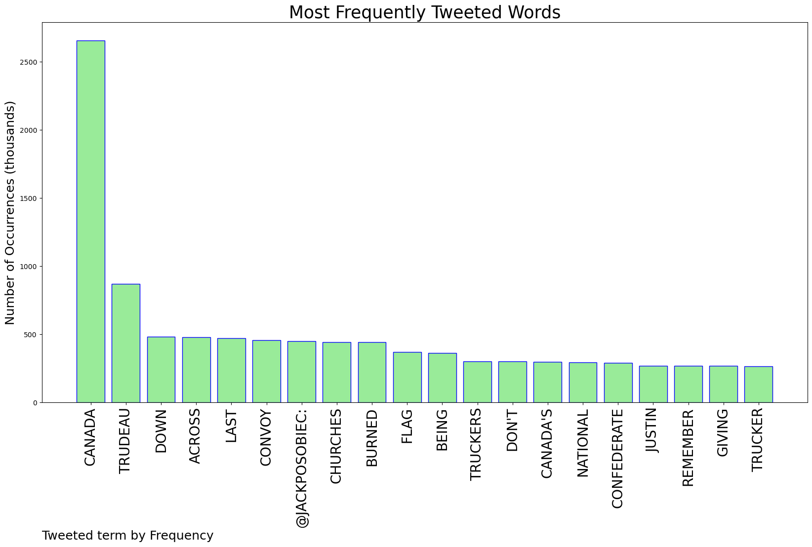
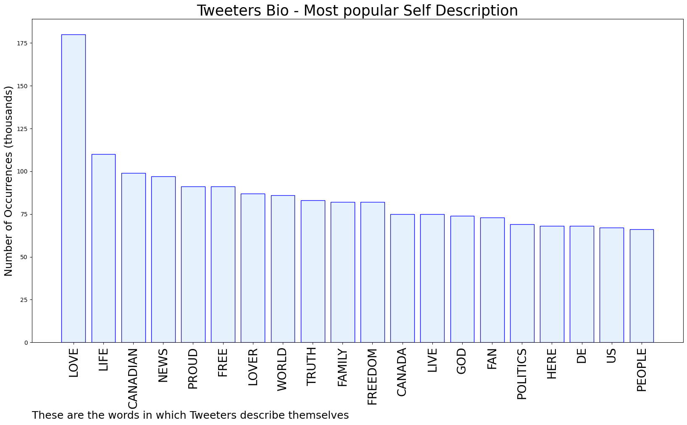
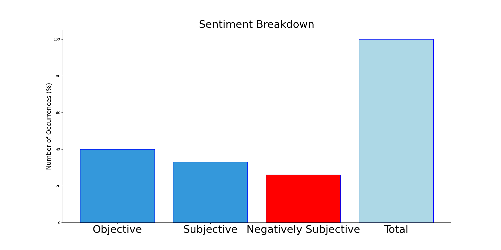

# MURCHIE85 TWITTER PROCESSING 
&#x1F34E; **TOPIC = "Canada"**

## AUTOMATED RESEARCH SUMMARY

*note: Image pulled from web automatically, not connected to author.
  
<b> This report is AUTOMATED and not hand crafted, it is designed for pulling metrics on a given keyword or hashtag and performs a series of reporting and analysis.</b>

|                **Sample-Tweets**        |
| :-------------: |
| RT @XoneNoYuuutsu: Waving a confederate flag in Canada is insane dickeating |
| @NamaariB @Gordie8089 @bennyjohnson More than a few countries have started going...dare I say it...Canada is BACK!!… https://t.co/ggqcAwau9G |
| RT @JackPosobiec: Funny how I don't remember Trudeau giving a national address when churches were being burned down across Canada last summ… |

The most popular user is: **Sinia000000000**

 RT @TundeTASH: Top 10:

- Sites to learn Excel for free
- Sites for Free Online Education
- Sites for your career
- Sites to review your re…

## RELATED METRICS 
| Metric | Value |
| ------------- | ------------- |
| #1 Most tweeted to  | **JackPosobiec** |
| #2 Most tweeted to  | **JustinTrudeau** |
| #3 Most tweeted to  | **XoneNoYuuutsu** |
| NewProfiles (less than 10 days) | 1.56%  |
| Tweeters with < 10 followers  | 5.4%|
| Tweeters with > 1000000 followers  | 0.04%  |

## MOST POPULAR TWEET TERMS 

| Popularity Rank  | Term |
| ------------- | ------------- |
| first  | **CANADA**  |
| second  | **TRUDEAU**  |
| third  | **DOWN** |
| fourth  | **ACROSS**  |
| fifth  | **LAST**  |

## Twitter Bio Analysis
### SENTIMENT ANALYSIS

VIEWS WERE : **SUBJECTIVE**  (33.33%) & **NEGATIVELY-SUBJECTIVE** (26.67%) **OBJECTIVE** (40.0%)

### TWEET SAMPLE 
| Random value picked from array |
| ------------- |
|RT @DrGillLeighton: No wonder Trudeau is too scared to reply directly to @PierrePoilievre, speaking passionately today in #Canada's Parliam… |

### MOST RETWEETED 

| The most retweeted user is: **Sinia000000000**  |
| ------------- |
| RT @TundeTASH: Top 10:- Sites to learn Excel for free- Sites for Free Online Education- Sites for your career- Sites to review your re… |

### CONCLUSION & EXTERNAL ANALYSIS

*This is my [Adam McMurchie`s] opinion on the data from the tweets, it serves as no objective truth.Since the tweets themselves are a mixture of fact & opinion. 
Authors analytical summary on request.
**RECOMMENDATIONS** WILL BE UPDATED IN NEXT  24 HOURS  