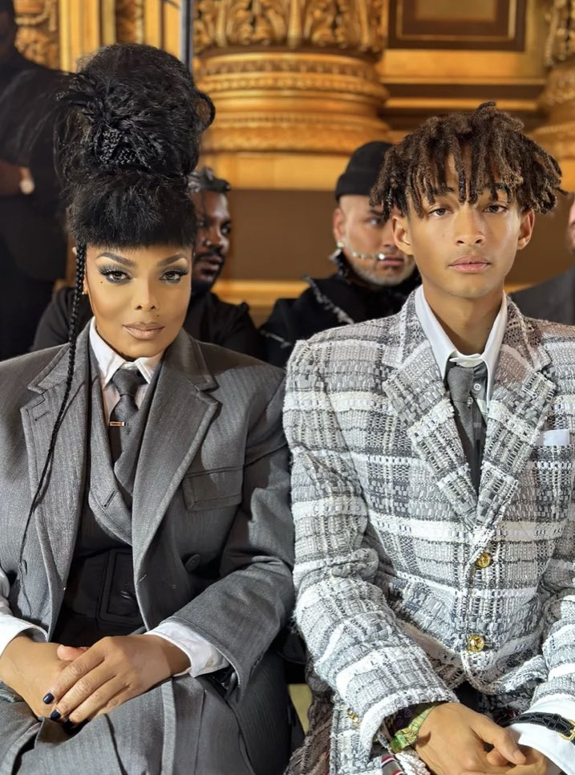
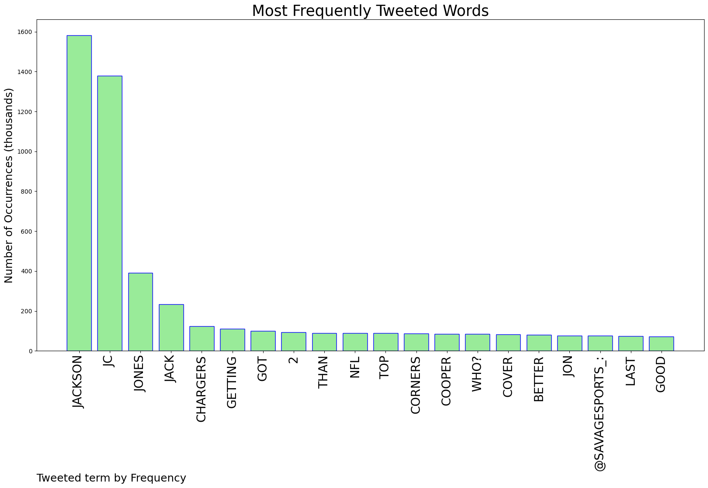
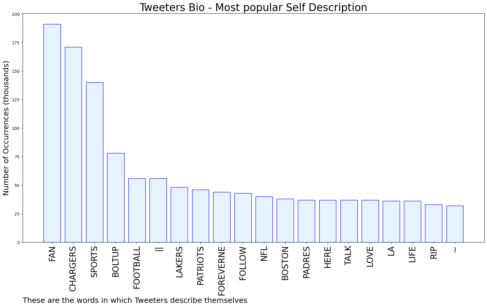

# MURCHIE85 TWITTER PROCESSING 
&#x1F34E; **TOPIC = "JC Jackson"**

## AUTOMATED RESEARCH SUMMARY

*note: Image pulled from web automatically, not connected to author.
  
<b> This report is AUTOMATED and not hand crafted, it is designed for pulling metrics on a given keyword or hashtag and performs a series of reporting and analysis.</b>

|                **Sample-Tweets**        |
| :-------------: |
| @RaidersBeat @Browns Lmaooo and it's funny cuz it's Amari shaking JC Jackson. |
| @puddleofjello @chargers Yeah, his injury was a little bit superficial as far as injuries go. But it might take him… https://t.co/pdlpG3b395 |
| @evander_87 @Patriots @presidentjacc @NFLonCBS Bill gets the most out of his backs even the ones he doesn't draft.… https://t.co/AmoxIENshS |

The most popular user is: **JC_jessy_**

 RT @teamwangofcl: Jackson Wang ➡️ Vogue Singapore’s October “Rebirth” &lt;Anniversary&gt; Issue Cover.

@JacksonWang852 x @voguesingapore 

#Vogu…

## RELATED METRICS 
| Metric | Value |
| ------------- | ------------- |
| #1 Most tweeted to  | **SavageSports_** |
| #2 Most tweeted to  | **NestPgs** |
| #3 Most tweeted to  | **Tdub_football** |
| NewProfiles (less than 10 days) | 0.42%  |
| Tweeters with < 10 followers  | 2.89%|
| Tweeters with > 1000000 followers  | 0.0%  |

## MOST POPULAR TWEET TERMS 

| Popularity Rank  | Term |
| ------------- | ------------- |
| first  | **JACKSON**  |
| second  | **JC**  |
| third  | **JONES** |
| fourth  | **JACK**  |
| fifth  | **CHARGERS**  |

## Twitter Bio Analysis
### SENTIMENT ANALYSIS

VIEWS WERE : **SUBJECTIVE**  (26.67%) & **NEGATIVELY-SUBJECTIVE** (20.0%) **OBJECTIVE** (53.33%)

### TWEET SAMPLE 
| Random value picked from array |
| ------------- |
|Big Ten hoopsIU’s Trayce Jackson-Davis Preseason Player of the Year https://t.co/M4JWSKWSl4 |

### MOST RETWEETED 

| The most retweeted user is: **JC_jessy_**  |
| ------------- |
| RT @teamwangofcl: Jackson Wang ➡️ Vogue Singapore’s October “Rebirth” &lt;Anniversary&gt; Issue Cover.@JacksonWang852 x @voguesingapore #Vogu… |

### CONCLUSION & EXTERNAL ANALYSIS

*This is my [Adam McMurchie`s] opinion on the data from the tweets, it serves as no objective truth.Since the tweets themselves are a mixture of fact & opinion. 
Authors analytical summary on request.
**RECOMMENDATIONS** WILL BE UPDATED IN NEXT  24 HOURS  