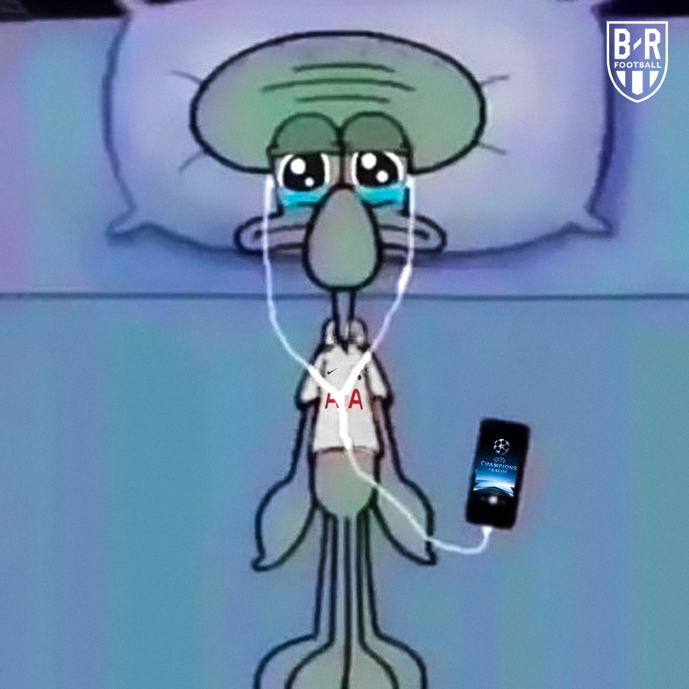
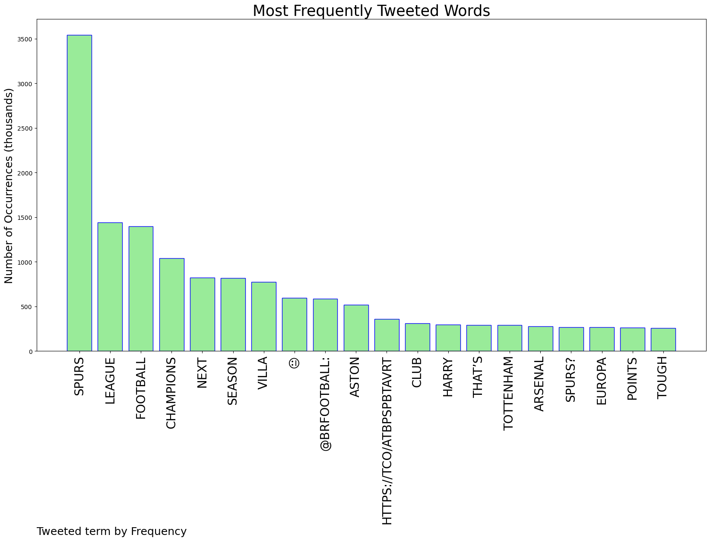
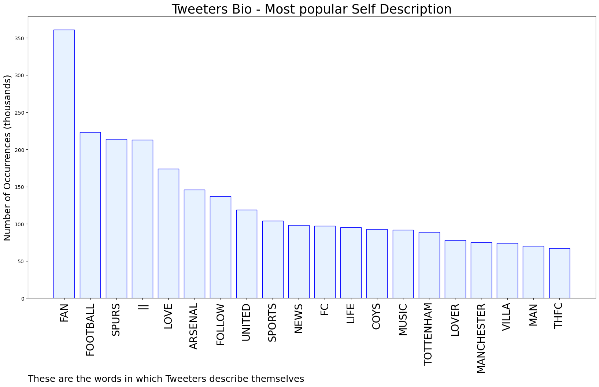

# MURCHIE85 TWITTER PROCESSING 
&#x1F34E; **TOPIC = "Spurs"**

## AUTOMATED RESEARCH SUMMARY

*note: Image pulled from web automatically, not connected to author.
  
<b> This report is AUTOMATED and not hand crafted, it is designed for pulling metrics on a given keyword or hashtag and performs a series of reporting and analysis.</b>

|                **Sample-Tweets**        |
| :-------------: |
| RT @BronToAD: @LakersDailyCom Pistons in 2007Celtics in 2012Spurs in 2013Warriors in 2023Call him the dynasty killer |
| RT @OP4C: Bet Emi Martinez can’t wait for his cut price move to spurs now |
| RT @JoshCheetham91: Guess Spurs' next away game. Go on, guess |

The most popular user is: **USMerWhoLockian**

 RT @FabrizioRomano: It's over between Tottenham and Julian Nagelsmann. No way to continue negotiations as club won't change current stance;…

## RELATED METRICS 
| Metric | Value |
| ------------- | ------------- |
| #1 Most tweeted to  | **brfootball** |
| #2 Most tweeted to  | **UTDTrey** |
| #3 Most tweeted to  | **433** |
| NewProfiles (less than 10 days) | 0.22%  |
| Tweeters with < 10 followers  | 4.0%|
| Tweeters with > 1000000 followers  | 0.08%  |

## MOST POPULAR TWEET TERMS 

| Popularity Rank  | Term |
| ------------- | ------------- |
| first  | **SPURS**  |
| second  | **LEAGUE**  |
| third  | **FOOTBALL** |
| fourth  | **CHAMPIONS**  |
| fifth  | **NEXT**  |

## Twitter Bio Analysis
### SENTIMENT ANALYSIS

VIEWS WERE : **SUBJECTIVE**  (33.33%) & **NEGATIVELY-SUBJECTIVE** (0.0%) **OBJECTIVE** (66.67%)

### TWEET SAMPLE 
| Random value picked from array |
| ------------- |
|RT @Orbinho: Today's results confirm that Spurs won't be in the Champions League next season. |

### MOST RETWEETED 

| The most retweeted user is: **USMerWhoLockian**  |
| ------------- |
| RT @FabrizioRomano: It's over between Tottenham and Julian Nagelsmann. No way to continue negotiations as club won't change current stance;… |

### CONCLUSION & EXTERNAL ANALYSIS

*This is my [Adam McMurchie`s] opinion on the data from the tweets, it serves as no objective truth.Since the tweets themselves are a mixture of fact & opinion. 
Authors analytical summary on request.
**RECOMMENDATIONS** WILL BE UPDATED IN NEXT  24 HOURS  