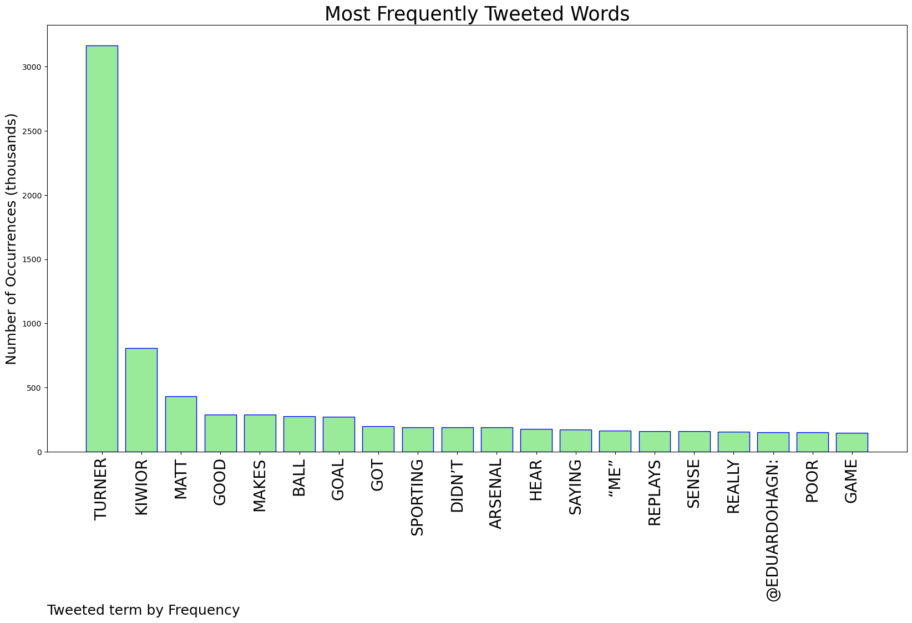
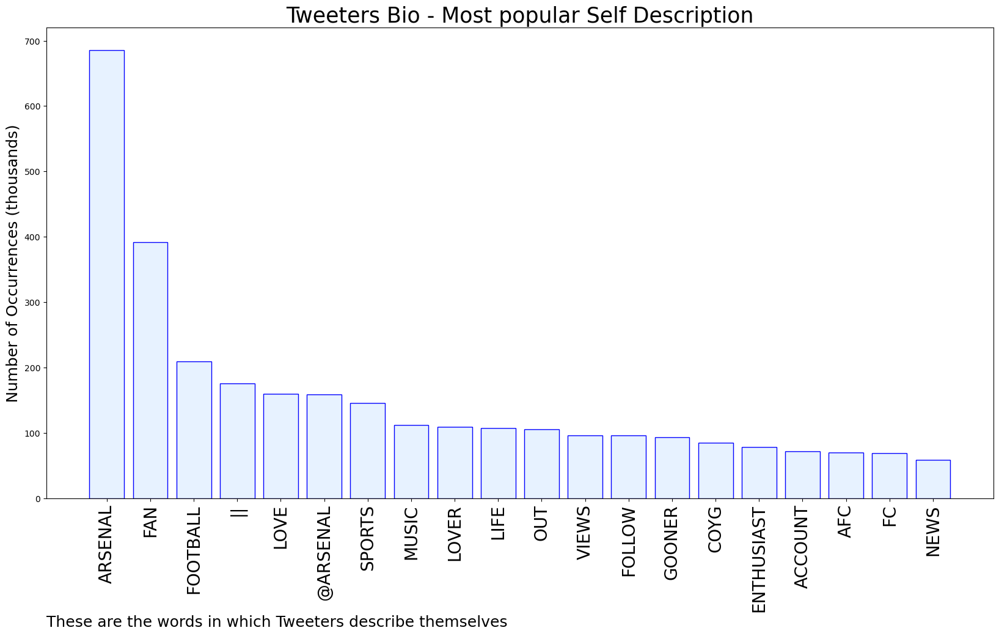

# MURCHIE85 TWITTER PROCESSING 
&#x1F34E; **TOPIC = "Turner"**

## AUTOMATED RESEARCH SUMMARY

*note: Image pulled from web automatically, not connected to author.
  
<b> This report is AUTOMATED and not hand crafted, it is designed for pulling metrics on a given keyword or hashtag and performs a series of reporting and analysis.</b>

|                **Sample-Tweets**        |
| :-------------: |
| RT @BookPings: Good Read - Looking for a page-turner filled with military action, humor, and steamy romance? Check out the Providence Serie… |
| Why does that presenter keep saying Ben turner instead of Matt turner 😂😂🤦🏽‍♂️ |
| Someone give Matt Turner’s head a wobble |

The most popular user is: **Goose_Turner**

 RT @heavenbrat: happy womens day especially to every first born daughter

## RELATED METRICS 
| Metric | Value |
| ------------- | ------------- |
| #1 Most tweeted to  | **Arsenal** |
| #2 Most tweeted to  | **EduardoHagn** |
| #3 Most tweeted to  | **Orbinho** |
| NewProfiles (less than 10 days) | 0.08%  |
| Tweeters with < 10 followers  | 7.66%|
| Tweeters with > 1000000 followers  | 0.04%  |

## MOST POPULAR TWEET TERMS 

| Popularity Rank  | Term |
| ------------- | ------------- |
| first  | **TURNER**  |
| second  | **KIWIOR**  |
| third  | **MATT** |
| fourth  | **GOOD**  |
| fifth  | **MAKES**  |

## Twitter Bio Analysis
### SENTIMENT ANALYSIS

VIEWS WERE : **SUBJECTIVE**  (33.33%) & **NEGATIVELY-SUBJECTIVE** (0.0%) **OBJECTIVE** (66.67%)

### TWEET SAMPLE 
| Random value picked from array |
| ------------- |
|Turner and Kiwior were bad there.Kiwior been good this game as well |

### MOST RETWEETED 

| The most retweeted user is: **Goose_Turner**  |
| ------------- |
| RT @heavenbrat: happy womens day especially to every first born daughter |

### CONCLUSION & EXTERNAL ANALYSIS

*This is my [Adam McMurchie`s] opinion on the data from the tweets, it serves as no objective truth.Since the tweets themselves are a mixture of fact & opinion. 
Authors analytical summary on request.
**RECOMMENDATIONS** WILL BE UPDATED IN NEXT  24 HOURS  