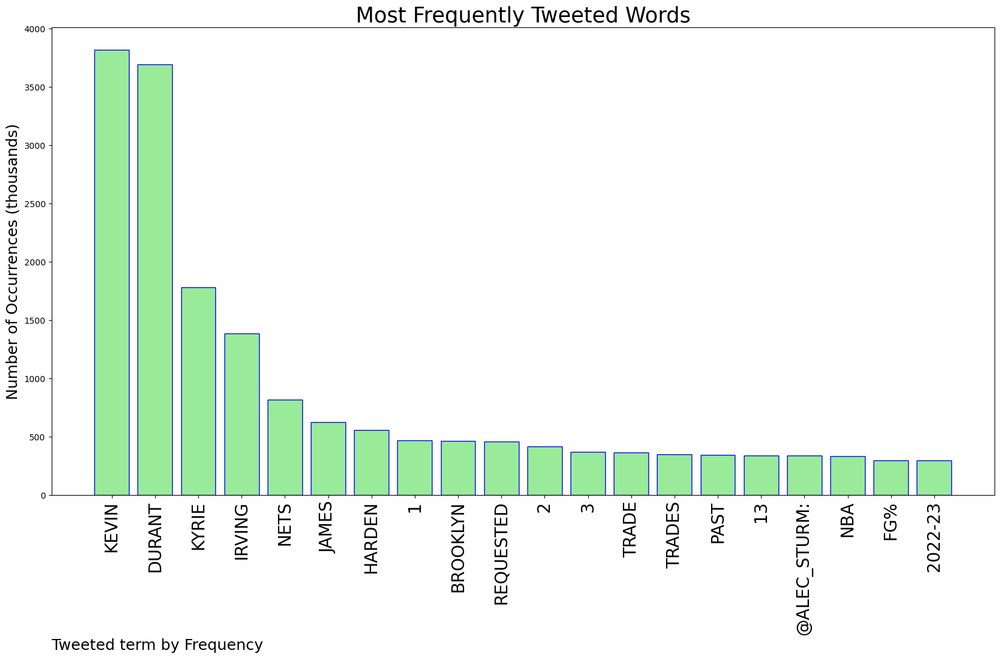
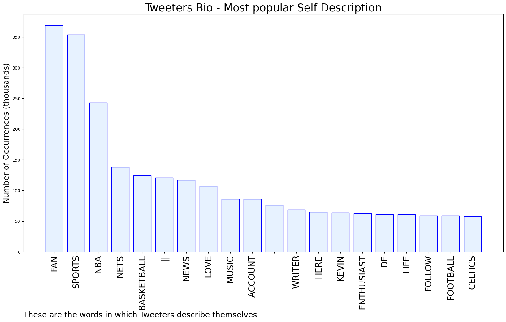
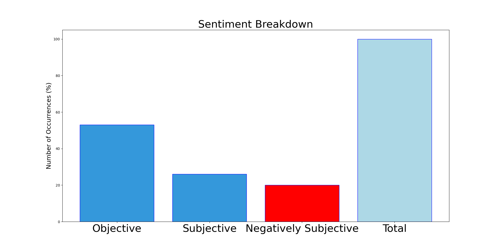

# MURCHIE85 TWITTER PROCESSING 
&#x1F34E; **TOPIC = "Kevin Durant"**

## AUTOMATED RESEARCH SUMMARY

*note: Image pulled from web automatically, not connected to author.
  
<b> This report is AUTOMATED and not hand crafted, it is designed for pulling metrics on a given keyword or hashtag and performs a series of reporting and analysis.</b>

|                **Sample-Tweets**        |
| :-------------: |
| Kevin Durant wants to play for the kings |
| RT @RossRead: Kevin Durant enjoying a peaceful Friday until Kyrie shows up.  https://t.co/GDMaS3621w |
| RT @taylorcsnow: Jayson Tatum was +42 in the first half. That's the 2nd-best plus/minus for a player in any half in NBA history (Kevin Du… |

The most popular user is: **CR7THEG07T**

 RT @KDTrey5: My next chapter https://t.co/DG2TJ5cnev https://t.co/zi94ss9NWI

## RELATED METRICS 
| Metric | Value |
| ------------- | ------------- |
| #1 Most tweeted to  | **Alec_Sturm** |
| #2 Most tweeted to  | **kirkgoldsberry** |
| #3 Most tweeted to  | **LegionHoops** |
| NewProfiles (less than 10 days) | 0.2%  |
| Tweeters with < 10 followers  | 4.44%|
| Tweeters with > 1000000 followers  | 0.16%  |

## MOST POPULAR TWEET TERMS 

| Popularity Rank  | Term |
| ------------- | ------------- |
| first  | **KEVIN**  |
| second  | **DURANT**  |
| third  | **KYRIE** |
| fourth  | **IRVING**  |
| fifth  | **NETS**  |

## Twitter Bio Analysis
### SENTIMENT ANALYSIS

VIEWS WERE : **SUBJECTIVE**  (26.67%) & **NEGATIVELY-SUBJECTIVE** (20.0%) **OBJECTIVE** (53.33%)

### TWEET SAMPLE 
| Random value picked from array |
| ------------- |
|That’s Kevin Durant https://t.co/4rNVULcvWw |

### MOST RETWEETED 

| The most retweeted user is: **CR7THEG07T**  |
| ------------- |
| RT @KDTrey5: My next chapter https://t.co/DG2TJ5cnev https://t.co/zi94ss9NWI |

### CONCLUSION & EXTERNAL ANALYSIS

*This is my [Adam McMurchie`s] opinion on the data from the tweets, it serves as no objective truth.Since the tweets themselves are a mixture of fact & opinion. 
Authors analytical summary on request.
**RECOMMENDATIONS** WILL BE UPDATED IN NEXT  24 HOURS  