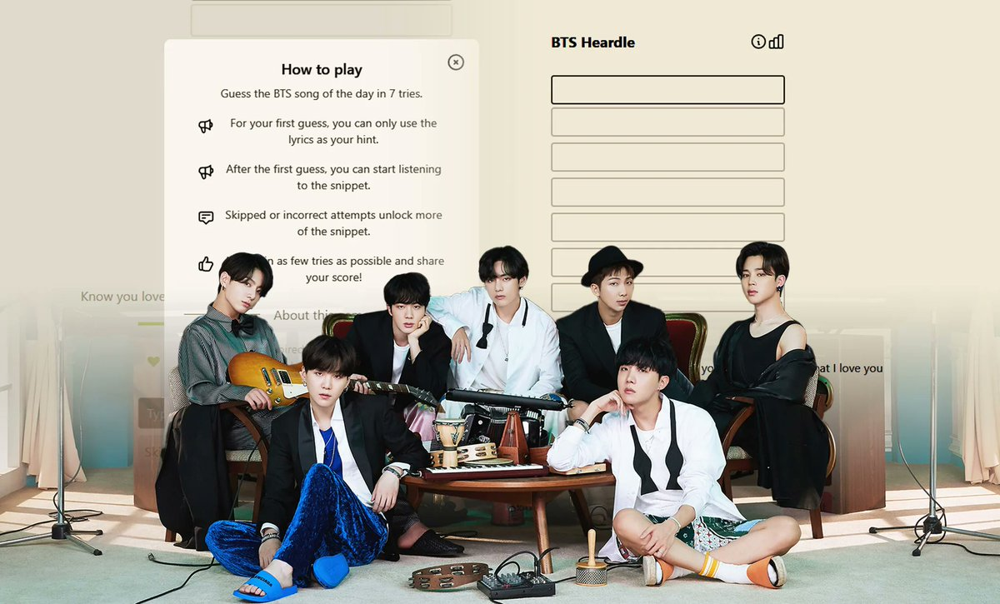
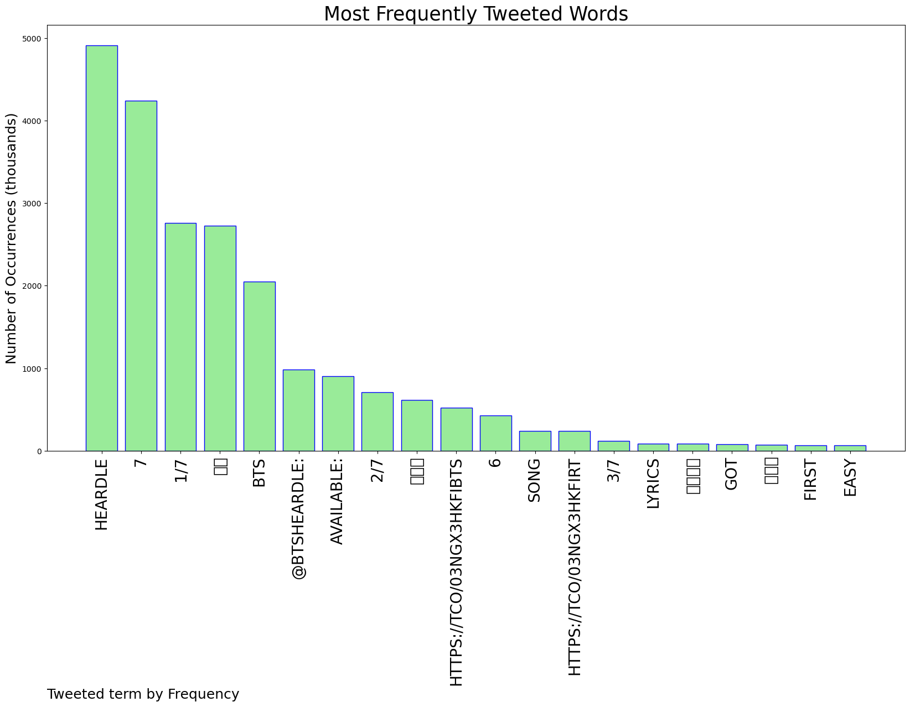
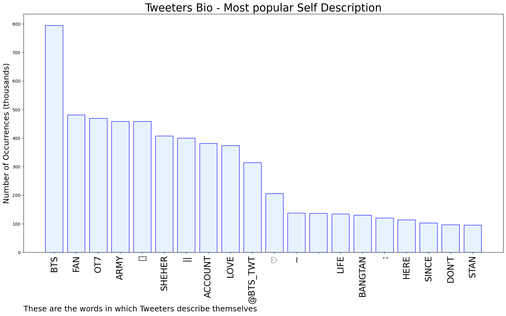

# MURCHIE85 TWITTER PROCESSING 
&#x1F34E; **TOPIC = "BTS Heardle"**

## AUTOMATED RESEARCH SUMMARY

*note: Image pulled from web automatically, not connected to author.
  
<b> This report is AUTOMATED and not hand crafted, it is designed for pulling metrics on a given keyword or hashtag and performs a series of reporting and analysis.</b>

|                **Sample-Tweets**        |
| :-------------: |
| RT @94Pied_Piper: BTS Heardle #6 1/7🔊🟪🔗https://t.co/JrMOktbfy4Listen to #Yours_Jin the best OST of 2021 and #SuperTuna_Jin the global… |
| BTS Heardle #7 1/7🔊🟪https://t.co/zyHbRa59Js |
| BTS Heardle #7 1/7🔊🟪https://t.co/LbzBkiL3sY// sorry ah aku pro https://t.co/BTiaaPBzRG |

The most popular user is: **sevnpavedtheway**

 RT @btschartdata: Test your BTS discography knowledge with @btsheardle 🔊💜
↳ https://t.co/H5TzB9XRp5 https://t.co/ukCq4iS1Hs

## RELATED METRICS 
| Metric | Value |
| ------------- | ------------- |
| #1 Most tweeted to  | **btsheardle** |
| #2 Most tweeted to  | **BTS_twt** |
| #3 Most tweeted to  | **billboard** |
| NewProfiles (less than 10 days) | 0.22%  |
| Tweeters with < 10 followers  | 1.0%|
| Tweeters with > 1000000 followers  | 0.0%  |

## MOST POPULAR TWEET TERMS 

| Popularity Rank  | Term |
| ------------- | ------------- |
| first  | **HEARDLE**  |
| second  | **7**  |
| third  | **1/7** |
| fourth  | **🔊🟪**  |
| fifth  | **BTS**  |

## Twitter Bio Analysis
### SENTIMENT ANALYSIS

VIEWS WERE : **SUBJECTIVE**  (6.67%) & **NEGATIVELY-SUBJECTIVE** (0.0%) **OBJECTIVE** (93.33%)

### TWEET SAMPLE 
| Random value picked from array |
| ------------- |
|@btsheardle @BTSUpdater BTS Heardle #7 2/7I'm so embarrassed 😭... the first song I met my beloved Bangtan with an… https://t.co/AHCnlwxz0O |

### MOST RETWEETED 

| The most retweeted user is: **sevnpavedtheway**  |
| ------------- |
| RT @btschartdata: Test your BTS discography knowledge with @btsheardle 🔊💜↳ https://t.co/H5TzB9XRp5 https://t.co/ukCq4iS1Hs |

### CONCLUSION & EXTERNAL ANALYSIS

*This is my [Adam McMurchie`s] opinion on the data from the tweets, it serves as no objective truth.Since the tweets themselves are a mixture of fact & opinion. 
Authors analytical summary on request.
**RECOMMENDATIONS** WILL BE UPDATED IN NEXT  24 HOURS  