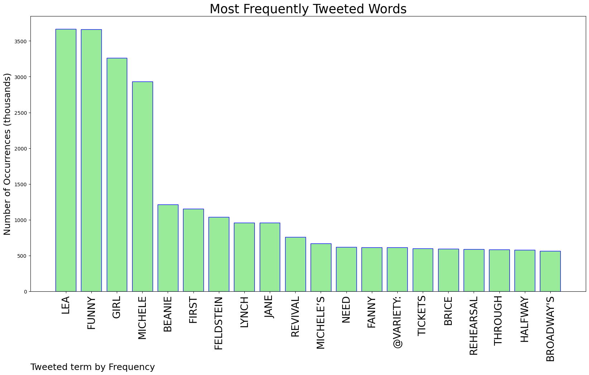
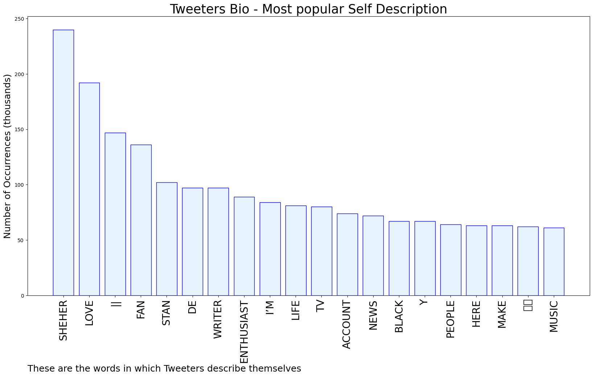
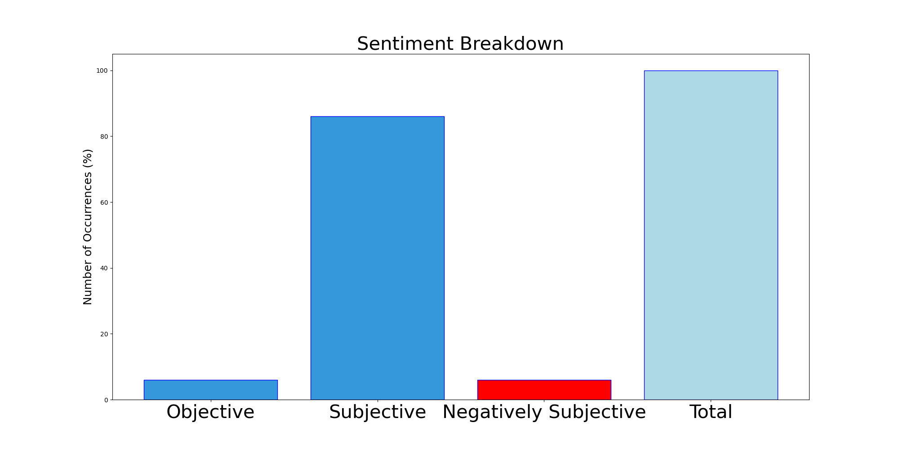

# MURCHIE85 TWITTER PROCESSING 
&#x1F34E; **TOPIC = "Funny Girl"**

## AUTOMATED RESEARCH SUMMARY

*note: Image pulled from web automatically, not connected to author.
  
<b> This report is AUTOMATED and not hand crafted, it is designed for pulling metrics on a given keyword or hashtag and performs a series of reporting and analysis.</b>

|                **Sample-Tweets**        |
| :-------------: |
| RT @AaliyahOroro: As I reel from the news that Lea Michele is set to play Fanny Brice in Funny Girl, I couldn’t help but wonder…Did my 1 mi… |
| Someway somehow I MUST see funny girl |
| RT @Variety: 🚨The rumors are true!🚨Lea Michele is replacing Beanie Feldstein in Broadway's revival of #FunnyGirl. https://t.co/qfqWiaGUwl… |

The most popular user is: **AZkumaku**

 RT @kisekisymphony: it's so funny how many fan-made pokémon gender differences are Female Girl Animal when canonical pokémon gender differe…

## RELATED METRICS 
| Metric | Value |
| ------------- | ------------- |
| #1 Most tweeted to  | **Variety** |
| #2 Most tweeted to  | **leylanocontext** |
| #3 Most tweeted to  | **madeleinejanne** |
| NewProfiles (less than 10 days) | 0.16%  |
| Tweeters with < 10 followers  | 2.46%|
| Tweeters with > 1000000 followers  | 0.12%  |

## MOST POPULAR TWEET TERMS 

| Popularity Rank  | Term |
| ------------- | ------------- |
| first  | **LEA**  |
| second  | **FUNNY**  |
| third  | **GIRL** |
| fourth  | **MICHELE**  |
| fifth  | **BEANIE**  |

## Twitter Bio Analysis
### SENTIMENT ANALYSIS

VIEWS WERE : **SUBJECTIVE**  (86.67%) & **NEGATIVELY-SUBJECTIVE** (6.67%) **OBJECTIVE** (6.67%)

### TWEET SAMPLE 
| Random value picked from array |
| ------------- |
|RT @madeleinejanne: i need to get tickets to lea michele’s first performance of funny girl so i can walk out halfway through just like sue… |

### MOST RETWEETED 

| The most retweeted user is: **AZkumaku**  |
| ------------- |
| RT @kisekisymphony: it's so funny how many fan-made pokémon gender differences are Female Girl Animal when canonical pokémon gender differe… |

### CONCLUSION & EXTERNAL ANALYSIS

*This is my [Adam McMurchie`s] opinion on the data from the tweets, it serves as no objective truth.Since the tweets themselves are a mixture of fact & opinion. 
Authors analytical summary on request.
**RECOMMENDATIONS** WILL BE UPDATED IN NEXT  24 HOURS  