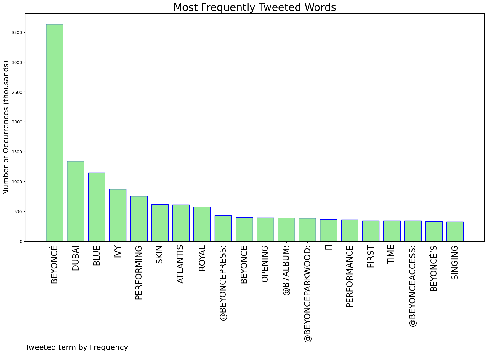
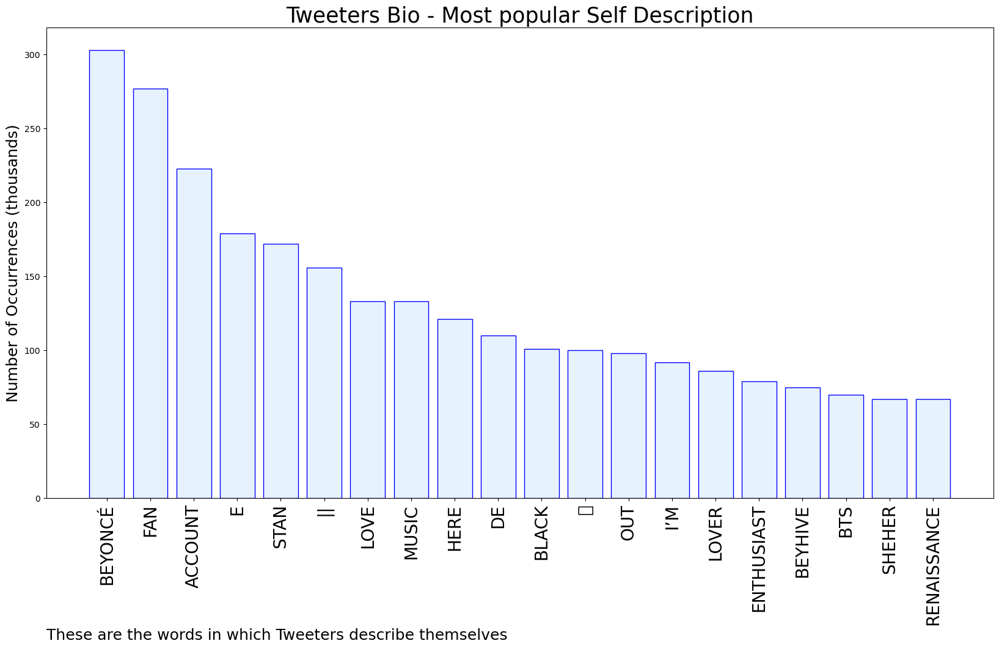
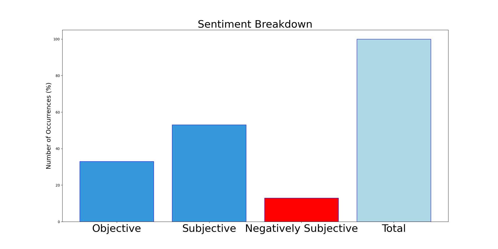

# MURCHIE85 TWITTER PROCESSING 
&#x1F34E; **TOPIC = "Beyoncé"**

## AUTOMATED RESEARCH SUMMARY

*note: Image pulled from web automatically, not connected to author.
  
<b> This report is AUTOMATED and not hand crafted, it is designed for pulling metrics on a given keyword or hashtag and performs a series of reporting and analysis.</b>

|                **Sample-Tweets**        |
| :-------------: |
| RT @PopBase: Beyoncé stuns at her private Dubai performance. https://t.co/Ksl21PMrEz |
| @PopCrave love her but does she know she’s beyonce and that ofc people will film😭😭 |
| #beyonce is sanging and these runs and vocals shouldn’t be missed B! |

The most popular user is: **__versiani**

 RT @Beyonce: act i   RENAISSANCE   7.29 
https://t.co/6sfw3sBWnz https://t.co/FPPhEW1OTK

## RELATED METRICS 
| Metric | Value |
| ------------- | ------------- |
| #1 Most tweeted to  | **beyoncepress** |
| #2 Most tweeted to  | **B7Album** |
| #3 Most tweeted to  | **beyonceparkwood** |
| NewProfiles (less than 10 days) | 0.24%  |
| Tweeters with < 10 followers  | 1.94%|
| Tweeters with > 1000000 followers  | 0.08%  |

## MOST POPULAR TWEET TERMS 

| Popularity Rank  | Term |
| ------------- | ------------- |
| first  | **BEYONCÉ**  |
| second  | **DUBAI**  |
| third  | **BLUE** |
| fourth  | **IVY**  |
| fifth  | **PERFORMING**  |

## Twitter Bio Analysis
### SENTIMENT ANALYSIS

VIEWS WERE : **SUBJECTIVE**  (53.33%) & **NEGATIVELY-SUBJECTIVE** (13.33%) **OBJECTIVE** (33.33%)

### TWEET SAMPLE 
| Random value picked from array |
| ------------- |
|Beyoncé performing songs from The Gift love that for me |

### MOST RETWEETED 

| The most retweeted user is: **__versiani**  |
| ------------- |
| RT @Beyonce: act i   RENAISSANCE   7.29 https://t.co/6sfw3sBWnz https://t.co/FPPhEW1OTK |

### CONCLUSION & EXTERNAL ANALYSIS

*This is my [Adam McMurchie`s] opinion on the data from the tweets, it serves as no objective truth.Since the tweets themselves are a mixture of fact & opinion. 
Authors analytical summary on request.
**RECOMMENDATIONS** WILL BE UPDATED IN NEXT  24 HOURS  