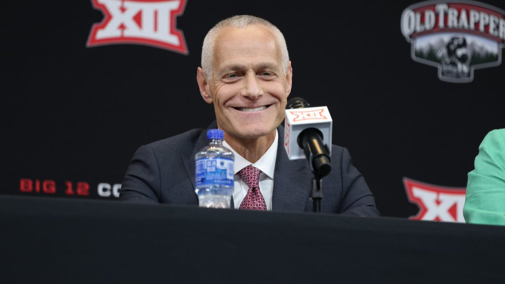
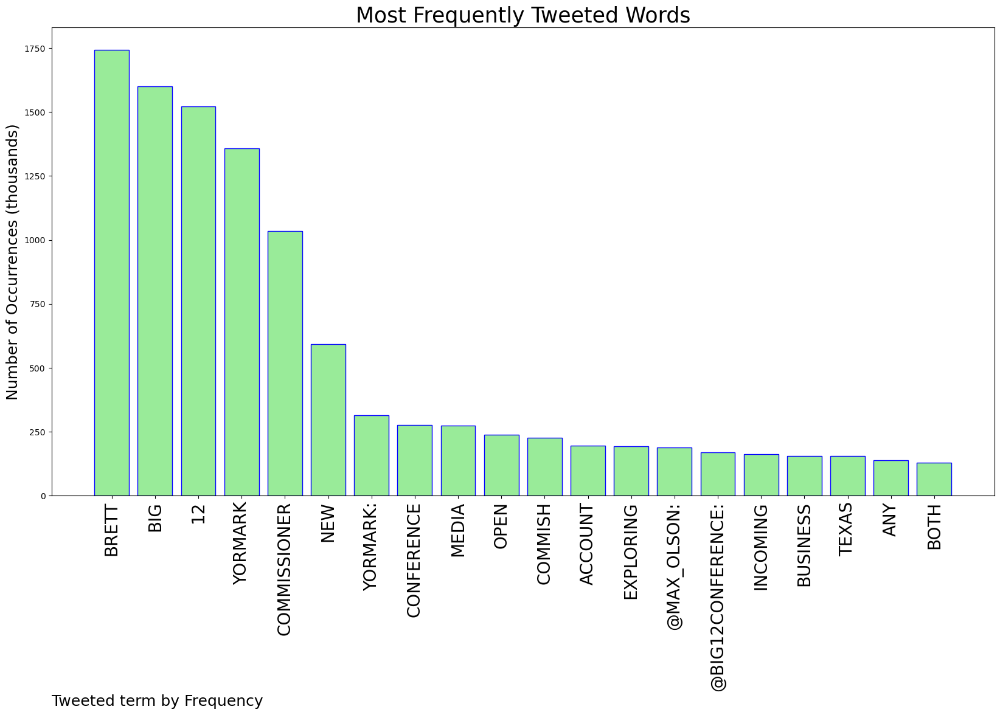
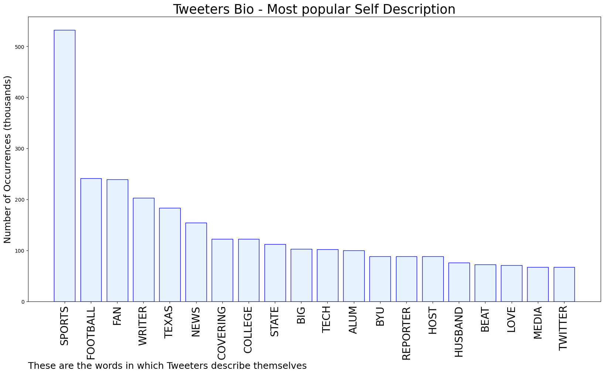

# MURCHIE85 TWITTER PROCESSING 
&#x1F34E; **TOPIC = "Brett Yormark"**

## AUTOMATED RESEARCH SUMMARY

*note: Image pulled from web automatically, not connected to author.
  
<b> This report is AUTOMATED and not hand crafted, it is designed for pulling metrics on a given keyword or hashtag and performs a series of reporting and analysis.</b>

|                **Sample-Tweets**        |
| :-------------: |
| Big 12 'Open for Business' Amid Pac-12 Rumors, Commissioner Brett Yormark Says https://t.co/03lvg37Bla #Football #NCAA #CollegeFootball |
| RT @KellisRobinett: After conference realignment returned, Baylor president Linda Livingstone says she told new Big 12 commissioner Brett Y… |
| The Big 12 soon will be under the leadership of Brett Yormark, a college sports newbie. Many will get their first i… https://t.co/G9ZldulU0A |

The most popular user is: **Gameday_U**

 RT @Big12Conference: Introducing: 𝐁𝐫𝐞𝐭𝐭 𝐘𝐨𝐫𝐦𝐚𝐫𝐤, the fifth commissioner of the 𝐁𝐢𝐠 𝟏𝟐 𝐂𝐨𝐧𝐟𝐞𝐫𝐞𝐧𝐜𝐞

📰 https://t.co/1TnK0EgBHO https://t.co/wx…

## RELATED METRICS 
| Metric | Value |
| ------------- | ------------- |
| #1 Most tweeted to  | **Big12Conference** |
| #2 Most tweeted to  | **max_olson** |
| #3 Most tweeted to  | **dennisdoddcbs** |
| NewProfiles (less than 10 days) | 0.18%  |
| Tweeters with < 10 followers  | 0.87%|
| Tweeters with > 1000000 followers  | 0.14%  |

## MOST POPULAR TWEET TERMS 

| Popularity Rank  | Term |
| ------------- | ------------- |
| first  | **BRETT**  |
| second  | **BIG**  |
| third  | **12** |
| fourth  | **YORMARK**  |
| fifth  | **COMMISSIONER**  |

## Twitter Bio Analysis
### SENTIMENT ANALYSIS

VIEWS WERE : **SUBJECTIVE**  (20.0%) & **NEGATIVELY-SUBJECTIVE** (13.33%) **OBJECTIVE** (66.67%)

### TWEET SAMPLE 
| Random value picked from array |
| ------------- |
|Incoming Big 12 commissioner Brett Yormark: “I’m an advocate of NIL. I think there needs to be guardrails. There pr… https://t.co/pmOzVIm36p |

### MOST RETWEETED 

| The most retweeted user is: **Gameday_U**  |
| ------------- |
| RT @Big12Conference: Introducing: 𝐁𝐫𝐞𝐭𝐭 𝐘𝐨𝐫𝐦𝐚𝐫𝐤, the fifth commissioner of the 𝐁𝐢𝐠 𝟏𝟐 𝐂𝐨𝐧𝐟𝐞𝐫𝐞𝐧𝐜𝐞📰 https://t.co/1TnK0EgBHO https://t.co/wx… |

### CONCLUSION & EXTERNAL ANALYSIS

*This is my [Adam McMurchie`s] opinion on the data from the tweets, it serves as no objective truth.Since the tweets themselves are a mixture of fact & opinion. 
Authors analytical summary on request.
**RECOMMENDATIONS** WILL BE UPDATED IN NEXT  24 HOURS  