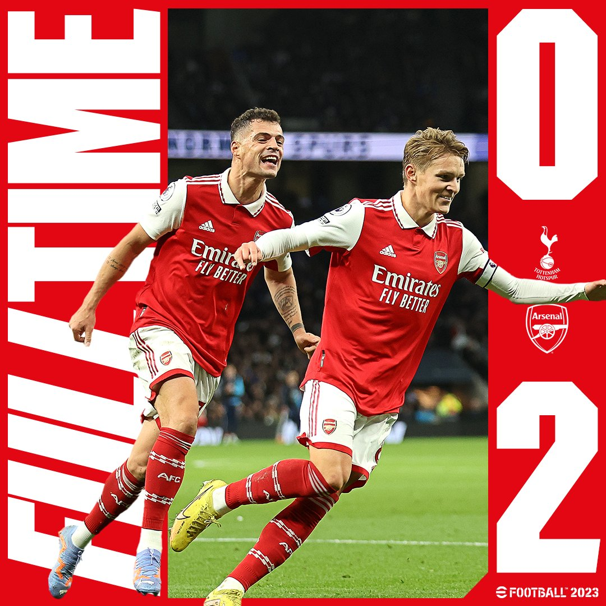
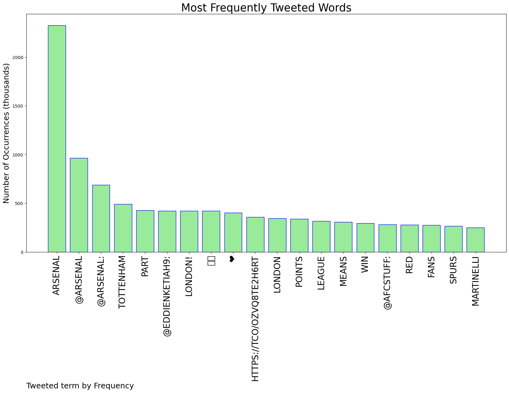
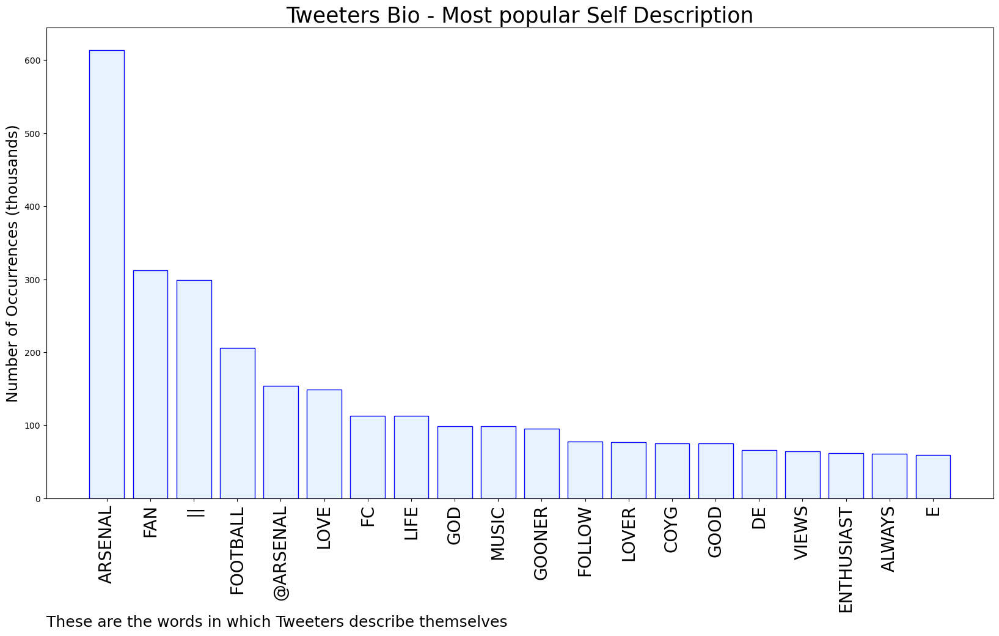
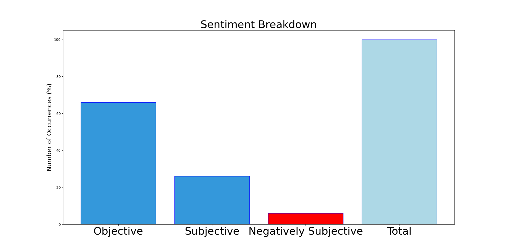

# MURCHIE85 TWITTER PROCESSING 
&#x1F34E; **TOPIC = "Arsenal"**

## AUTOMATED RESEARCH SUMMARY

*note: Image pulled from web automatically, not connected to author.
  
<b> This report is AUTOMATED and not hand crafted, it is designed for pulling metrics on a given keyword or hashtag and performs a series of reporting and analysis.</b>

|                **Sample-Tweets**        |
| :-------------: |
| @EddieNketiah9 @Arsenal The whole of London actually belongs to us bro |
| RT @backagain: INJECT THIS INTO MY VEINS.We turned up on their turf, outclassed them, embarrassed them, left them with salt in their mout… |
| RT @Arsenal: Ballers 🏀 https://t.co/kkgU1r1dxc |

The most popular user is: **Kkenfer**

 RT @Arsenal: 🔴 More than three points.

✊ Always forward - together https://t.co/RsupXz9IbI

## RELATED METRICS 
| Metric | Value |
| ------------- | ------------- |
| #1 Most tweeted to  | **Arsenal** |
| #2 Most tweeted to  | **EddieNketiah9** |
| #3 Most tweeted to  | **afcstuff** |
| NewProfiles (less than 10 days) | 0.32%  |
| Tweeters with < 10 followers  | 3.78%|
| Tweeters with > 1000000 followers  | 0.08%  |

## MOST POPULAR TWEET TERMS 

| Popularity Rank  | Term |
| ------------- | ------------- |
| first  | **ARSENAL**  |
| second  | **@ARSENAL**  |
| third  | **@ARSENAL:** |
| fourth  | **TOTTENHAM**  |
| fifth  | **PART**  |

## Twitter Bio Analysis
### SENTIMENT ANALYSIS

VIEWS WERE : **SUBJECTIVE**  (26.67%) & **NEGATIVELY-SUBJECTIVE** (6.67%) **OBJECTIVE** (66.67%)

### TWEET SAMPLE 
| Random value picked from array |
| ------------- |
|RT @Arsenal: 🔴 More than three points.✊ Always forward - together https://t.co/RsupXz9IbI |

### MOST RETWEETED 

| The most retweeted user is: **Kkenfer**  |
| ------------- |
| RT @Arsenal: 🔴 More than three points.✊ Always forward - together https://t.co/RsupXz9IbI |

### CONCLUSION & EXTERNAL ANALYSIS

*This is my [Adam McMurchie`s] opinion on the data from the tweets, it serves as no objective truth.Since the tweets themselves are a mixture of fact & opinion. 
Authors analytical summary on request.
**RECOMMENDATIONS** WILL BE UPDATED IN NEXT  24 HOURS  