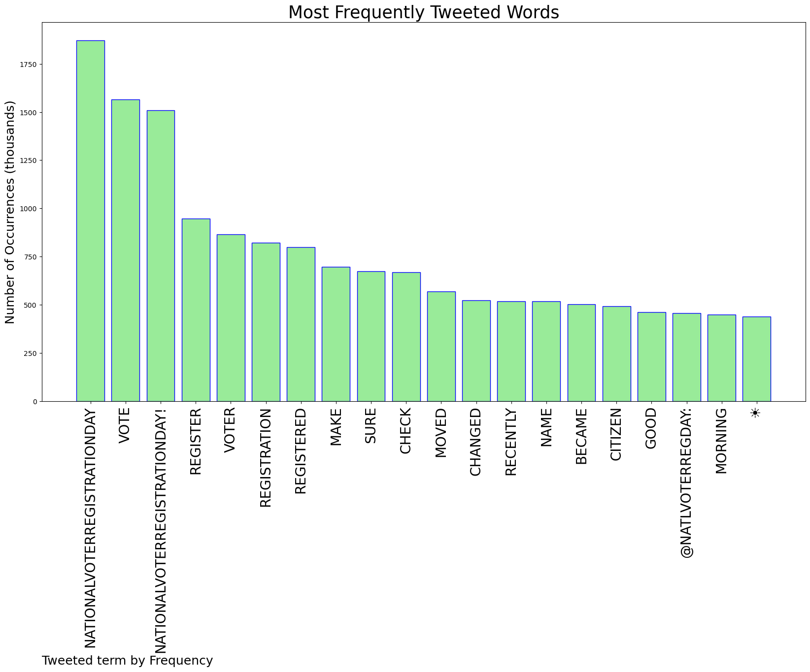
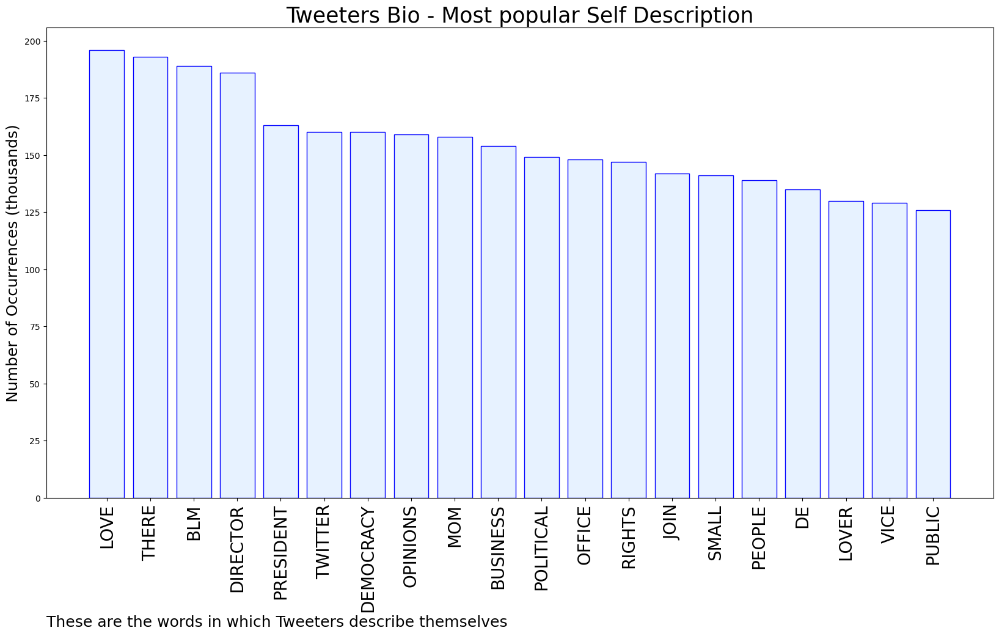

# MURCHIE85 TWITTER PROCESSING 
&#x1F34E; **TOPIC = "#NationalVoterRegistrationDay"**

## AUTOMATED RESEARCH SUMMARY

*note: Image pulled from web automatically, not connected to author.
  
<b> This report is AUTOMATED and not hand crafted, it is designed for pulling metrics on a given keyword or hashtag and performs a series of reporting and analysis.</b>

|                **Sample-Tweets**        |
| :-------------: |
| Today is #NationalVoterRegistrationDay and Election Day is coming up fast!We need BIG turnout to build on our fig… https://t.co/sK1VskV6rH |
| RT @lwvgnba: National Voter Registration Day is a reminder to all of us to make sure we are registered to vote and our registrations are ac… |
| RT @NatlVoterRegDay: Good Morning ☀️ It's #NationalVoterRegistrationDay! If you recently moved, changed your name, became a citizen, or hav… |

The most popular user is: **andreafrantz221**

 RT @NatlVoterRegDay: Good Morning ☀️ It's #NationalVoterRegistrationDay! If you recently moved, changed your name, became a citizen, or hav…

## RELATED METRICS 
| Metric | Value |
| ------------- | ------------- |
| #1 Most tweeted to  | **NatlVoterRegDay** |
| #2 Most tweeted to  | **MomsDemand** |
| #3 Most tweeted to  | **TeamPelosi** |
| NewProfiles (less than 10 days) | 0.34%  |
| Tweeters with < 10 followers  | 1.28%|
| Tweeters with > 1000000 followers  | 0.36%  |

## MOST POPULAR TWEET TERMS 

| Popularity Rank  | Term |
| ------------- | ------------- |
| first  | **NATIONALVOTERREGISTRATIONDAY**  |
| second  | **VOTE**  |
| third  | **NATIONALVOTERREGISTRATIONDAY!** |
| fourth  | **REGISTER**  |
| fifth  | **VOTER**  |

## Twitter Bio Analysis
### SENTIMENT ANALYSIS

VIEWS WERE : **SUBJECTIVE**  (26.67%) & **NEGATIVELY-SUBJECTIVE** (6.67%) **OBJECTIVE** (66.67%)

### TWEET SAMPLE 
| Random value picked from array |
| ------------- |
|RT @TeamPelosi: ALL House Republicans said NO to women's freedoms; COVID relief to save lives + jobs; ending gas price gouging; capping sen… |

### MOST RETWEETED 

| The most retweeted user is: **andreafrantz221**  |
| ------------- |
| RT @NatlVoterRegDay: Good Morning ☀️ It's #NationalVoterRegistrationDay! If you recently moved, changed your name, became a citizen, or hav… |

### CONCLUSION & EXTERNAL ANALYSIS

*This is my [Adam McMurchie`s] opinion on the data from the tweets, it serves as no objective truth.Since the tweets themselves are a mixture of fact & opinion. 
Authors analytical summary on request.
**RECOMMENDATIONS** WILL BE UPDATED IN NEXT  24 HOURS  