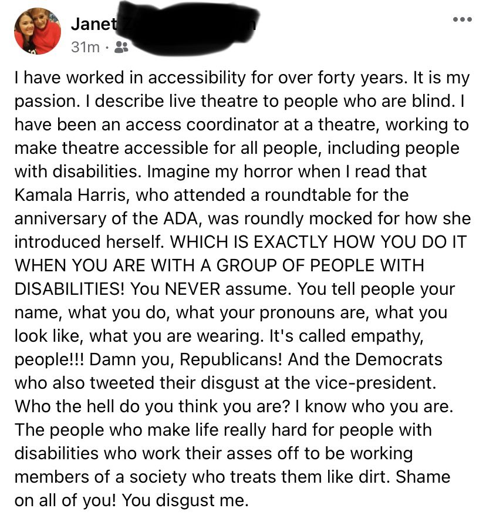
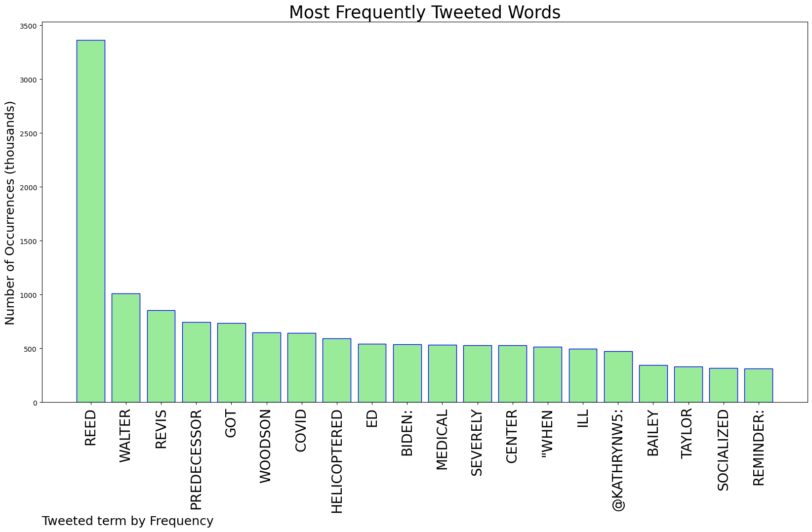
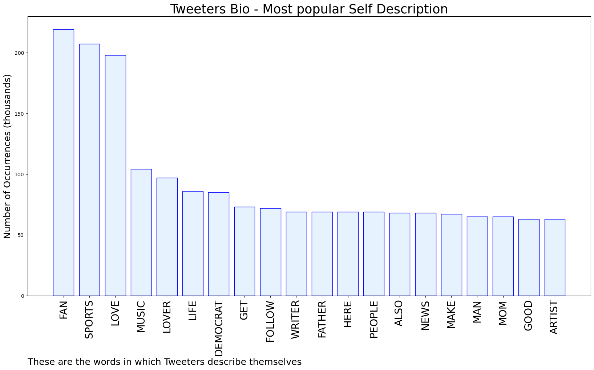

# MURCHIE85 TWITTER PROCESSING 
&#x1F34E; **TOPIC = "Reed"**

## AUTOMATED RESEARCH SUMMARY

*note: Image pulled from web automatically, not connected to author.
  
<b> This report is AUTOMATED and not hand crafted, it is designed for pulling metrics on a given keyword or hashtag and performs a series of reporting and analysis.</b>

|                **Sample-Tweets**        |
| :-------------: |
| With our experience, we're eager to put our expertise to work for you. For quality construction, Reed Brothers Cons… https://t.co/gdAUx3nNIW |
| RT @RBReich: Just a reminder: At Walter Reed they have socialized medicine. |
| RT @frynaomifry: i went on jokermen to talk lou reed and we went deep!!!! |

The most popular user is: **reed_vettel**

 RT @F1: BREAKING: Sebastian Vettel has announced he will retire from F1 at the end of the 2022 season

4 world titles
53 race wins
122 podi…

## RELATED METRICS 
| Metric | Value |
| ------------- | ------------- |
| #1 Most tweeted to  | **nflthrowback** |
| #2 Most tweeted to  | **kathrynw5** |
| #3 Most tweeted to  | **RBReich** |
| NewProfiles (less than 10 days) | 1.18%  |
| Tweeters with < 10 followers  | 6.06%|
| Tweeters with > 1000000 followers  | 0.02%  |

## MOST POPULAR TWEET TERMS 

| Popularity Rank  | Term |
| ------------- | ------------- |
| first  | **REED**  |
| second  | **WALTER**  |
| third  | **REVIS** |
| fourth  | **PREDECESSOR**  |
| fifth  | **GOT**  |

## Twitter Bio Analysis
### SENTIMENT ANALYSIS

VIEWS WERE : **SUBJECTIVE**  (13.33%) & **NEGATIVELY-SUBJECTIVE** (13.33%) **OBJECTIVE** (73.33%)

### TWEET SAMPLE 
| Random value picked from array |
| ------------- |
|RT @RBReich: Just a reminder: At Walter Reed they have socialized medicine. |

### MOST RETWEETED 

| The most retweeted user is: **reed_vettel**  |
| ------------- |
| RT @F1: BREAKING: Sebastian Vettel has announced he will retire from F1 at the end of the 2022 season4 world titles53 race wins122 podi… |

### CONCLUSION & EXTERNAL ANALYSIS

*This is my [Adam McMurchie`s] opinion on the data from the tweets, it serves as no objective truth.Since the tweets themselves are a mixture of fact & opinion. 
Authors analytical summary on request.
**RECOMMENDATIONS** WILL BE UPDATED IN NEXT  24 HOURS  