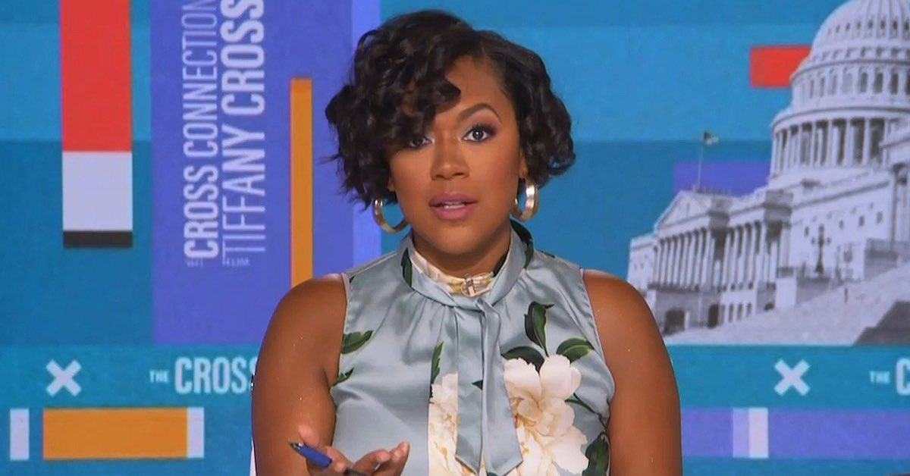
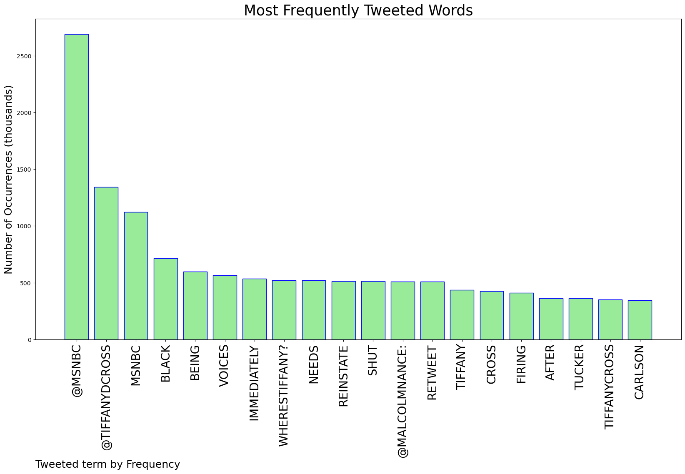
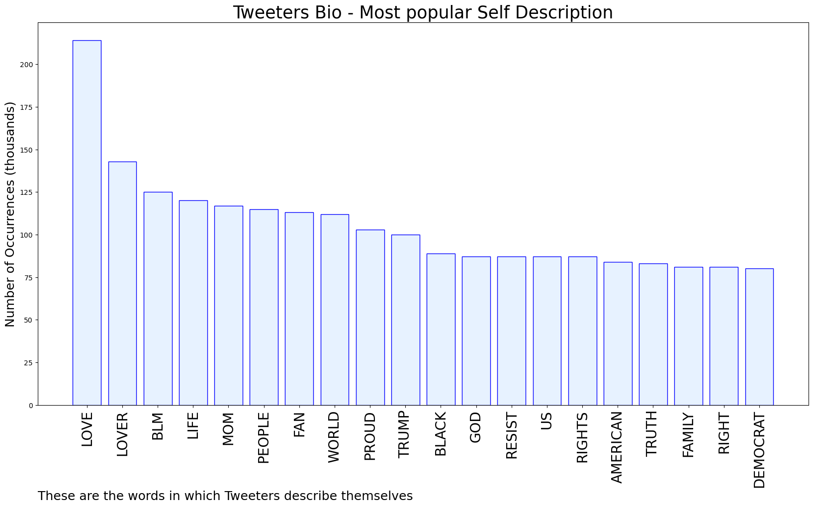

# MURCHIE85 TWITTER PROCESSING 
&#x1F34E; **TOPIC = "MSNBC"**

## AUTOMATED RESEARCH SUMMARY

*note: Image pulled from web automatically, not connected to author.
  
<b> This report is AUTOMATED and not hand crafted, it is designed for pulling metrics on a given keyword or hashtag and performs a series of reporting and analysis.</b>

|                **Sample-Tweets**        |
| :-------------: |
| RT @MalcolmNance: RETWEET #WheresTiffany? If you think @MSNBC needs to reinstate @TiffanyDCross IMMEDIATELY. Black voices being shut out of… |
| @kylegriffin1 @MSNBC He owns it now, so suck it up |
| @BodhidogPhoenix @ElieNYC @MHarrisPerry @TheTakeaway @MSNBC "working on whiteness"What does that even mean? |

The most popular user is: **heilmanbaRobert**

 RT @EileenM60933733: “Liz Cheney and I are not brave. We are just surrounded by cowards”
Adam Kinzinger @MSNBC

## RELATED METRICS 
| Metric | Value |
| ------------- | ------------- |
| #1 Most tweeted to  | **MSNBC** |
| #2 Most tweeted to  | **TiffanyDCross** |
| #3 Most tweeted to  | **kylegriffin1** |
| NewProfiles (less than 10 days) | 4.62%  |
| Tweeters with < 10 followers  | 8.88%|
| Tweeters with > 1000000 followers  | 0.04%  |

## MOST POPULAR TWEET TERMS 

| Popularity Rank  | Term |
| ------------- | ------------- |
| first  | **@MSNBC**  |
| second  | **@TIFFANYDCROSS**  |
| third  | **MSNBC** |
| fourth  | **BLACK**  |
| fifth  | **BEING**  |

## Twitter Bio Analysis
### SENTIMENT ANALYSIS

VIEWS WERE : **SUBJECTIVE**  (14.29%) & **NEGATIVELY-SUBJECTIVE** (28.57%) **OBJECTIVE** (57.14%)

### TWEET SAMPLE 
| Random value picked from array |
| ------------- |
|RT @TheRDFloyd: @kylegriffin1 @MSNBC Define "misinformation" and don't use one of your third party "fact checkers" for help. |

### MOST RETWEETED 

| The most retweeted user is: **heilmanbaRobert**  |
| ------------- |
| RT @EileenM60933733: “Liz Cheney and I are not brave. We are just surrounded by cowards”Adam Kinzinger @MSNBC |

### CONCLUSION & EXTERNAL ANALYSIS

*This is my [Adam McMurchie`s] opinion on the data from the tweets, it serves as no objective truth.Since the tweets themselves are a mixture of fact & opinion. 
Authors analytical summary on request.
**RECOMMENDATIONS** WILL BE UPDATED IN NEXT  24 HOURS  