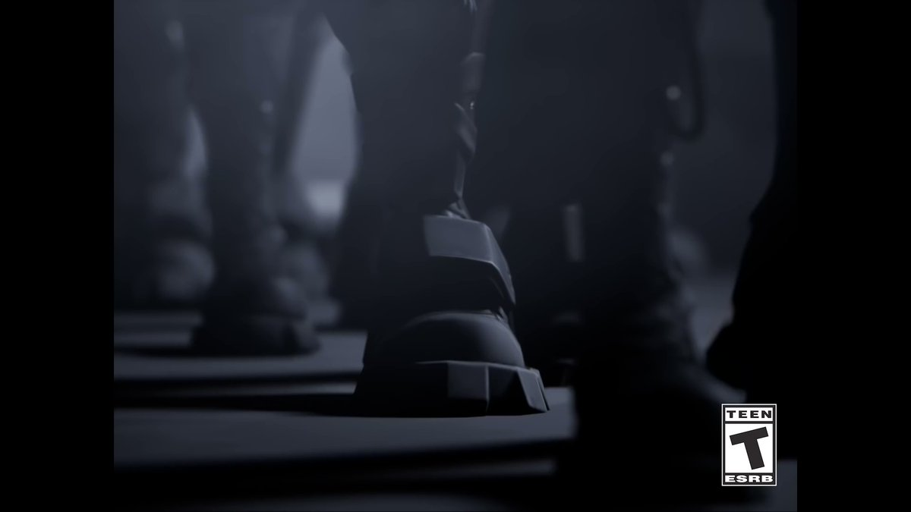
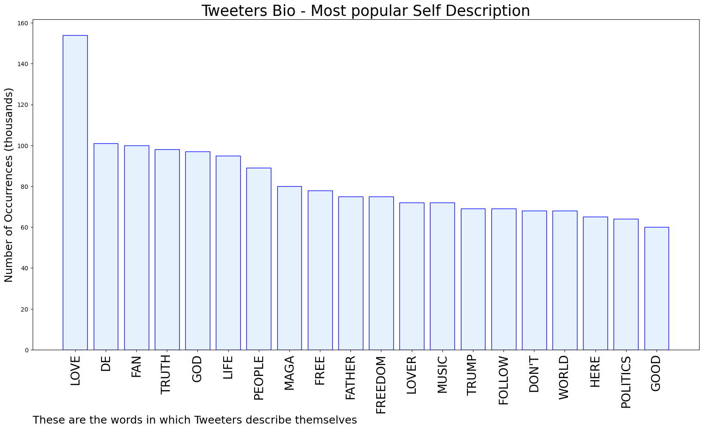
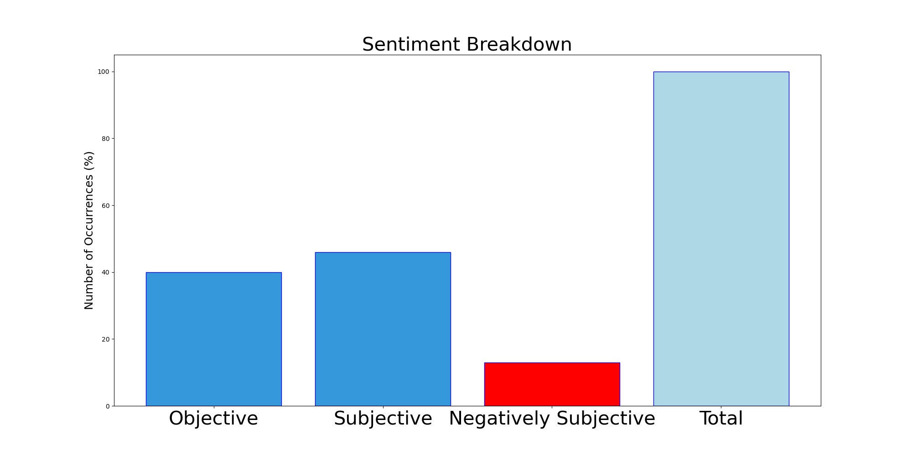

# MURCHIE85 TWITTER PROCESSING 
&#x1F34E; **TOPIC = "Apple"**

## AUTOMATED RESEARCH SUMMARY

*note: Image pulled from web automatically, not connected to author.
  
<b> This report is AUTOMATED and not hand crafted, it is designed for pulling metrics on a given keyword or hashtag and performs a series of reporting and analysis.</b>

|                **Sample-Tweets**        |
| :-------------: |
| RT @elonmusk: Apple should publish all censorship actions it has taken that affect its customers |
| So BlackRock is part owner of Apple? Shocker. This explains everything #Apple |
| @fishinthisweek @josephcwhite @TheRabbitHole84 @elonmusk Where on this chart does it show leadership at Apple donated to the Dems? |

The most popular user is: **ozrenac**

 RT @elonmusk: Apple has mostly stopped advertising on Twitter. Do they hate free speech in America?

## RELATED METRICS 
| Metric | Value |
| ------------- | ------------- |
| #1 Most tweeted to  | **elonmusk** |
| #2 Most tweeted to  | **Apple** |
| #3 Most tweeted to  | **tim_cook** |
| NewProfiles (less than 10 days) | 3.0%  |
| Tweeters with < 10 followers  | 9.6%|
| Tweeters with > 1000000 followers  | 0.06%  |

## MOST POPULAR TWEET TERMS 

| Popularity Rank  | Term |
| ------------- | ------------- |
| first  | **APPLE**  |
| second  | **TWITTER**  |
| third  | **@ELONMUSK:** |
| fourth  | **APP**  |
| fifth  | **STORE**  |

## Twitter Bio Analysis
### SENTIMENT ANALYSIS

VIEWS WERE : **SUBJECTIVE**  (46.67%) & **NEGATIVELY-SUBJECTIVE** (13.33%) **OBJECTIVE** (40.0%)

### TWEET SAMPLE 
| Random value picked from array |
| ------------- |
|Imaging complaining about Apple while tweeting from an iPhone. https://t.co/8Die5CinQD |

### MOST RETWEETED 

| The most retweeted user is: **ozrenac**  |
| ------------- |
| RT @elonmusk: Apple has mostly stopped advertising on Twitter. Do they hate free speech in America? |

### CONCLUSION & EXTERNAL ANALYSIS

*This is my [Adam McMurchie`s] opinion on the data from the tweets, it serves as no objective truth.Since the tweets themselves are a mixture of fact & opinion. 
Authors analytical summary on request.
**RECOMMENDATIONS** WILL BE UPDATED IN NEXT  24 HOURS  