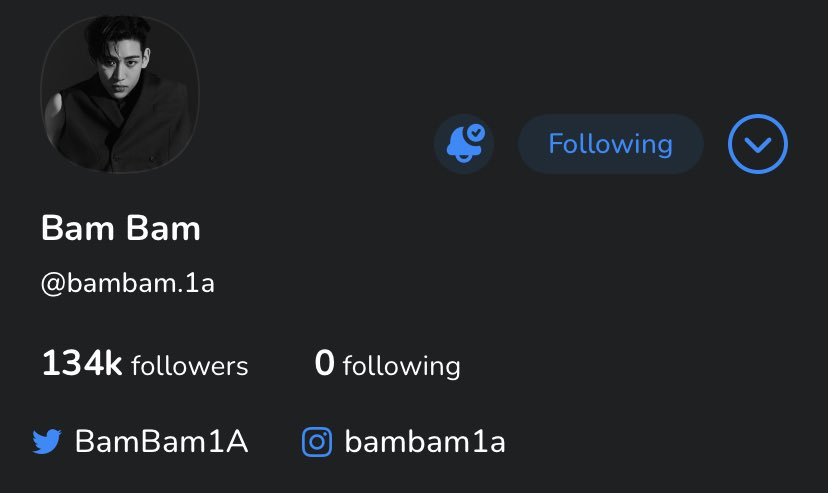
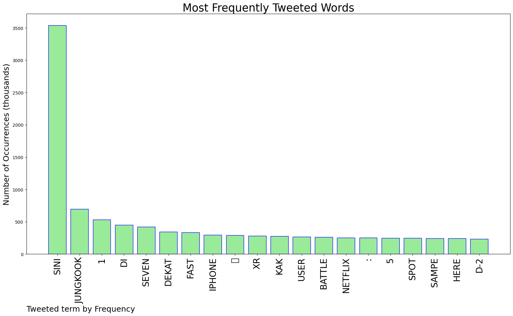
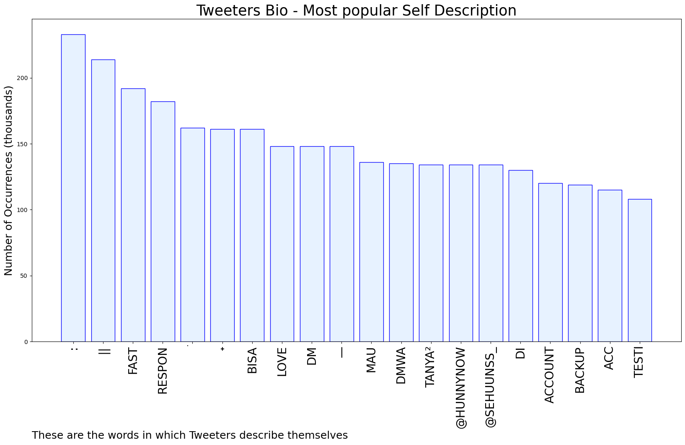
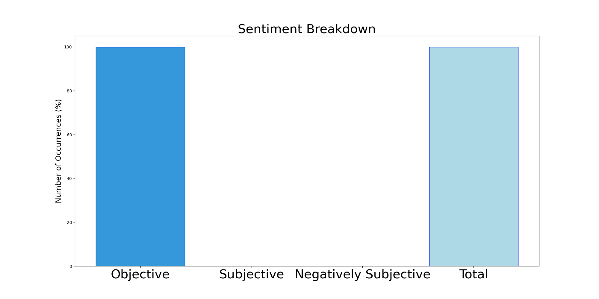

# MURCHIE85 TWITTER PROCESSING 
&#x1F34E; **TOPIC = "Sini"**

## AUTOMATED RESEARCH SUMMARY

*note: Image pulled from web automatically, not connected to author.
  
<b> This report is AUTOMATED and not hand crafted, it is designed for pulling metrics on a given keyword or hashtag and performs a series of reporting and analysis.</b>

|                **Sample-Tweets**        |
| :-------------: |
| i might need to kill sukuna myself lah sini jo gue bantuin dah lu😭😭😭😭😭😭 |
| @lapakZB1 https://t.co/YpRGmC65Uu sini nder jump up ya bisa qris / spay laterr |
| @zheraze_ Yuk join sini, kak @dear_flwr lagi open reseller (opress)✓ Twitter Blue✓ Sosmed Needs ✓ Unlock Docs✓… https://t.co/NFL1TmvrCe |

The most popular user is: **sini_pin**

 RT @BamBam1A: 2023-2024 BamBam THE 1ST WORLD TOUR [AREA 52]

23.09.16. SEOUL
23.09.22. MANILA
23.09.30. MACAU
23.10.15. KUALA LUMPUR
23.10.…

## RELATED METRICS 
| Metric | Value |
| ------------- | ------------- |
| #1 Most tweeted to  | **jeffrazi** |
| #2 Most tweeted to  | **7btsupdates** |
| #3 Most tweeted to  | **BanyuSadewa** |
| NewProfiles (less than 10 days) | 1.26%  |
| Tweeters with < 10 followers  | 7.16%|
| Tweeters with > 1000000 followers  | 0.02%  |

## MOST POPULAR TWEET TERMS 

| Popularity Rank  | Term |
| ------------- | ------------- |
| first  | **SINI**  |
| second  | **JUNGKOOK**  |
| third  | **1** |
| fourth  | **DI**  |
| fifth  | **SEVEN**  |

## Twitter Bio Analysis
### SENTIMENT ANALYSIS

VIEWS WERE : **SUBJECTIVE**  (0.0%) & **NEGATIVELY-SUBJECTIVE** (0.0%) **OBJECTIVE** (100.0%)

### TWEET SAMPLE 
| Random value picked from array |
| ------------- |
|@vaancxme get 900k sung cair / get 920 reg cair soreee kaaa sini 🤗 https://t.co/Bs6Chzvw4G |

### MOST RETWEETED 

| The most retweeted user is: **sini_pin**  |
| ------------- |
| RT @BamBam1A: 2023-2024 BamBam THE 1ST WORLD TOUR [AREA 52]23.09.16. SEOUL23.09.22. MANILA23.09.30. MACAU23.10.15. KUALA LUMPUR23.10.… |

### CONCLUSION & EXTERNAL ANALYSIS

*This is my [Adam McMurchie`s] opinion on the data from the tweets, it serves as no objective truth.Since the tweets themselves are a mixture of fact & opinion. 
Authors analytical summary on request.
**RECOMMENDATIONS** WILL BE UPDATED IN NEXT  24 HOURS  