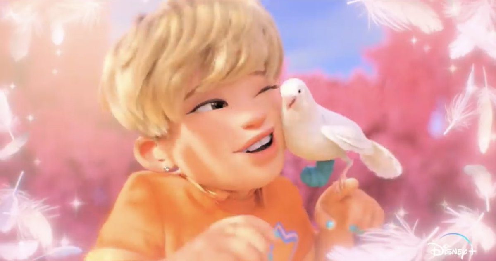
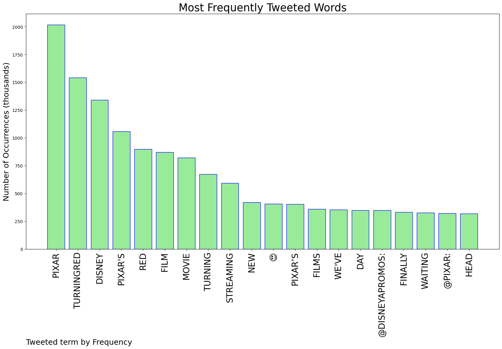

# MURCHIE85 TWITTER PROCESSING 
&#x1F34E; **TOPIC = "Pixar"**

## AUTOMATED RESEARCH SUMMARY

*note: Image pulled from web automatically, not connected to author.
  
<b> This report is AUTOMATED and not hand crafted, it is designed for pulling metrics on a given keyword or hashtag and performs a series of reporting and analysis.</b>

|                **Sample-Tweets**        |
| :-------------: |
| RT @OgrePixel: Today the new #pixar movie #TurningRed premieres on #DisneyPlus! 💫The film is a metaphor for puberty and all the changes it… |
| RT @JuddLegum: BREAKING: Today's statement by @Disney CEO Bob Chapek against the "Don't Say Gay" bill has failed to satisfy many Disney emp… |
| RT @jmartinwrites: “We at Pixar have personally witnessed beautiful stories, full of diverse characters, come back from Disney corporate re… |

The most popular user is: **BEAUU_A**

 RT @mrjohndarby: me: how can I impress your dad?

gf: he's really into cars

me: ok

[later]
her dad: nice to meet you

me: let's talk abou…

## RELATED METRICS 
| Metric | Value |
| ------------- | ------------- |
| #1 Most tweeted to  | **Pixar** |
| #2 Most tweeted to  | **DisneyAPromos** |
| #3 Most tweeted to  | **PixarTurningRed** |
| NewProfiles (less than 10 days) | 0.66%  |
| Tweeters with < 10 followers  | 5.6%|
| Tweeters with > 1000000 followers  | 0.56%  |

## MOST POPULAR TWEET TERMS 

| Popularity Rank  | Term |
| ------------- | ------------- |
| first  | **PIXAR**  |
| second  | **TURNINGRED**  |
| third  | **DISNEY** |
| fourth  | **"PIXARS"**  |
| fifth  | **RED**  |

## Twitter Bio Analysis
### SENTIMENT ANALYSIS

VIEWS WERE : **SUBJECTIVE**  (40.0%) & **NEGATIVELY-SUBJECTIVE** (13.33%) **OBJECTIVE** (46.67%)

### TWEET SAMPLE 
| Random value picked from array |
| ------------- |
|RT @DisneyAPromos: New official poster for Pixar's #TurningRed with art by Hana Augustine.The film and a documentary about its making hit… |

### MOST RETWEETED 

| The most retweeted user is: **BEAUU_A**  |
| ------------- |
| RT @mrjohndarby: me: how can I impress your dad?gf: he's really into carsme: ok[later]her dad: nice to meet youme: let's talk abou… |

### CONCLUSION & EXTERNAL ANALYSIS

*This is my [Adam McMurchie`s] opinion on the data from the tweets, it serves as no objective truth.Since the tweets themselves are a mixture of fact & opinion. 
Authors analytical summary on request.
**RECOMMENDATIONS** WILL BE UPDATED IN NEXT  24 HOURS  