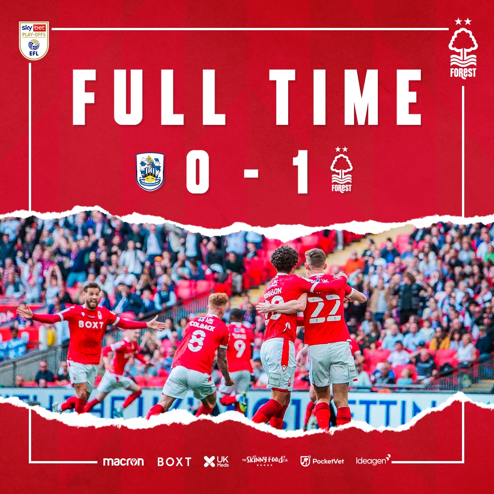
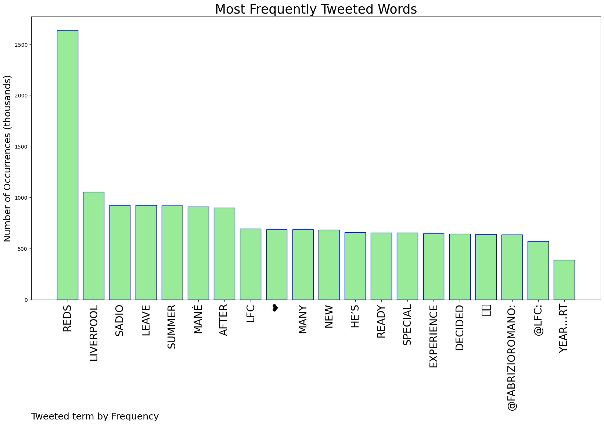

# MURCHIE85 TWITTER PROCESSING 
&#x1F34E; **TOPIC = "Reds"**

## AUTOMATED RESEARCH SUMMARY

*note: Image pulled from web automatically, not connected to author.
  
<b> This report is AUTOMATED and not hand crafted, it is designed for pulling metrics on a given keyword or hashtag and performs a series of reporting and analysis.</b>

|                **Sample-Tweets**        |
| :-------------: |
| RT @brfootball: Sadio Mané will leave Liverpool this summer, reports @FabrizioRomanoIn his six years with the Reds, he won it all 👏 https… |
| Evan Longoria is here to save us from the embarrassment of being swept by the Reds. |
| Yesssss you reds 🔴⚪️ #NFFC https://t.co/7r5kLZdp1Q |

The most popular user is: **MaybeNotArsenal**

 RT @FabrizioRomano: Sadio Mané has decided to leave Liverpool this summer 🚨🔴 #LFC 

He’s ready for a new experience after many special year…

## RELATED METRICS 
| Metric | Value |
| ------------- | ------------- |
| #1 Most tweeted to  | **FabrizioRomano** |
| #2 Most tweeted to  | **LFC** |
| #3 Most tweeted to  | **brfootball** |
| NewProfiles (less than 10 days) | 0.5%  |
| Tweeters with < 10 followers  | 4.02%|
| Tweeters with > 1000000 followers  | 0.02%  |

## MOST POPULAR TWEET TERMS 

| Popularity Rank  | Term |
| ------------- | ------------- |
| first  | **REDS**  |
| second  | **LIVERPOOL**  |
| third  | **SADIO** |
| fourth  | **LEAVE**  |
| fifth  | **SUMMER**  |

## Twitter Bio Analysis
### SENTIMENT ANALYSIS

VIEWS WERE : **SUBJECTIVE**  (26.67%) & **NEGATIVELY-SUBJECTIVE** (33.33%) **OBJECTIVE** (40.0%)

### TWEET SAMPLE 
| Random value picked from array |
| ------------- |
|RT @LFC: Up the Reds ❤️ https://t.co/QXgEmL7iPi |

### MOST RETWEETED 

| The most retweeted user is: **MaybeNotArsenal**  |
| ------------- |
| RT @FabrizioRomano: Sadio Mané has decided to leave Liverpool this summer 🚨🔴 #LFC He’s ready for a new experience after many special year… |

### CONCLUSION & EXTERNAL ANALYSIS

*This is my [Adam McMurchie`s] opinion on the data from the tweets, it serves as no objective truth.Since the tweets themselves are a mixture of fact & opinion. 
Authors analytical summary on request.
**RECOMMENDATIONS** WILL BE UPDATED IN NEXT  24 HOURS  