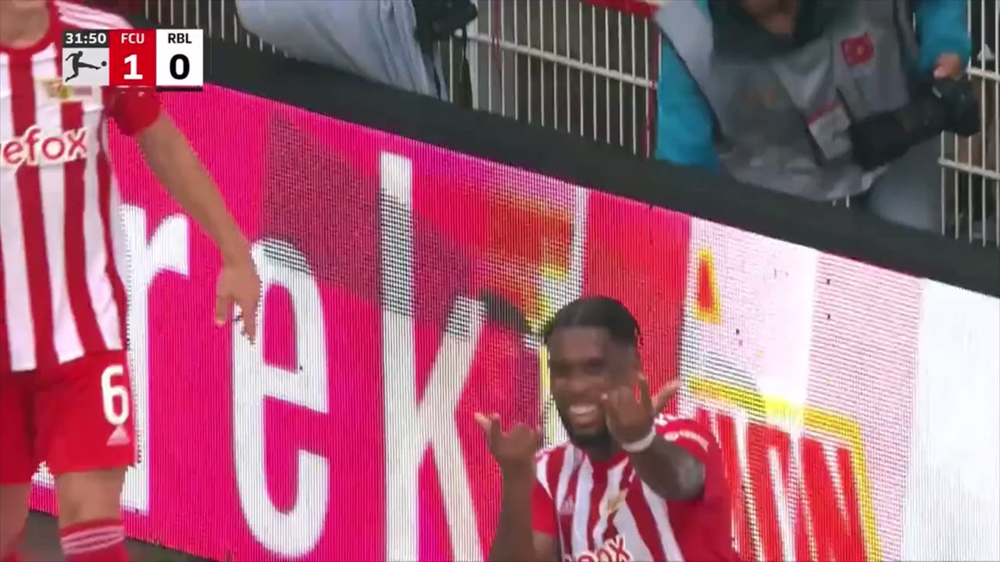
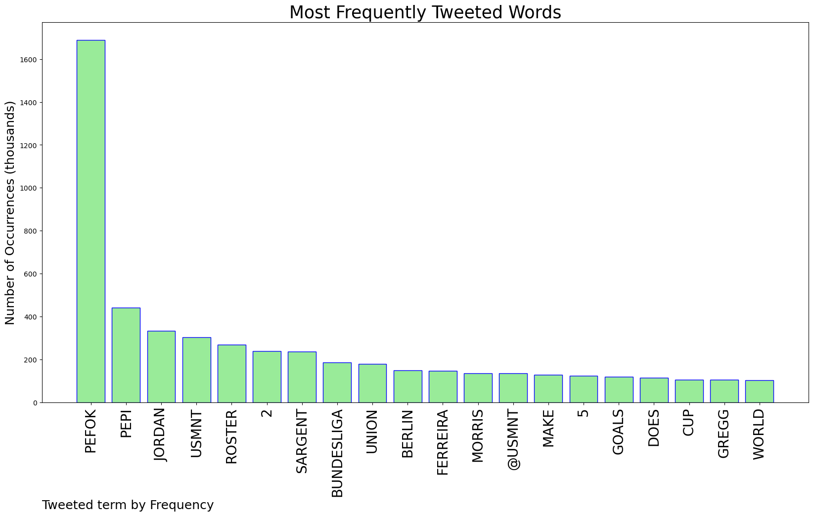
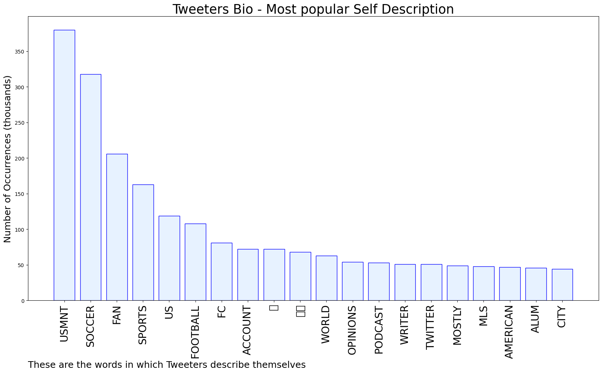

# MURCHIE85 TWITTER PROCESSING 
&#x1F34E; **TOPIC = "Pefok"**

## AUTOMATED RESEARCH SUMMARY

*note: Image pulled from web automatically, not connected to author.
  
<b> This report is AUTOMATED and not hand crafted, it is designed for pulling metrics on a given keyword or hashtag and performs a series of reporting and analysis.</b>

|                **Sample-Tweets**        |
| :-------------: |
| @Isick007 @the_bonnfire Agreed, I want to see Pefok after he’s played so well for Union Berlin. I probably would ha… https://t.co/pCroknZsR9 |
| RT @usmntonly: Jordan Pefok does not make the USMNT roster. He has 2 goals and 2 assists in 5 Bundesliga appearances for Union Berlin, who… |
| RT @smoothie_comps: Big misses by #USMNT strikers since World Cup qualifying started:6 - Ferreira3 - Pepi1 - Pefok, Wright https://t.co/… |

The most popular user is: **JoeyHashtag**

 RT @usmntonly: Jordan Pefok does not make the USMNT roster. He has 2 goals and 2 assists in 5 Bundesliga appearances for Union Berlin, who…

## RELATED METRICS 
| Metric | Value |
| ------------- | ------------- |
| #1 Most tweeted to  | **USMNT** |
| #2 Most tweeted to  | **usmntonly** |
| #3 Most tweeted to  | **ManagerTactical** |
| NewProfiles (less than 10 days) | 0.79%  |
| Tweeters with < 10 followers  | 6.76%|
| Tweeters with > 1000000 followers  | 0.0%  |

## MOST POPULAR TWEET TERMS 

| Popularity Rank  | Term |
| ------------- | ------------- |
| first  | **PEFOK**  |
| second  | **PEPI**  |
| third  | **JORDAN** |
| fourth  | **USMNT**  |
| fifth  | **ROSTER**  |

## Twitter Bio Analysis
### SENTIMENT ANALYSIS

VIEWS WERE : **SUBJECTIVE**  (13.33%) & **NEGATIVELY-SUBJECTIVE** (20.0%) **OBJECTIVE** (66.67%)

### TWEET SAMPLE 
| Random value picked from array |
| ------------- |
|@gabeberger7 @usmntonly @USMNT Pefok is injured currently |

### MOST RETWEETED 

| The most retweeted user is: **JoeyHashtag**  |
| ------------- |
| RT @usmntonly: Jordan Pefok does not make the USMNT roster. He has 2 goals and 2 assists in 5 Bundesliga appearances for Union Berlin, who… |

### CONCLUSION & EXTERNAL ANALYSIS

*This is my [Adam McMurchie`s] opinion on the data from the tweets, it serves as no objective truth.Since the tweets themselves are a mixture of fact & opinion. 
Authors analytical summary on request.
**RECOMMENDATIONS** WILL BE UPDATED IN NEXT  24 HOURS  