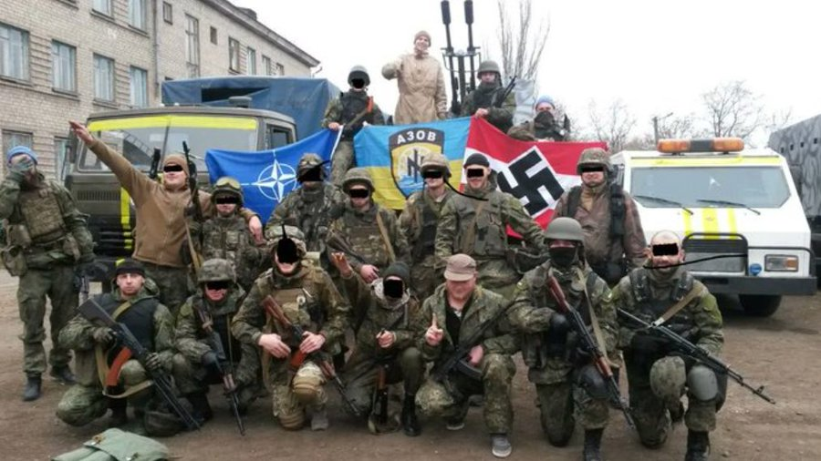
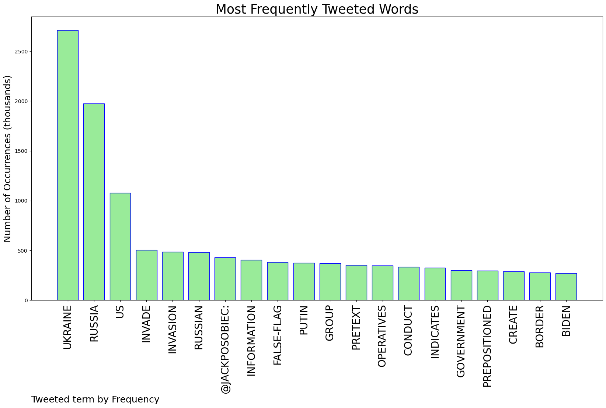
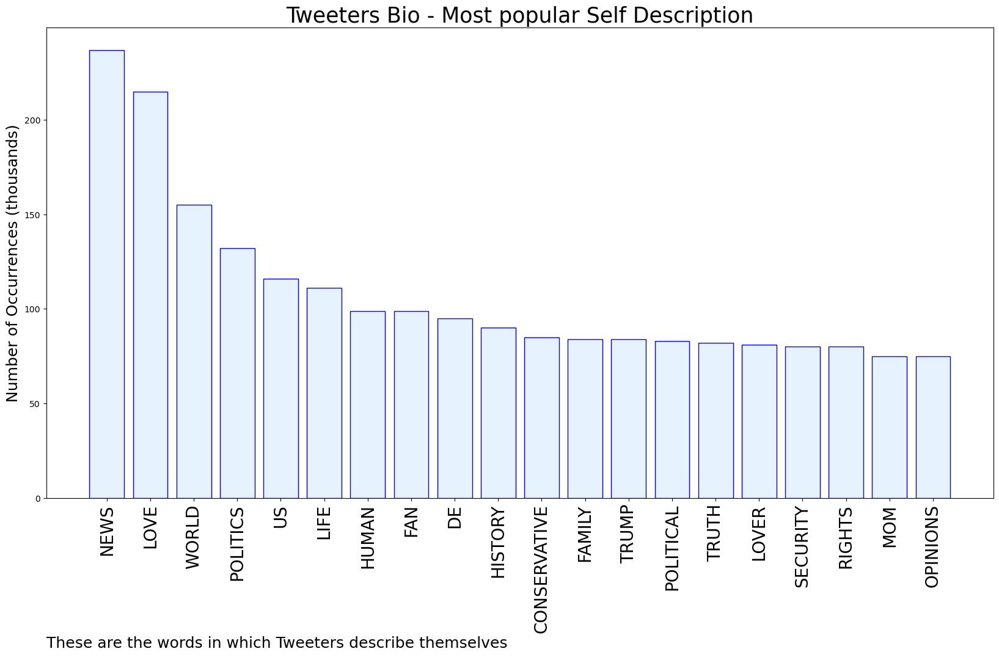

# MURCHIE85 TWITTER PROCESSING 
&#x1F34E; **TOPIC = "Ukraine"**

## AUTOMATED RESEARCH SUMMARY

*note: Image pulled from web automatically, not connected to author.
  
<b> This report is AUTOMATED and not hand crafted, it is designed for pulling metrics on a given keyword or hashtag and performs a series of reporting and analysis.</b>

|                **Sample-Tweets**        |
| :-------------: |
| The administration believes Russia is also laying the groundwork by framing Ukraine as an aggressor that has been p… https://t.co/u2430kuJDc |
| U.S. Considers Backing an Insurgency in Ukraine https://t.co/npVZ4skcIJ -- Here come the Democrats with billions of… https://t.co/VVFCJc2ZVA |
| Hey NATO...tell Putin to go f himself and give Ukraine full membership. The only thing he understands is force. And… https://t.co/rNF11ET24Z |

The most popular user is: **japanesetooru**

 RT @DAlperovitch: In the last few weeks, I have become increasingly convinced that Kremlin has unfortunately made a decision to invade Ukra…

## RELATED METRICS 
| Metric | Value |
| ------------- | ------------- |
| #1 Most tweeted to  | **JackPosobiec** |
| #2 Most tweeted to  | **NatashaBertrand** |
| #3 Most tweeted to  | **caslernoel** |
| NewProfiles (less than 10 days) | 0.84%  |
| Tweeters with < 10 followers  | 4.02%|
| Tweeters with > 1000000 followers  | 0.16%  |

## MOST POPULAR TWEET TERMS 

| Popularity Rank  | Term |
| ------------- | ------------- |
| first  | **UKRAINE**  |
| second  | **RUSSIA**  |
| third  | **US** |
| fourth  | **INVADE**  |
| fifth  | **INVASION**  |

## Twitter Bio Analysis
### SENTIMENT ANALYSIS

VIEWS WERE : **SUBJECTIVE**  (13.33%) & **NEGATIVELY-SUBJECTIVE** (13.33%) **OBJECTIVE** (73.33%)

### TWEET SAMPLE 
| Random value picked from array |
| ------------- |
|RT @GlasnostGone: US claims Russia's plotting to stage acts of provocation to create a pretext to invade #Ukraine. Pentagon said Russian op… |

### MOST RETWEETED 

| The most retweeted user is: **japanesetooru**  |
| ------------- |
| RT @DAlperovitch: In the last few weeks, I have become increasingly convinced that Kremlin has unfortunately made a decision to invade Ukra… |

### CONCLUSION & EXTERNAL ANALYSIS

*This is my [Adam McMurchie`s] opinion on the data from the tweets, it serves as no objective truth.Since the tweets themselves are a mixture of fact & opinion. 
Authors analytical summary on request.
**RECOMMENDATIONS** WILL BE UPDATED IN NEXT  24 HOURS  