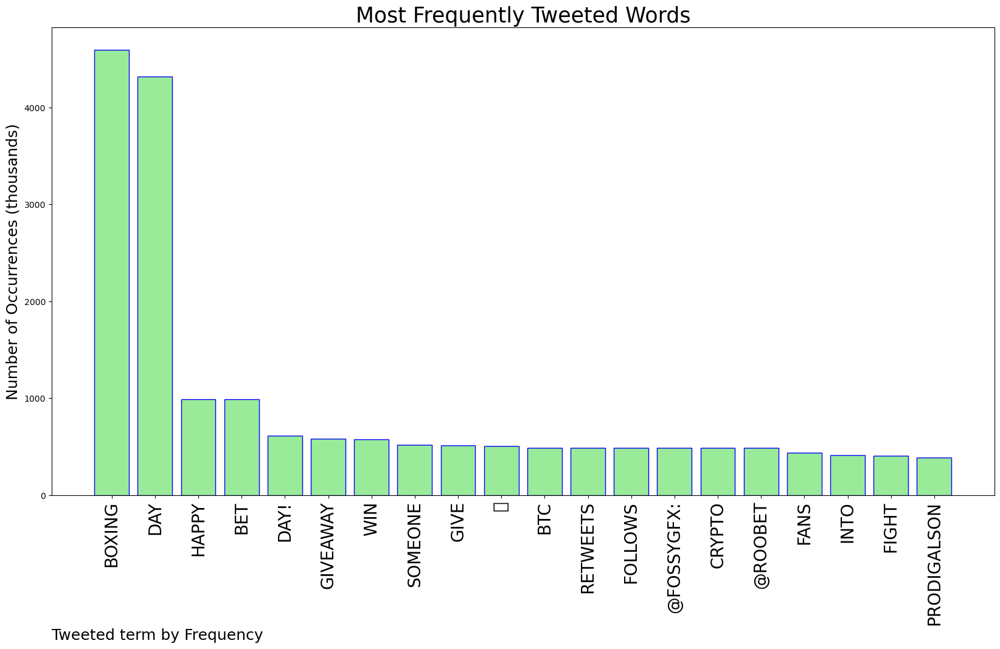
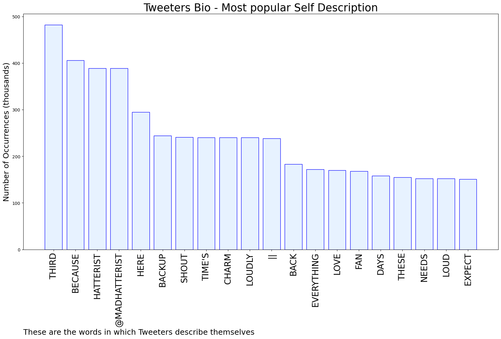

# MURCHIE85 TWITTER PROCESSING 
&#x1F34E; **TOPIC = "Boxing Day"**

## AUTOMATED RESEARCH SUMMARY

*note: Image pulled from web automatically, not connected to author.
  
<b> This report is AUTOMATED and not hand crafted, it is designed for pulling metrics on a given keyword or hashtag and performs a series of reporting and analysis.</b>

|                **Sample-Tweets**        |
| :-------------: |
| RT @BradleyCarl256: Sheila Gashumba has given us a boxing day bonanza😂 https://t.co/JedJXui7wL |
| RT @NatsWoodward: Boxing Day Swim ❄️💙 #exmouth #devon#seaswim https://t.co/Ka7l2zaedj |
| feel so ill. Is it the flu? cant go look for paracetamol as i can't lift my head.Happy boxing day. |

The most popular user is: **jeepers491**

 RT @ahmedhankir: Hi 👋 I'm Ahmed, I'm a Muslim mental health doctor. For the last 12 years, I've swapped shifts so colleagues can celebrate…

## RELATED METRICS 
| Metric | Value |
| ------------- | ------------- |
| #1 Most tweeted to  | **FossyGFX** |
| #2 Most tweeted to  | **Roobet** |
| #3 Most tweeted to  | **madhatterist2** |
| NewProfiles (less than 10 days) | 0.58%  |
| Tweeters with < 10 followers  | 5.06%|
| Tweeters with > 1000000 followers  | 0.16%  |

## MOST POPULAR TWEET TERMS 

| Popularity Rank  | Term |
| ------------- | ------------- |
| first  | **BOXING**  |
| second  | **DAY**  |
| third  | **HAPPY** |
| fourth  | **BET**  |
| fifth  | **DAY!**  |

## Twitter Bio Analysis
### SENTIMENT ANALYSIS

VIEWS WERE : **SUBJECTIVE**  (26.67%) & **NEGATIVELY-SUBJECTIVE** (6.67%) **OBJECTIVE** (66.67%)

### TWEET SAMPLE 
| Random value picked from array |
| ------------- |
|@UNH0LYPRINCE … Pushing in, bringing up some boxing day leftovers, and his Christmas present. Leaving ut it by… https://t.co/EP48KKLqjo |

### MOST RETWEETED 

| The most retweeted user is: **jeepers491**  |
| ------------- |
| RT @ahmedhankir: Hi 👋 I'm Ahmed, I'm a Muslim mental health doctor. For the last 12 years, I've swapped shifts so colleagues can celebrate… |

### CONCLUSION & EXTERNAL ANALYSIS

*This is my [Adam McMurchie`s] opinion on the data from the tweets, it serves as no objective truth.Since the tweets themselves are a mixture of fact & opinion. 
Authors analytical summary on request.
**RECOMMENDATIONS** WILL BE UPDATED IN NEXT  24 HOURS  