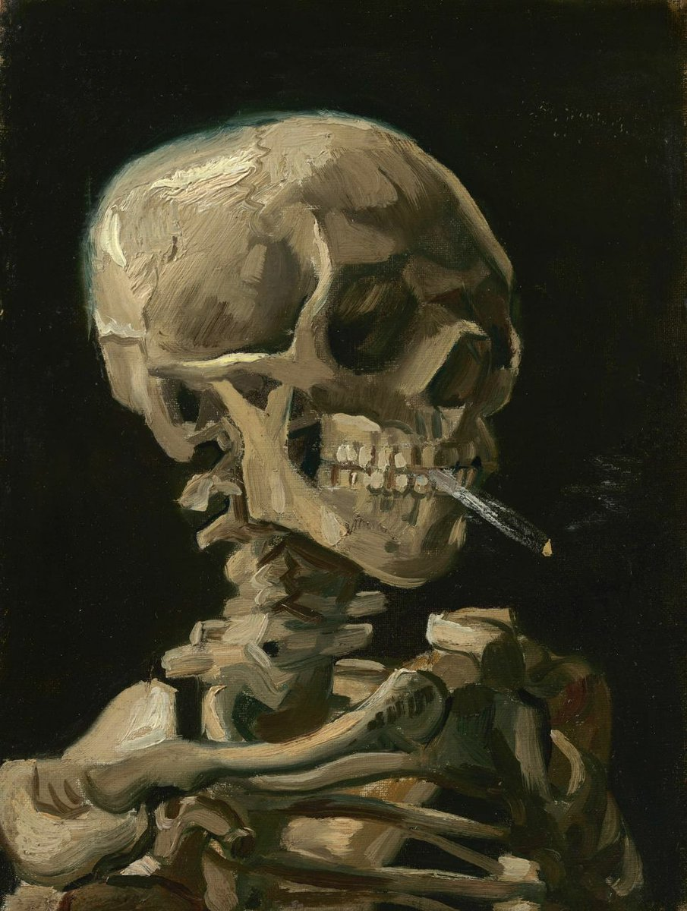
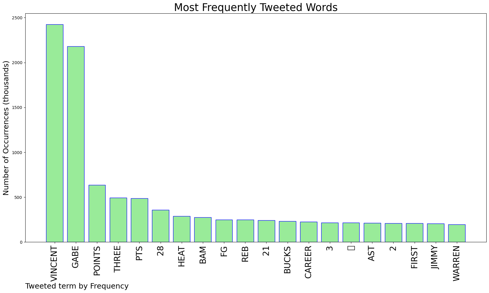
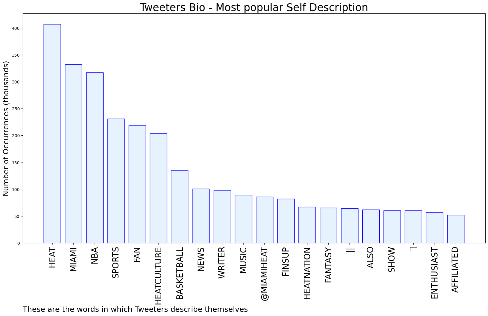
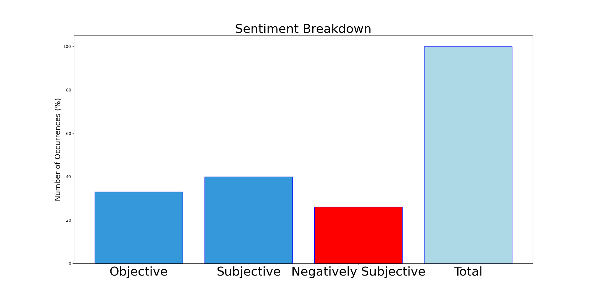

# MURCHIE85 TWITTER PROCESSING 
&#x1F34E; **TOPIC = "Gabe Vincent"**

## AUTOMATED RESEARCH SUMMARY

*note: Image pulled from web automatically, not connected to author.
  
<b> This report is AUTOMATED and not hand crafted, it is designed for pulling metrics on a given keyword or hashtag and performs a series of reporting and analysis.</b>

|                **Sample-Tweets**        |
| :-------------: |
| RT @AdamNBorai: Gabe Vincent... You have my attention https://t.co/6Va6AlEQaT |
| RT @NBA: Gabe Vincent's career-high 28 points power the @MiamiHEAT at home!Bam Adebayo: 24 PTS, 12 REBJimmy Butler: 17 PTS, 11 REBMax S… |
| Gabe Vincent looks like a Drake/JR Smith love child. |

The most popular user is: **Gabe_Mayhem**

 RT @sadhorrorr: by vincent van gogh https://t.co/MJIX7auR2v

## RELATED METRICS 
| Metric | Value |
| ------------- | ------------- |
| #1 Most tweeted to  | **HeatvsHaters** |
| #2 Most tweeted to  | **NBA** |
| #3 Most tweeted to  | **MiamiHEAT** |
| NewProfiles (less than 10 days) | 0.27%  |
| Tweeters with < 10 followers  | 1.37%|
| Tweeters with > 1000000 followers  | 0.33%  |

## MOST POPULAR TWEET TERMS 

| Popularity Rank  | Term |
| ------------- | ------------- |
| first  | **VINCENT**  |
| second  | **GABE**  |
| third  | **POINTS** |
| fourth  | **THREE**  |
| fifth  | **PTS**  |

## Twitter Bio Analysis
### SENTIMENT ANALYSIS

VIEWS WERE : **SUBJECTIVE**  (40.0%) & **NEGATIVELY-SUBJECTIVE** (26.67%) **OBJECTIVE** (33.33%)

### TWEET SAMPLE 
| Random value picked from array |
| ------------- |
|RT @HeatvsHaters: Gabe Vincent against the Bucks: 🔺28 points (career-high)🔺6 assists 🔺3 rebounds🔺2 steals🔺10/17 FG (5/11 3P) |

### MOST RETWEETED 

| The most retweeted user is: **Gabe_Mayhem**  |
| ------------- |
| RT @sadhorrorr: by vincent van gogh https://t.co/MJIX7auR2v |

### CONCLUSION & EXTERNAL ANALYSIS

*This is my [Adam McMurchie`s] opinion on the data from the tweets, it serves as no objective truth.Since the tweets themselves are a mixture of fact & opinion. 
Authors analytical summary on request.
**RECOMMENDATIONS** WILL BE UPDATED IN NEXT  24 HOURS  