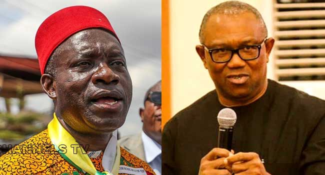
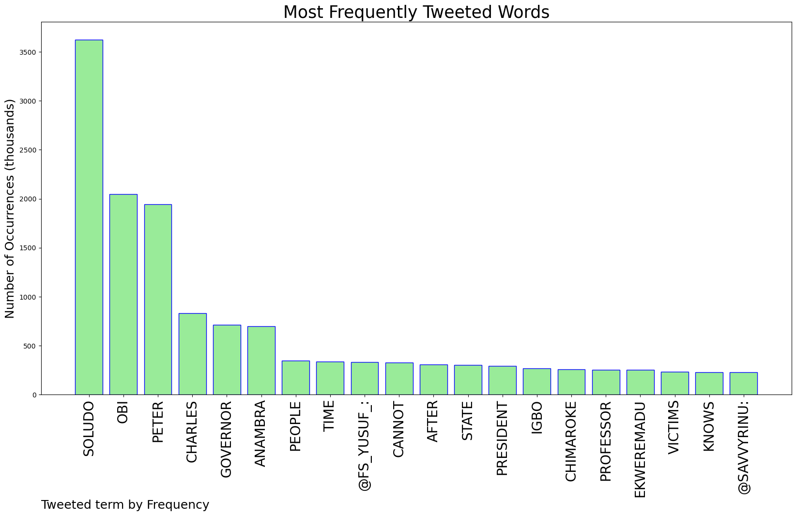
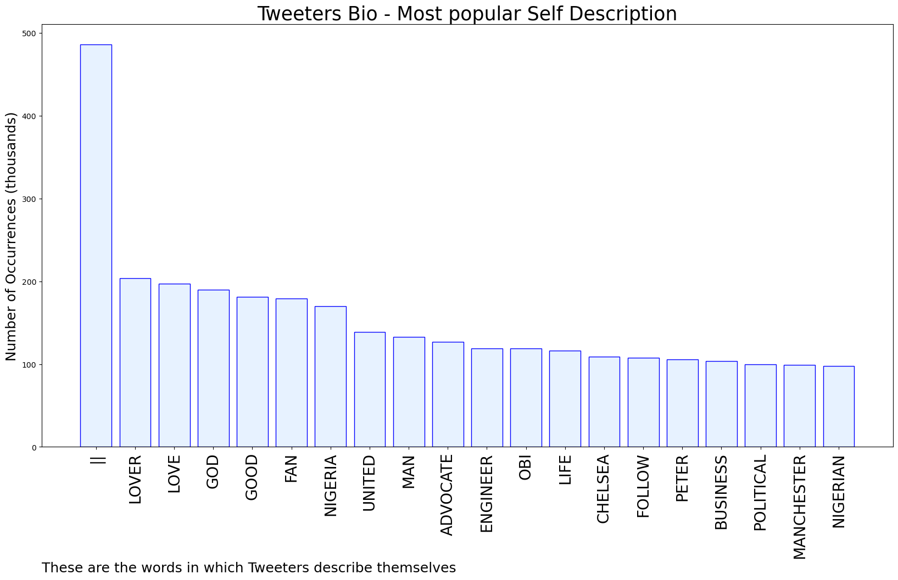
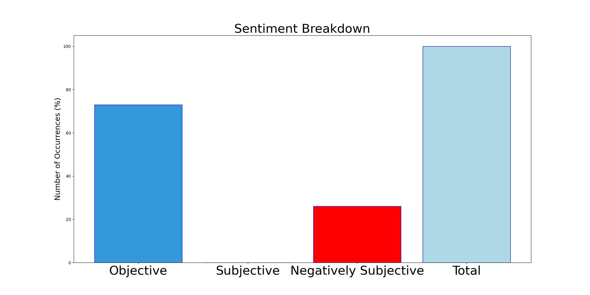

# MURCHIE85 TWITTER PROCESSING 
&#x1F34E; **TOPIC = "Soludo"**

## AUTOMATED RESEARCH SUMMARY

*note: Image pulled from web automatically, not connected to author.
  
<b> This report is AUTOMATED and not hand crafted, it is designed for pulling metrics on a given keyword or hashtag and performs a series of reporting and analysis.</b>

|                **Sample-Tweets**        |
| :-------------: |
| RT @AfamDeluxo: Emeka Ihedioha called Ndiigbo saboteurs. Charles Soludo just tagged us Nazis. What is our crime? Sigh! |
| RT @SavvyRinu: Charles Soludo doesn’t have time for the flood victims in Anambra but has the time to sit and write a series diatribe on Pet… |
| RT @OgbeniDipo: Social media abuse and trolling will not count in 2023. Happy that Professor Charles Soludo has re-echoed this. He is not a… |

The most popular user is: **OmagbemiGeorge**

 RT @ChudeMedia: Don’t be surprised, Soludo is part of establishment, jealous and envious of Peter Obi, this is Gov of Taraba state Confirmi…

## RELATED METRICS 
| Metric | Value |
| ------------- | ------------- |
| #1 Most tweeted to  | **FS_Yusuf_** |
| #2 Most tweeted to  | **SavvyRinu** |
| #3 Most tweeted to  | **VictorIsrael_** |
| NewProfiles (less than 10 days) | 1.64%  |
| Tweeters with < 10 followers  | 1.18%|
| Tweeters with > 1000000 followers  | 0.02%  |

## MOST POPULAR TWEET TERMS 

| Popularity Rank  | Term |
| ------------- | ------------- |
| first  | **SOLUDO**  |
| second  | **OBI**  |
| third  | **PETER** |
| fourth  | **CHARLES**  |
| fifth  | **GOVERNOR**  |

## Twitter Bio Analysis
### SENTIMENT ANALYSIS

VIEWS WERE : **SUBJECTIVE**  (0.0%) & **NEGATIVELY-SUBJECTIVE** (26.67%) **OBJECTIVE** (73.33%)

### TWEET SAMPLE 
| Random value picked from array |
| ------------- |
|RT @Topboychriss: Peter Obi should not reply Soludo.Soludo is looking for an excuse to run away from governance. He should focus on deliv… |

### MOST RETWEETED 

| The most retweeted user is: **OmagbemiGeorge**  |
| ------------- |
| RT @ChudeMedia: Don’t be surprised, Soludo is part of establishment, jealous and envious of Peter Obi, this is Gov of Taraba state Confirmi… |

### CONCLUSION & EXTERNAL ANALYSIS

*This is my [Adam McMurchie`s] opinion on the data from the tweets, it serves as no objective truth.Since the tweets themselves are a mixture of fact & opinion. 
Authors analytical summary on request.
**RECOMMENDATIONS** WILL BE UPDATED IN NEXT  24 HOURS  