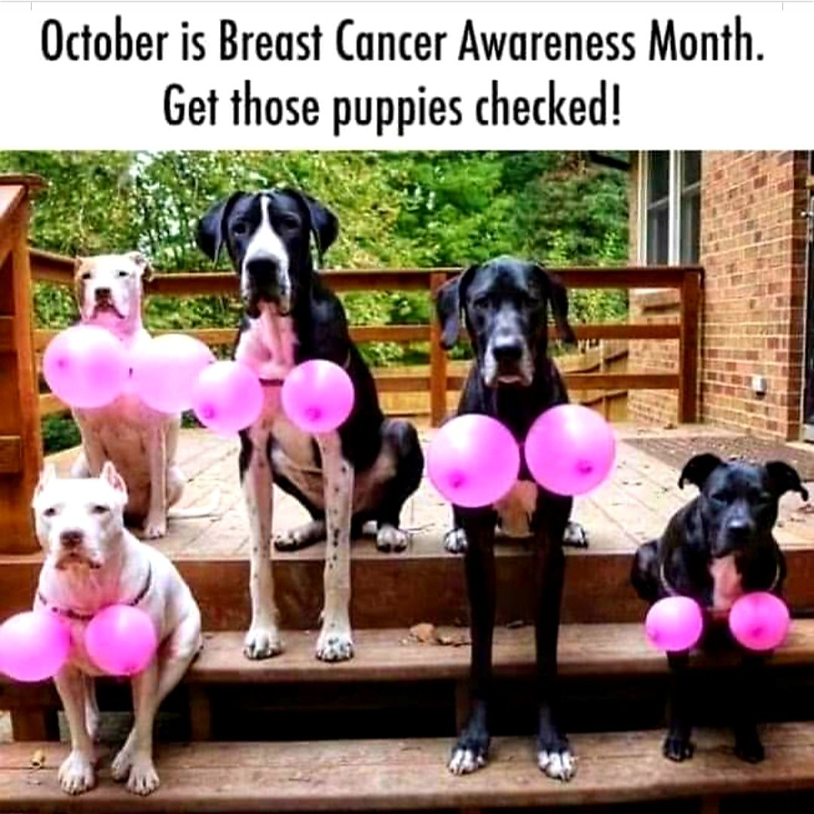
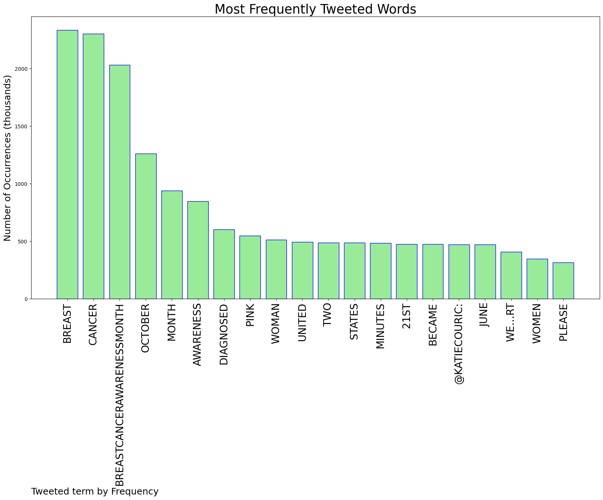
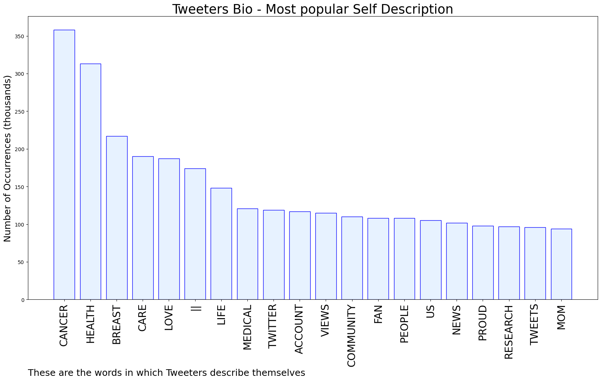

# MURCHIE85 TWITTER PROCESSING 
&#x1F34E; **TOPIC = "#BreastCancerAwarenessMonth"**

## AUTOMATED RESEARCH SUMMARY

*note: Image pulled from web automatically, not connected to author.
  
<b> This report is AUTOMATED and not hand crafted, it is designed for pulling metrics on a given keyword or hashtag and performs a series of reporting and analysis.</b>

|                **Sample-Tweets**        |
| :-------------: |
| RT @iHartEricka: #BreastCancerAwarenessMonth Stop gendering breast cancer! Stop donating to all white run/led billion dollar BC orgs! https… |
| Many breast cancer symptoms are invisible and not noticeable without a professional screening, but some symptoms ca… https://t.co/91aS7cdM1b |
| A special offer for the senior citizens#breastcancer #breastcancerawareness #breastcancerawarenessmonth… https://t.co/d8Np9TG4wy |

The most popular user is: **rozbat**

 RT @FLOTUS: You have so many things to take care of, and between work and family, a day that never ends... 

This #BreastCancerAwarenessMon…

## RELATED METRICS 
| Metric | Value |
| ------------- | ------------- |
| #1 Most tweeted to  | **katiecouric** |
| #2 Most tweeted to  | **ananavarro** |
| #3 Most tweeted to  | **TheGumFairy** |
| NewProfiles (less than 10 days) | 0.98%  |
| Tweeters with < 10 followers  | 4.28%|
| Tweeters with > 1000000 followers  | 0.16%  |

## MOST POPULAR TWEET TERMS 

| Popularity Rank  | Term |
| ------------- | ------------- |
| first  | **BREAST**  |
| second  | **CANCER**  |
| third  | **BREASTCANCERAWARENESSMONTH** |
| fourth  | **OCTOBER**  |
| fifth  | **MONTH**  |

## Twitter Bio Analysis
### SENTIMENT ANALYSIS

VIEWS WERE : **SUBJECTIVE**  (26.67%) & **NEGATIVELY-SUBJECTIVE** (26.67%) **OBJECTIVE** (46.67%)

### TWEET SAMPLE 
| Random value picked from array |
| ------------- |
|RT @NHSuk: It's #BreastCancerAwarenessMonth.Breast cancer can cause a number of signs and symptoms. Get used to checking regularly and be… |

### MOST RETWEETED 

| The most retweeted user is: **rozbat**  |
| ------------- |
| RT @FLOTUS: You have so many things to take care of, and between work and family, a day that never ends... This #BreastCancerAwarenessMon… |

### CONCLUSION & EXTERNAL ANALYSIS

*This is my [Adam McMurchie`s] opinion on the data from the tweets, it serves as no objective truth.Since the tweets themselves are a mixture of fact & opinion. 
Authors analytical summary on request.
**RECOMMENDATIONS** WILL BE UPDATED IN NEXT  24 HOURS  