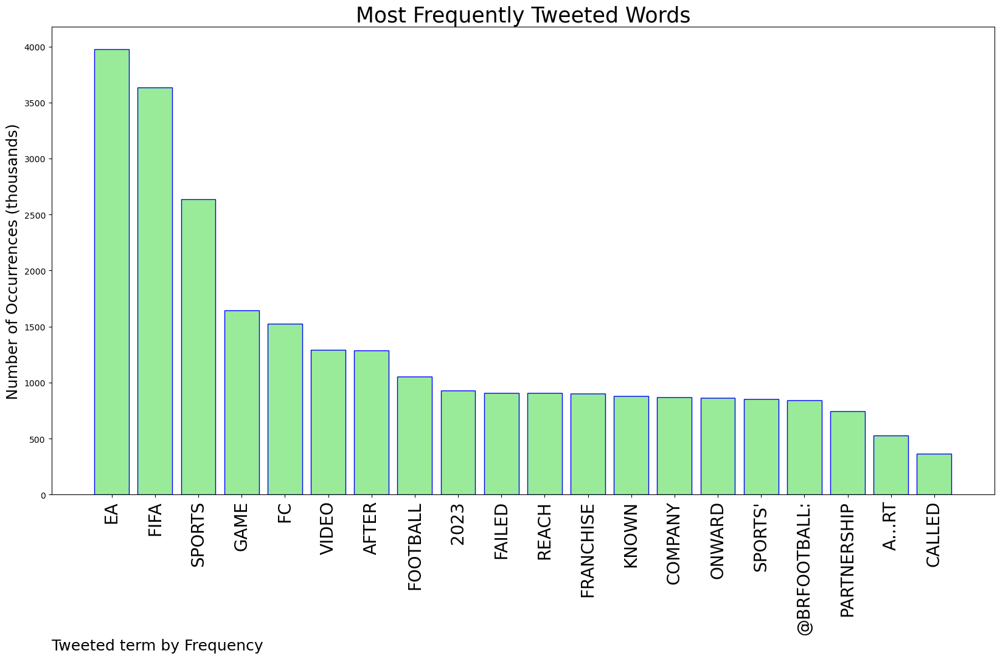
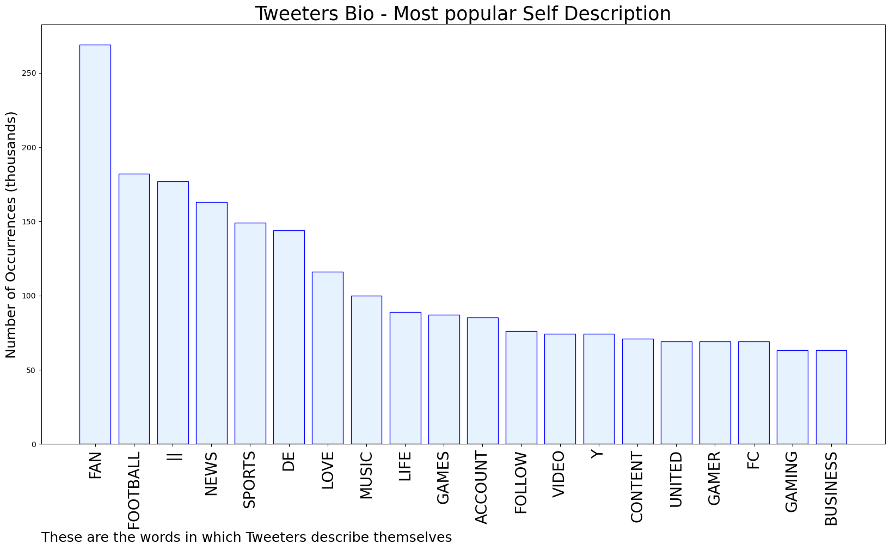
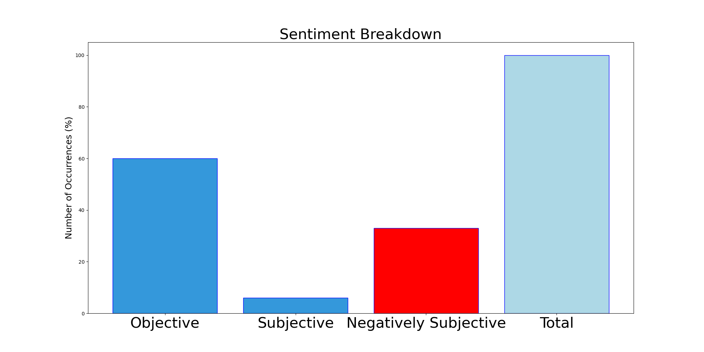

# MURCHIE85 TWITTER PROCESSING 
&#x1F34E; **TOPIC = "FIFA"**

## AUTOMATED RESEARCH SUMMARY

*note: Image pulled from web automatically, not connected to author.
  
<b> This report is AUTOMATED and not hand crafted, it is designed for pulling metrics on a given keyword or hashtag and performs a series of reporting and analysis.</b>

|                **Sample-Tweets**        |
| :-------------: |
| @2K this is your moment to get the rights to FIFA https://t.co/zNTSUUEfPM |
| RT @TMZ: EA Sports announced Tuesday its iconic partnership with FIFA is now over ... and its soccer video games will move forward as "EA S… |
| RT @Kotaku: EA's FIFA series loses its name after nearly 30 years: https://t.co/H7ZcyRGkEV https://t.co/v4umMynJUe |

The most popular user is: **RobinMg10**

 RT @valyeeet: men be at house parties saying "this song was on fifa"

## RELATED METRICS 
| Metric | Value |
| ------------- | ------------- |
| #1 Most tweeted to  | **brfootball** |
| #2 Most tweeted to  | **nytimes** |
| #3 Most tweeted to  | **Nibellion** |
| NewProfiles (less than 10 days) | 1.06%  |
| Tweeters with < 10 followers  | 6.44%|
| Tweeters with > 1000000 followers  | 0.18%  |

## MOST POPULAR TWEET TERMS 

| Popularity Rank  | Term |
| ------------- | ------------- |
| first  | **EA**  |
| second  | **FIFA**  |
| third  | **SPORTS** |
| fourth  | **GAME**  |
| fifth  | **FC**  |

## Twitter Bio Analysis
### SENTIMENT ANALYSIS

VIEWS WERE : **SUBJECTIVE**  (6.67%) & **NEGATIVELY-SUBJECTIVE** (33.33%) **OBJECTIVE** (60.0%)

### TWEET SAMPLE 
| Random value picked from array |
| ------------- |
|Lads, how are you all feeling about the Fifa game news? 😬 |

### MOST RETWEETED 

| The most retweeted user is: **RobinMg10**  |
| ------------- |
| RT @valyeeet: men be at house parties saying "this song was on fifa" |

### CONCLUSION & EXTERNAL ANALYSIS

*This is my [Adam McMurchie`s] opinion on the data from the tweets, it serves as no objective truth.Since the tweets themselves are a mixture of fact & opinion. 
Authors analytical summary on request.
**RECOMMENDATIONS** WILL BE UPDATED IN NEXT  24 HOURS  