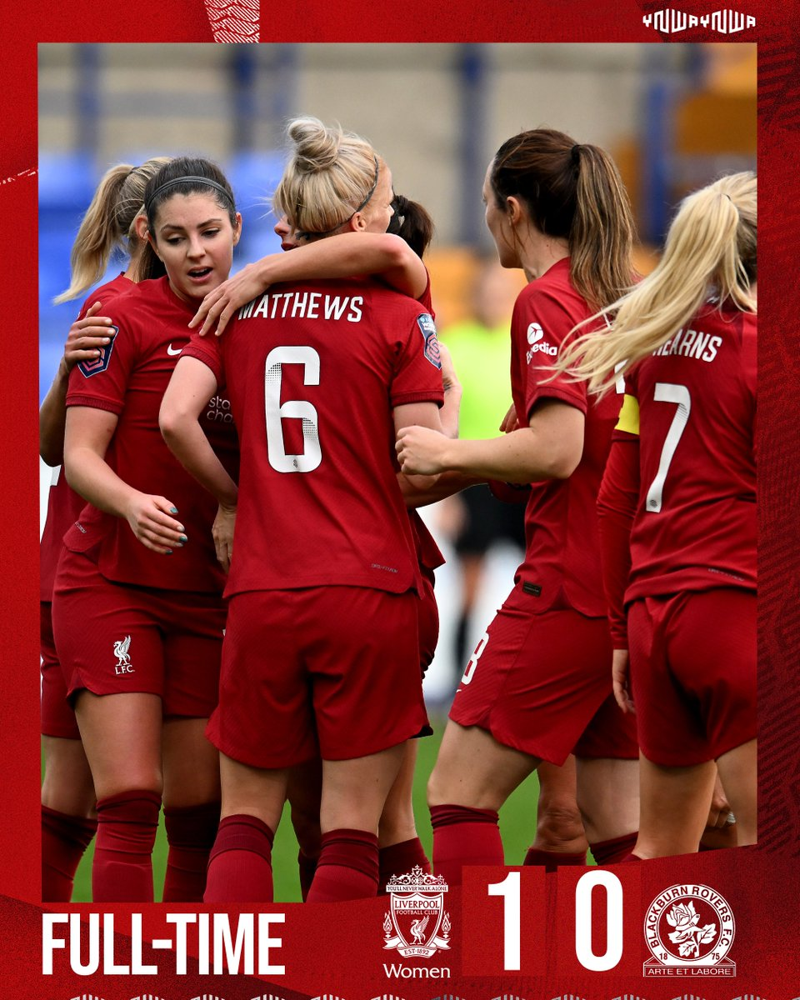
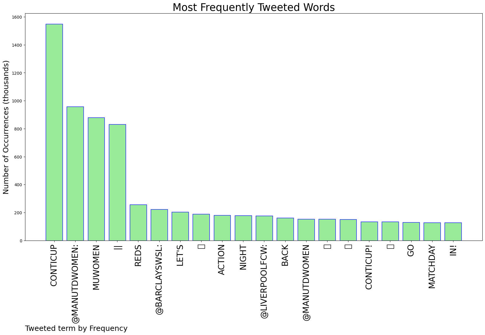
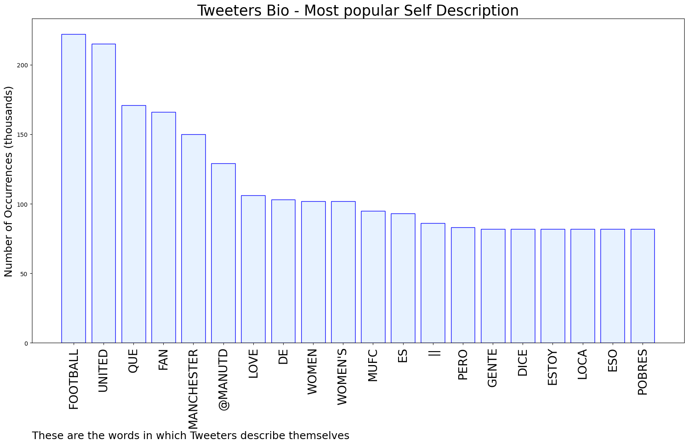

# MURCHIE85 TWITTER PROCESSING 
&#x1F34E; **TOPIC = "#ContiCup"**

## AUTOMATED RESEARCH SUMMARY

*note: Image pulled from web automatically, not connected to author.
  
<b> This report is AUTOMATED and not hand crafted, it is designed for pulling metrics on a given keyword or hashtag and performs a series of reporting and analysis.</b>

|                **Sample-Tweets**        |
| :-------------: |
| RT @ManUtdWomen: A SECOND FOR VILDE! A THIRD FOR UNITED!!! 🤩#MUWomen || #ContiCup https://t.co/i5aa7FA2qy |
| RT @ManUtdWomen: 🔑 Key reading for fans attending tonight's game at @LSVStadium 👇#MUWomen || #ContiCup |
| RT @LiverpoolFCW: Midweek #ContiCup action comes next 👌 https://t.co/YXZW50owIv |

The most popular user is: **DzheringRuslan**

 RT @LiverpoolFCW: 3️⃣ wins out of 3️⃣ in the #ContiCup 👌

Well in, Reds 🔴 https://t.co/UJpMVuERbg

## RELATED METRICS 
| Metric | Value |
| ------------- | ------------- |
| #1 Most tweeted to  | **ManUtdWomen** |
| #2 Most tweeted to  | **BarclaysWSL** |
| #3 Most tweeted to  | **LiverpoolFCW** |
| NewProfiles (less than 10 days) | 1.46%  |
| Tweeters with < 10 followers  | 1.86%|
| Tweeters with > 1000000 followers  | 0.35%  |

## MOST POPULAR TWEET TERMS 

| Popularity Rank  | Term |
| ------------- | ------------- |
| first  | **CONTICUP**  |
| second  | **@MANUTDWOMEN:**  |
| third  | **MUWOMEN** |
| fourth  | **||**  |
| fifth  | **REDS**  |

## Twitter Bio Analysis
### SENTIMENT ANALYSIS

VIEWS WERE : **SUBJECTIVE**  (26.67%) & **NEGATIVELY-SUBJECTIVE** (20.0%) **OBJECTIVE** (53.33%)

### TWEET SAMPLE 
| Random value picked from array |
| ------------- |
|Today in the #ContiCup! Watch @ManUtdWomen 🆚 @EvertonWomen LIVE on the FA Player 📺 https://t.co/yaGyHdygth |

### MOST RETWEETED 

| The most retweeted user is: **DzheringRuslan**  |
| ------------- |
| RT @LiverpoolFCW: 3️⃣ wins out of 3️⃣ in the #ContiCup 👌Well in, Reds 🔴 https://t.co/UJpMVuERbg |

### CONCLUSION & EXTERNAL ANALYSIS

*This is my [Adam McMurchie`s] opinion on the data from the tweets, it serves as no objective truth.Since the tweets themselves are a mixture of fact & opinion. 
Authors analytical summary on request.
**RECOMMENDATIONS** WILL BE UPDATED IN NEXT  24 HOURS  