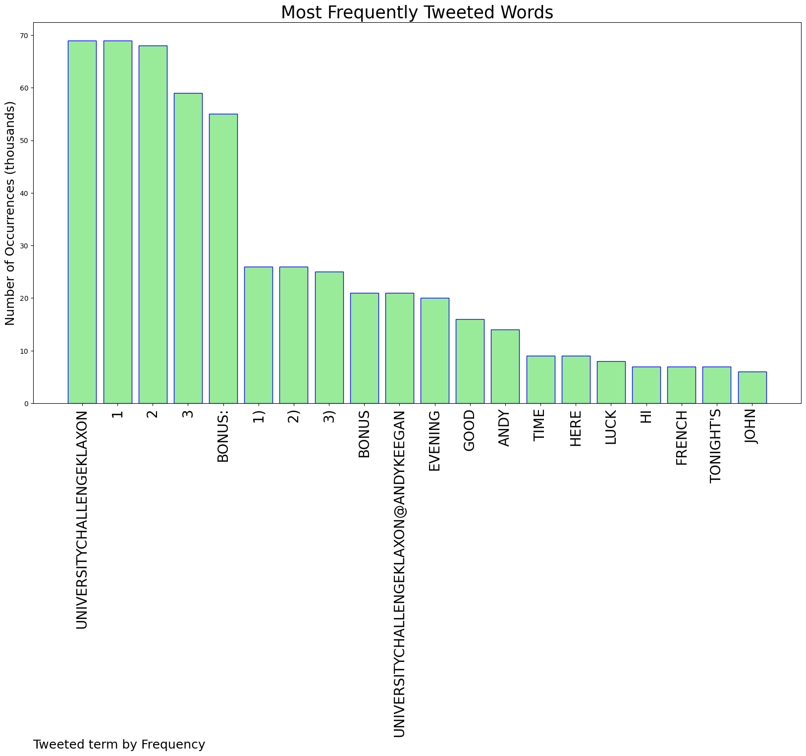
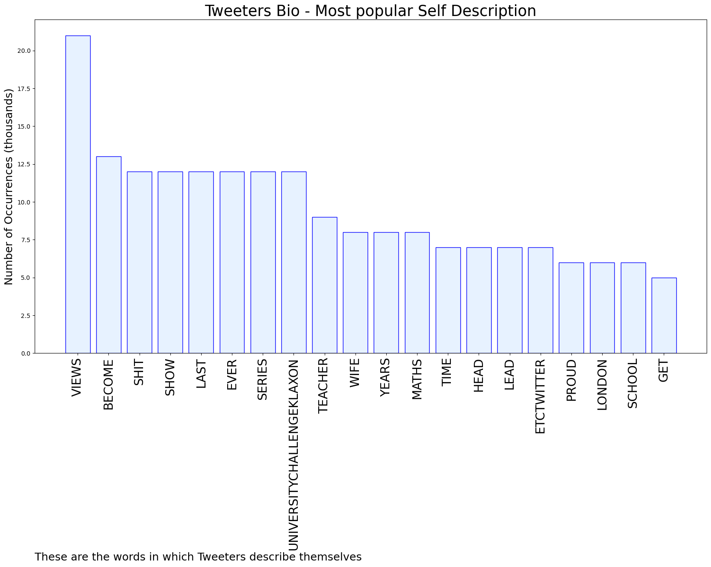

# MURCHIE85 TWITTER PROCESSING 
&#x1F34E; **TOPIC = "#UniversityChallengeKlaxon"**

## AUTOMATED RESEARCH SUMMARY

*note: Image pulled from web automatically, not connected to author.
  
<b> This report is AUTOMATED and not hand crafted, it is designed for pulling metrics on a given keyword or hashtag and performs a series of reporting and analysis.</b>

|                **Sample-Tweets**        |
| :-------------: |
| @andykeegan This week the Stevens’ are going for…Spanish💃Stevens Pertussis PercussionPurcellBonus - Persephon… https://t.co/p3unJ4qSY5 |
| RT @andykeegan: Right then, you know how this works by now so let's just get on with it. Eyes and ears open, let me know if you spot a winn… |
| @andykeegan Happy Monday again! Todays #universitychallengeklaxon1. Tibia2. Percy Jackson3. Accrington StanleyB… https://t.co/7Z9jQFdIAJ |

The most popular user is: **LisaLewisWrites**

 RT @andykeegan: What the slightly lighter evening?! Must be time for another round of #UniversityChallengeKlaxon ! This week's Predict-O-Si…

## RELATED METRICS 
| Metric | Value |
| ------------- | ------------- |
| #1 Most tweeted to  | **andykeegan** |
| #2 Most tweeted to  | **_ccroberts** |
| #3 Most tweeted to  | **JonPHawkins** |
| NewProfiles (less than 10 days) | 0.0%  |
| Tweeters with < 10 followers  | 3.57%|
| Tweeters with > 1000000 followers  | 0.0%  |

## MOST POPULAR TWEET TERMS 

| Popularity Rank  | Term |
| ------------- | ------------- |
| first  | **UNIVERSITYCHALLENGEKLAXON**  |
| second  | **1**  |
| third  | **2** |
| fourth  | **3**  |
| fifth  | **BONUS:**  |

## Twitter Bio Analysis
### SENTIMENT ANALYSIS

VIEWS WERE : **SUBJECTIVE**  (26.67%) & **NEGATIVELY-SUBJECTIVE** (13.33%) **OBJECTIVE** (60.0%)

### TWEET SAMPLE 
| Random value picked from array |
| ------------- |
|@andykeegan Hey! Just in the nick of time! 1) Beans 2) Cello 3) BrittenBonus: KSI #UniversityChallengeKlaxon |

### MOST RETWEETED 

| The most retweeted user is: **LisaLewisWrites**  |
| ------------- |
| RT @andykeegan: What the slightly lighter evening?! Must be time for another round of #UniversityChallengeKlaxon ! This week's Predict-O-Si… |

### CONCLUSION & EXTERNAL ANALYSIS

*This is my [Adam McMurchie`s] opinion on the data from the tweets, it serves as no objective truth.Since the tweets themselves are a mixture of fact & opinion. 
Authors analytical summary on request.
**RECOMMENDATIONS** WILL BE UPDATED IN NEXT  24 HOURS  