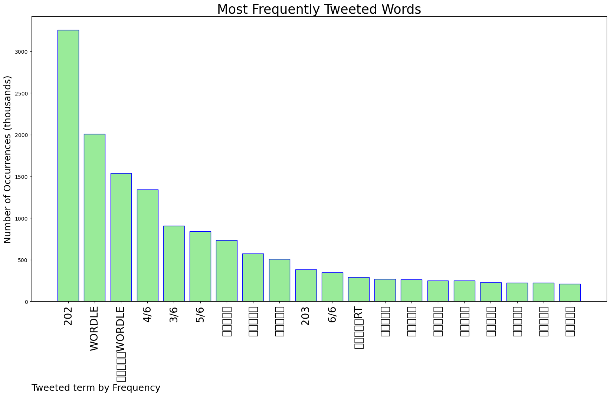
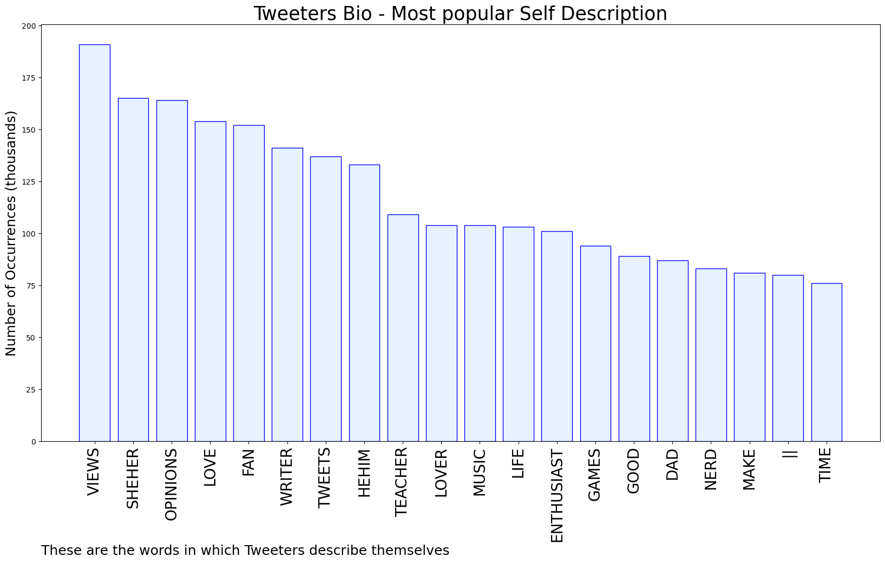

# MURCHIE85 TWITTER PROCESSING 
&#x1F34E; **TOPIC = "Wordle"**

## AUTOMATED RESEARCH SUMMARY

*note: Image pulled from web automatically, not connected to author.
  
<b> This report is AUTOMATED and not hand crafted, it is designed for pulling metrics on a given keyword or hashtag and performs a series of reporting and analysis.</b>

|                **Sample-Tweets**        |
| :-------------: |
| This Wordle thing really is as fun as everyone says. Wordle 202 5/6⬛🟩⬛⬛⬛⬛🟩⬛⬛⬛⬛🟩🟩🟨⬛🟩🟩🟩⬛🟩🟩🟩🟩🟩🟩 |
| Phew 😮‍💨😅 Wordle 202 6/6⬛⬛⬛⬛🟨🟩⬛⬛⬛⬛🟩⬛🟨⬛⬛🟩🟨🟩⬛⬛🟩🟩🟩⬛🟩🟩🟩🟩🟩🟩 |
| Wordle 202 5/6🟨⬛⬛⬛⬛⬛🟨🟨⬛🟩🟨⬛⬛🟨🟩⬛🟩🟩🟩🟩🟩🟩🟩🟩🟩Another dub, 3/3 so far 😤😤😤 |

The most popular user is: **victorres345**

 RT @egypturnash: howdy howdy howdy
           🤠
     ⬜️⬜️⬜️
🟨    ⬜️    🟨
👇  🟨  🟩👇
      🟩     🟨
     🟩       🟩
    👢           👢

I'm the w…

## RELATED METRICS 
| Metric | Value |
| ------------- | ------------- |
| #1 Most tweeted to  | **davaja** |
| #2 Most tweeted to  | **jenniferemorrow** |
| #3 Most tweeted to  | **PFTompkins** |
| NewProfiles (less than 10 days) | 0.26%  |
| Tweeters with < 10 followers  | 3.02%|
| Tweeters with > 1000000 followers  | 0.06%  |

## MOST POPULAR TWEET TERMS 

| Popularity Rank  | Term |
| ------------- | ------------- |
| first  | **202**  |
| second  | **WORDLE**  |
| third  | **🟩🟩🟩🟩🟩WORDLE** |
| fourth  | **4/6**  |
| fifth  | **3/6**  |

## Twitter Bio Analysis
### SENTIMENT ANALYSIS

VIEWS WERE : **SUBJECTIVE**  (26.67%) & **NEGATIVELY-SUBJECTIVE** (6.67%) **OBJECTIVE** (66.67%)

### TWEET SAMPLE 
| Random value picked from array |
| ------------- |
|I’ll take that!Wordle 202 2/6🟩🟩⬛⬛🟩🟩🟩🟩🟩🟩 |

### MOST RETWEETED 

| The most retweeted user is: **victorres345**  |
| ------------- |
| RT @egypturnash: howdy howdy howdy           🤠     ⬜️⬜️⬜️🟨    ⬜️    🟨👇  🟨  🟩👇      🟩     🟨     🟩       🟩    👢           👢I'm the w… |

### CONCLUSION & EXTERNAL ANALYSIS

*This is my [Adam McMurchie`s] opinion on the data from the tweets, it serves as no objective truth.Since the tweets themselves are a mixture of fact & opinion. 
Authors analytical summary on request.
**RECOMMENDATIONS** WILL BE UPDATED IN NEXT  24 HOURS  