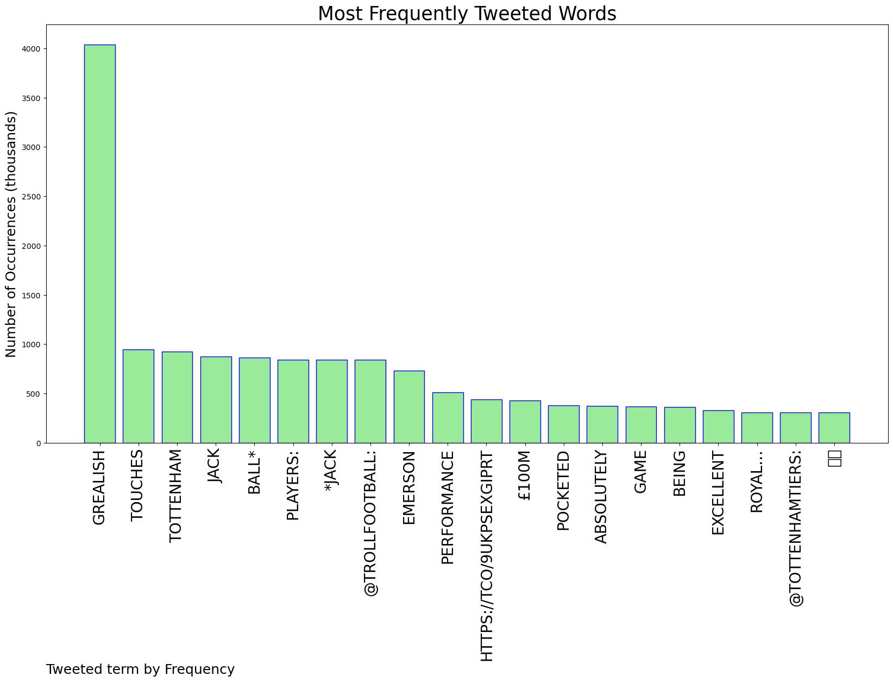
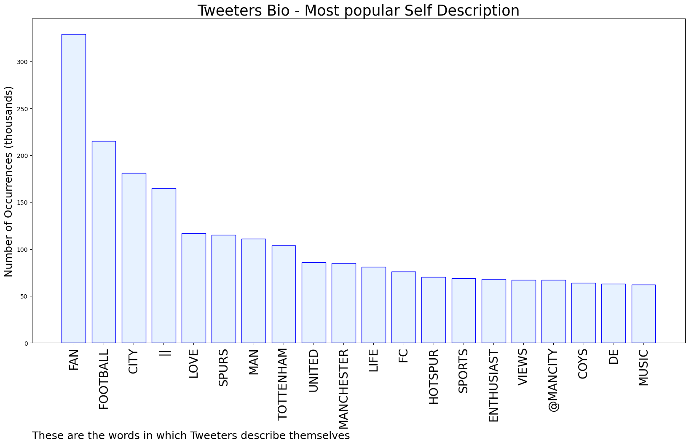

# MURCHIE85 TWITTER PROCESSING 
&#x1F34E; **TOPIC = "Grealish"**

## AUTOMATED RESEARCH SUMMARY

*note: Image pulled from web automatically, not connected to author.
  
<b> This report is AUTOMATED and not hand crafted, it is designed for pulling metrics on a given keyword or hashtag and performs a series of reporting and analysis.</b>

|                **Sample-Tweets**        |
| :-------------: |
| RT @City_Zone_: [🤔] Jack Grealish. Discuss. https://t.co/Ri0GP1smxW |
| RT @waatitdobaby: Royal handcuffed grealish today |
| Another crap performance at Tottenham. Slow, languid &amp; way too relaxed despite being behind. Alvarez especially was… https://t.co/nReuhhGq7s |

The most popular user is: **LeftyRS_**

 RT @TrollFootball: *Jack Grealish touches the ball.*

Tottenham players: 

https://t.co/9ukPsEXgip

## RELATED METRICS 
| Metric | Value |
| ------------- | ------------- |
| #1 Most tweeted to  | **TrollFootball** |
| #2 Most tweeted to  | **TottenhamTiers** |
| #3 Most tweeted to  | **Sjopinion10** |
| NewProfiles (less than 10 days) | 0.1%  |
| Tweeters with < 10 followers  | 5.98%|
| Tweeters with > 1000000 followers  | 0.02%  |

## MOST POPULAR TWEET TERMS 

| Popularity Rank  | Term |
| ------------- | ------------- |
| first  | **GREALISH**  |
| second  | **TOUCHES**  |
| third  | **TOTTENHAM** |
| fourth  | **JACK**  |
| fifth  | **BALL***  |

## Twitter Bio Analysis
### SENTIMENT ANALYSIS

VIEWS WERE : **SUBJECTIVE**  (20.0%) & **NEGATIVELY-SUBJECTIVE** (13.33%) **OBJECTIVE** (66.67%)

### TWEET SAMPLE 
| Random value picked from array |
| ------------- |
|Ake and Grealish absolutely unreal btw👍🏻👍🏻 |

### MOST RETWEETED 

| The most retweeted user is: **LeftyRS_**  |
| ------------- |
| RT @TrollFootball: *Jack Grealish touches the ball.*Tottenham players: https://t.co/9ukPsEXgip |

### CONCLUSION & EXTERNAL ANALYSIS

*This is my [Adam McMurchie`s] opinion on the data from the tweets, it serves as no objective truth.Since the tweets themselves are a mixture of fact & opinion. 
Authors analytical summary on request.
**RECOMMENDATIONS** WILL BE UPDATED IN NEXT  24 HOURS  