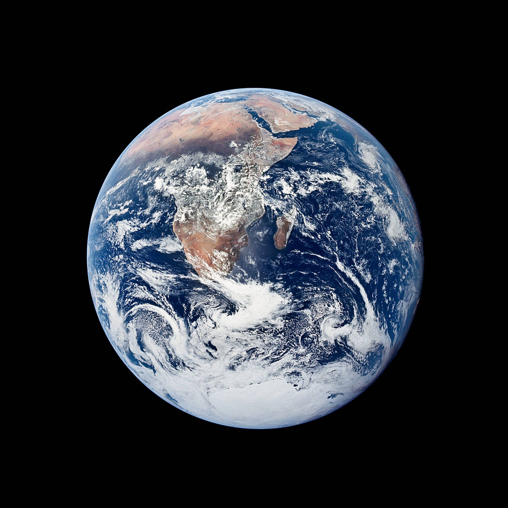
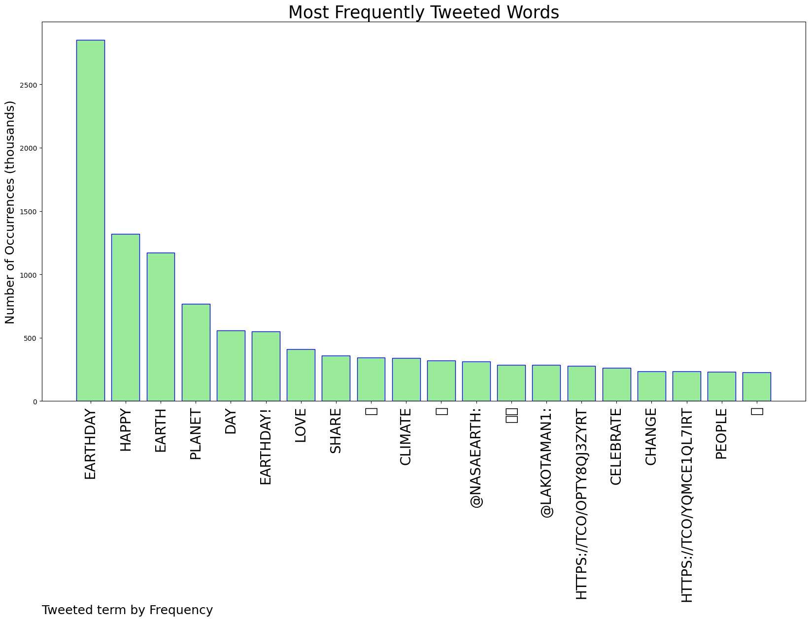
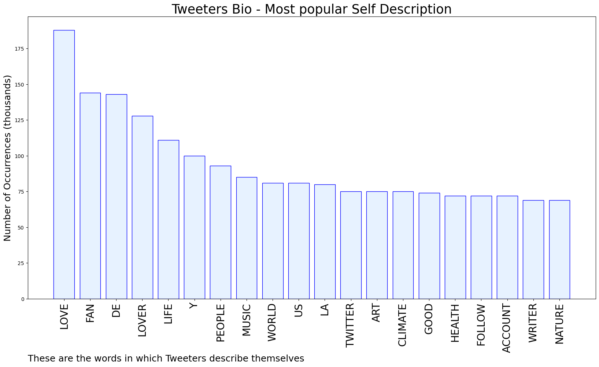

# MURCHIE85 TWITTER PROCESSING 
&#x1F34E; **TOPIC = "#EarthDay"**

## AUTOMATED RESEARCH SUMMARY

*note: Image pulled from web automatically, not connected to author.
  
<b> This report is AUTOMATED and not hand crafted, it is designed for pulling metrics on a given keyword or hashtag and performs a series of reporting and analysis.</b>

|                **Sample-Tweets**        |
| :-------------: |
| RT @AECOM: What does it mean to deliver #SustainableLegacies? Watch our teams solve our clients’ most complex challenges and make a posit… |
| Day 22 - Happy Earth Day !! Free Metro Rides all day LA #30DaysofBiking #EarthDay #Metro #Bicycle #Somafab… https://t.co/1XGdsEXEzf |
| RT @jimmykimmel: This land is your land, this land is my land, this land belongs to horses too… protect and cherish it. #EarthDay https://t… |

The most popular user is: **TheIanFunZone**

 RT @NASAEarth: Share if you love Earth. 💚 #EarthDay https://t.co/OptY8Qj3zy

## RELATED METRICS 
| Metric | Value |
| ------------- | ------------- |
| #1 Most tweeted to  | **NASAEarth** |
| #2 Most tweeted to  | **LakotaMan1** |
| #3 Most tweeted to  | **CaptMarkKelly** |
| NewProfiles (less than 10 days) | 0.22%  |
| Tweeters with < 10 followers  | 5.36%|
| Tweeters with > 1000000 followers  | 0.22%  |

## MOST POPULAR TWEET TERMS 

| Popularity Rank  | Term |
| ------------- | ------------- |
| first  | **EARTHDAY**  |
| second  | **HAPPY**  |
| third  | **EARTH** |
| fourth  | **PLANET**  |
| fifth  | **DAY**  |

## Twitter Bio Analysis
### SENTIMENT ANALYSIS

VIEWS WERE : **SUBJECTIVE**  (60.0%) & **NEGATIVELY-SUBJECTIVE** (0.0%) **OBJECTIVE** (40.0%)

### TWEET SAMPLE 
| Random value picked from array |
| ------------- |
|RT @DrRonHolt: Hate has no home on #EarthDay or any day. Only love. RT if you agree. Spread the love. #lgbt+ #trans https://t.co/dVBIcw… |

### MOST RETWEETED 

| The most retweeted user is: **TheIanFunZone**  |
| ------------- |
| RT @NASAEarth: Share if you love Earth. 💚 #EarthDay https://t.co/OptY8Qj3zy |

### CONCLUSION & EXTERNAL ANALYSIS

*This is my [Adam McMurchie`s] opinion on the data from the tweets, it serves as no objective truth.Since the tweets themselves are a mixture of fact & opinion. 
Authors analytical summary on request.
**RECOMMENDATIONS** WILL BE UPDATED IN NEXT  24 HOURS  