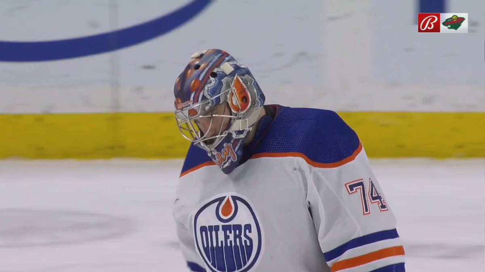
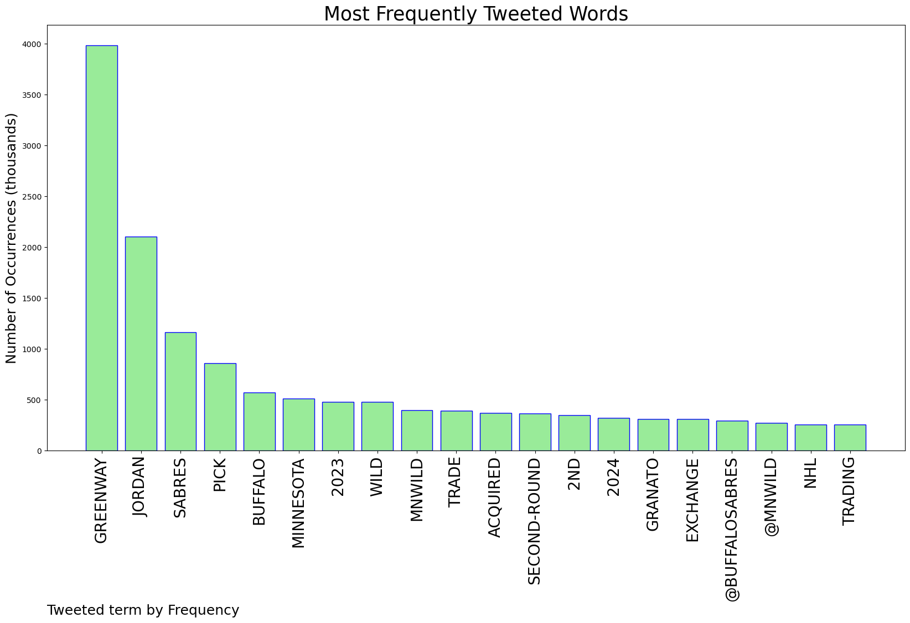
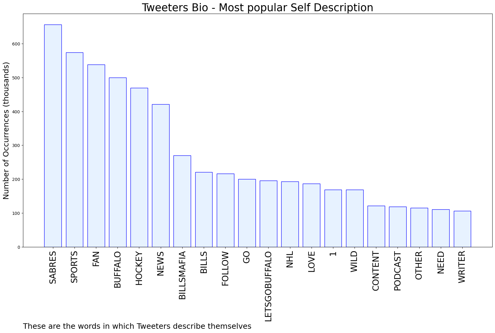
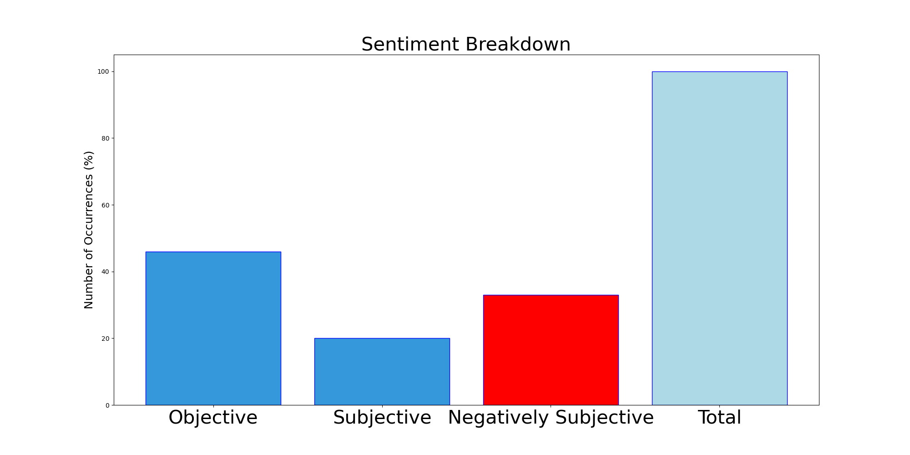

# MURCHIE85 TWITTER PROCESSING 
&#x1F34E; **TOPIC = "Greenway"**

## AUTOMATED RESEARCH SUMMARY

*note: Image pulled from web automatically, not connected to author.
  
<b> This report is AUTOMATED and not hand crafted, it is designed for pulling metrics on a given keyword or hashtag and performs a series of reporting and analysis.</b>

|                **Sample-Tweets**        |
| :-------------: |
| Really nice work by #mnwild’s Guerin at the deadline: Klingberg, Johansson, Nyquist, Sunqvist, a 2 in ‘23, a 5 AND… https://t.co/Nc21NTSOia |
| RT @SKORNorth: BREAKING: The #mnwild have traded Jordan Greenway to the Buffalo Sabres for a 2023 second-round pick and 2024 fifth-round pi… |
| RT @LLysowski: Return for Greenway is a 2023 second-round pick and a 2024 fifth-rounder. Working to confirm which of the Sabres' seconds ar… |

The most popular user is: **steve_greenway**

 RT @BladeoftheS: Jacob Rees-Mogg claims that nobody cares about #partygate anymore.

Do you care?

Feel free to RT to show that you do. htt…

## RELATED METRICS 
| Metric | Value |
| ------------- | ------------- |
| #1 Most tweeted to  | **BuffaloSabres** |
| #2 Most tweeted to  | **mnwild** |
| #3 Most tweeted to  | **TheFourthPeriod** |
| NewProfiles (less than 10 days) | 0.14%  |
| Tweeters with < 10 followers  | 4.66%|
| Tweeters with > 1000000 followers  | 0.08%  |

## MOST POPULAR TWEET TERMS 

| Popularity Rank  | Term |
| ------------- | ------------- |
| first  | **GREENWAY**  |
| second  | **JORDAN**  |
| third  | **SABRES** |
| fourth  | **PICK**  |
| fifth  | **BUFFALO**  |

## Twitter Bio Analysis
### SENTIMENT ANALYSIS

VIEWS WERE : **SUBJECTIVE**  (20.0%) & **NEGATIVELY-SUBJECTIVE** (33.33%) **OBJECTIVE** (46.67%)

### TWEET SAMPLE 
| Random value picked from array |
| ------------- |
|RT @BuffaloSabres: We have acquired forward Jordan Greenway from the Minnesota Wild in exchange for a second-round pick in the 2023 NHL Dra… |

### MOST RETWEETED 

| The most retweeted user is: **steve_greenway**  |
| ------------- |
| RT @BladeoftheS: Jacob Rees-Mogg claims that nobody cares about #partygate anymore.Do you care?Feel free to RT to show that you do. htt… |

### CONCLUSION & EXTERNAL ANALYSIS

*This is my [Adam McMurchie`s] opinion on the data from the tweets, it serves as no objective truth.Since the tweets themselves are a mixture of fact & opinion. 
Authors analytical summary on request.
**RECOMMENDATIONS** WILL BE UPDATED IN NEXT  24 HOURS  