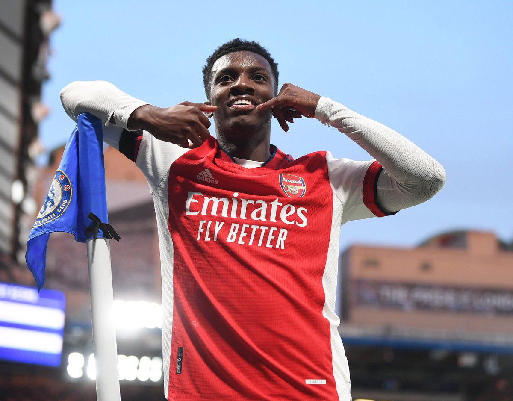
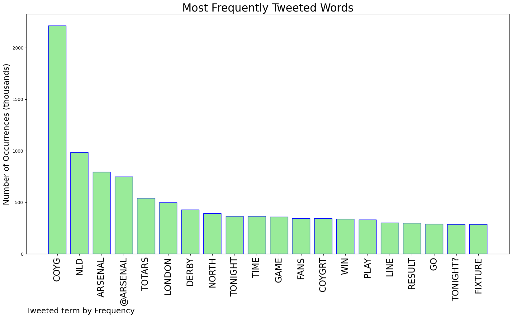
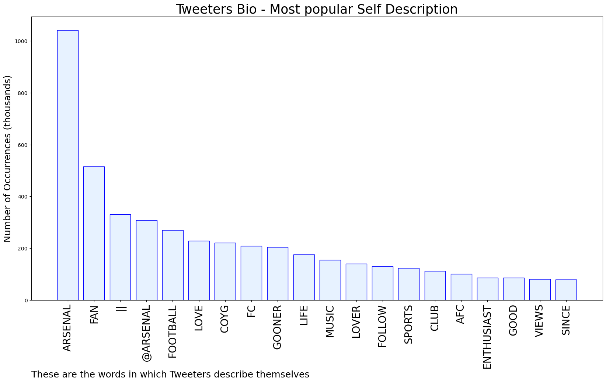

# MURCHIE85 TWITTER PROCESSING 
&#x1F34E; **TOPIC = "#COYG"**

## AUTOMATED RESEARCH SUMMARY

*note: Image pulled from web automatically, not connected to author.
  
<b> This report is AUTOMATED and not hand crafted, it is designed for pulling metrics on a given keyword or hashtag and performs a series of reporting and analysis.</b>

|                **Sample-Tweets**        |
| :-------------: |
| RT @Babablueh: Heavenly FATHER,                Have mercy on us. #COYG❤️ |
| @amylou8188 Hopefully 🤞🤞 #COYG |
| Halibut with green lip mussels, parmesan risotto, roasted cauliflower, and tobiko. Enjoy the beautiful day everyone… https://t.co/vlGeTskLto |

The most popular user is: **DannyKayTV1**

 RT @EddieNketiah9: God’s timing!📞🙏🏾 #COYG @Arsenal https://t.co/QUqqmp0NrZ

## RELATED METRICS 
| Metric | Value |
| ------------- | ------------- |
| #1 Most tweeted to  | **Arsenal** |
| #2 Most tweeted to  | **GilbertoSilva** |
| #3 Most tweeted to  | **NunoTavares** |
| NewProfiles (less than 10 days) | 0.78%  |
| Tweeters with < 10 followers  | 2.24%|
| Tweeters with > 1000000 followers  | 0.0%  |

## MOST POPULAR TWEET TERMS 

| Popularity Rank  | Term |
| ------------- | ------------- |
| first  | **COYG**  |
| second  | **NLD**  |
| third  | **ARSENAL** |
| fourth  | **@ARSENAL**  |
| fifth  | **TOTARS**  |

## Twitter Bio Analysis
### SENTIMENT ANALYSIS

VIEWS WERE : **SUBJECTIVE**  (33.33%) & **NEGATIVELY-SUBJECTIVE** (13.33%) **OBJECTIVE** (53.33%)

### TWEET SAMPLE 
| Random value picked from array |
| ------------- |
|If Arsenal win today, we are singing Champions league anthem again, after ‘🎶North London Forever 🎶’ at Emirates nex… https://t.co/L87AENLH0A |

### MOST RETWEETED 

| The most retweeted user is: **DannyKayTV1**  |
| ------------- |
| RT @EddieNketiah9: God’s timing!📞🙏🏾 #COYG @Arsenal https://t.co/QUqqmp0NrZ |

### CONCLUSION & EXTERNAL ANALYSIS

*This is my [Adam McMurchie`s] opinion on the data from the tweets, it serves as no objective truth.Since the tweets themselves are a mixture of fact & opinion. 
Authors analytical summary on request.
**RECOMMENDATIONS** WILL BE UPDATED IN NEXT  24 HOURS  