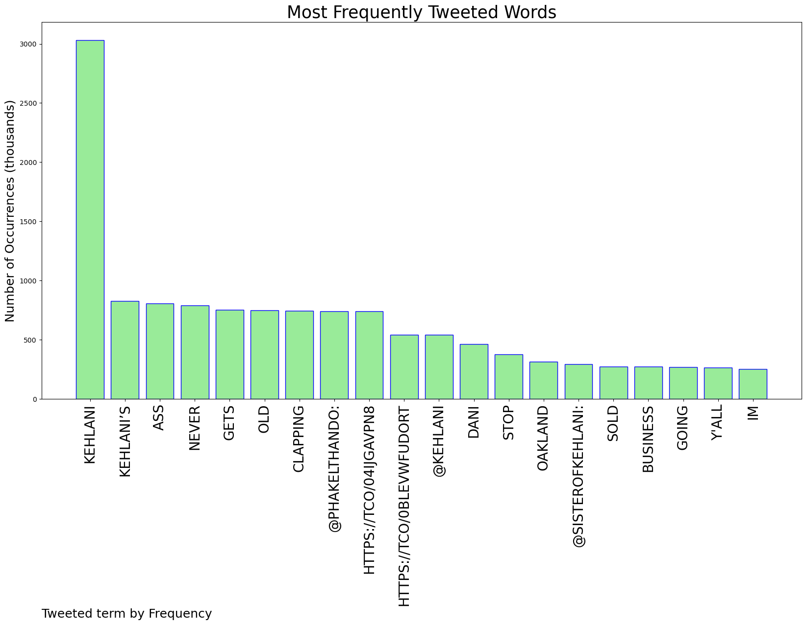
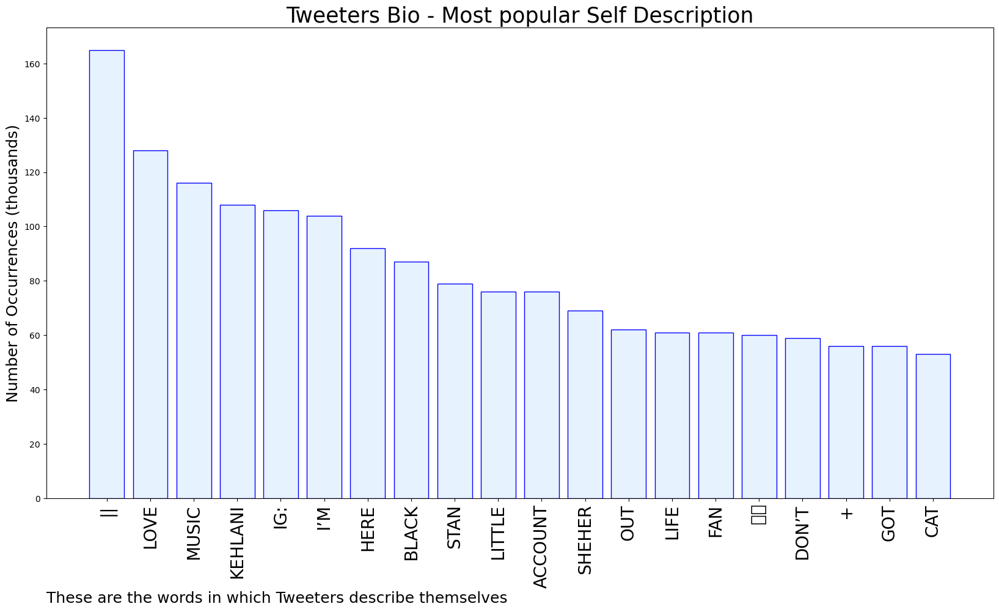

# MURCHIE85 TWITTER PROCESSING 
&#x1F34E; **TOPIC = "Kehlani"**

## AUTOMATED RESEARCH SUMMARY

*note: Image pulled from web automatically, not connected to author.
  
<b> This report is AUTOMATED and not hand crafted, it is designed for pulling metrics on a given keyword or hashtag and performs a series of reporting and analysis.</b>

|                **Sample-Tweets**        |
| :-------------: |
| RT @SG_EGO: Baybeeee Kehlani confirmed that break up so we can stop playing detective lmao🫠 https://t.co/KRd4SKACI3 |
| RT @PhakeLThando: kehlani’s ass clapping never gets old https://t.co/04ijgAVpn8 https://t.co/0BleVwfudO |
| RT @PhakeLThando: kehlani’s ass clapping never gets old https://t.co/04ijgAVpn8 https://t.co/0BleVwfudO |

The most popular user is: **kehlani_molani**

 RT @Ian_Fraser: Italian cyclist Michael Guerra uses his knowledge of physics and aerodynamics to adopt a “plank” position and overtake his…

## RELATED METRICS 
| Metric | Value |
| ------------- | ------------- |
| #1 Most tweeted to  | **PhakeLThando** |
| #2 Most tweeted to  | **Kehlani** |
| #3 Most tweeted to  | **sisterofkehlani** |
| NewProfiles (less than 10 days) | 0.66%  |
| Tweeters with < 10 followers  | 3.44%|
| Tweeters with > 1000000 followers  | 0.08%  |

## MOST POPULAR TWEET TERMS 

| Popularity Rank  | Term |
| ------------- | ------------- |
| first  | **KEHLANI**  |
| second  | **KEHLANI’S**  |
| third  | **ASS** |
| fourth  | **NEVER**  |
| fifth  | **GETS**  |

## Twitter Bio Analysis
### SENTIMENT ANALYSIS

VIEWS WERE : **SUBJECTIVE**  (46.67%) & **NEGATIVELY-SUBJECTIVE** (13.33%) **OBJECTIVE** (40.0%)

### TWEET SAMPLE 
| Random value picked from array |
| ------------- |
|RT @PhakeLThando: kehlani’s ass clapping never gets old https://t.co/04ijgAVpn8 https://t.co/0BleVwfudO |

### MOST RETWEETED 

| The most retweeted user is: **kehlani_molani**  |
| ------------- |
| RT @Ian_Fraser: Italian cyclist Michael Guerra uses his knowledge of physics and aerodynamics to adopt a “plank” position and overtake his… |

### CONCLUSION & EXTERNAL ANALYSIS

*This is my [Adam McMurchie`s] opinion on the data from the tweets, it serves as no objective truth.Since the tweets themselves are a mixture of fact & opinion. 
Authors analytical summary on request.
**RECOMMENDATIONS** WILL BE UPDATED IN NEXT  24 HOURS  