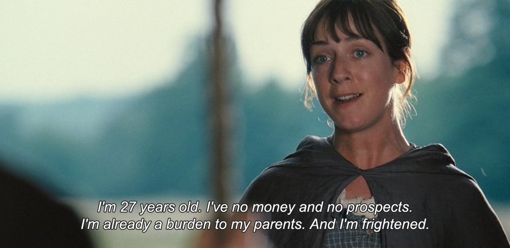
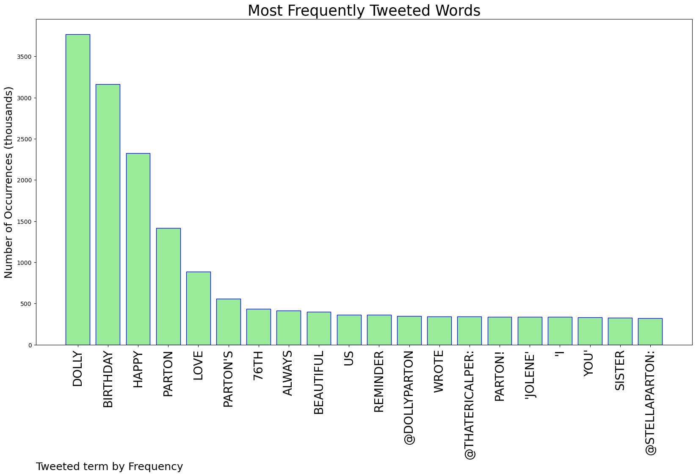
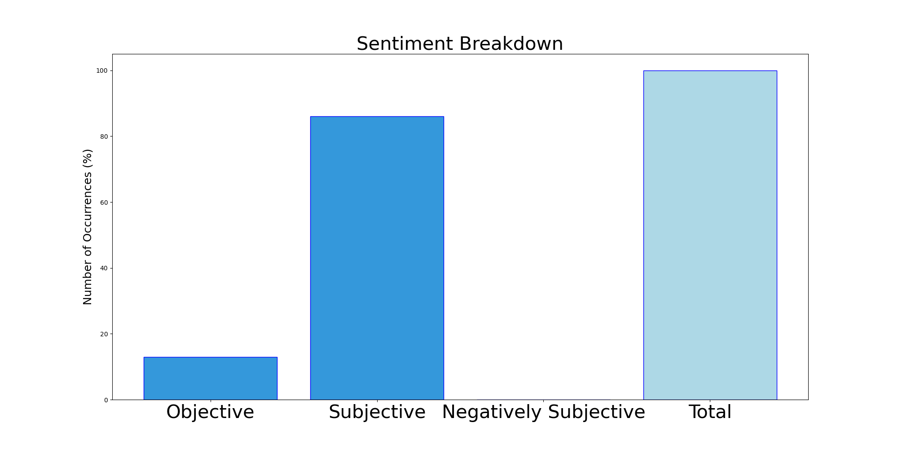

# MURCHIE85 TWITTER PROCESSING 
&#x1F34E; **TOPIC = "Dolly"**

## AUTOMATED RESEARCH SUMMARY

*note: Image pulled from web automatically, not connected to author.
  
<b> This report is AUTOMATED and not hand crafted, it is designed for pulling metrics on a given keyword or hashtag and performs a series of reporting and analysis.</b>

|                **Sample-Tweets**        |
| :-------------: |
| RT @robfardon: Her daddy never learned to read, so she started a foundation to send books to kids. Her Imagination Library now reaches chil… |
| RT @RexChapman: Happy 76th birthday, Dolly Parton @DollyParton . One minute of gold from a living legend… |
| @hpcprogrammer Florida Woman wishes Dolly Parton a happy birthday. Details at 7. |

The most popular user is: **not_ur_dolly**

 RT @theeslimreaper: I want everybody confused as possible when it comes to me because you shouldn’t be minding my business

## RELATED METRICS 
| Metric | Value |
| ------------- | ------------- |
| #1 Most tweeted to  | **DollyParton** |
| #2 Most tweeted to  | **StellaParton** |
| #3 Most tweeted to  | **ThatEricAlper** |
| NewProfiles (less than 10 days) | 0.76%  |
| Tweeters with < 10 followers  | 3.48%|
| Tweeters with > 1000000 followers  | 0.24%  |

## MOST POPULAR TWEET TERMS 

| Popularity Rank  | Term |
| ------------- | ------------- |
| first  | **DOLLY**  |
| second  | **BIRTHDAY**  |
| third  | **HAPPY** |
| fourth  | **PARTON**  |
| fifth  | **LOVE**  |

## Twitter Bio Analysis
### SENTIMENT ANALYSIS

VIEWS WERE : **SUBJECTIVE**  (86.67%) & **NEGATIVELY-SUBJECTIVE** (0.0%) **OBJECTIVE** (13.33%)

### TWEET SAMPLE 
| Random value picked from array |
| ------------- |
|RT @srd0459: I don't listen to Country, but I do like Dolly Parton. |

### MOST RETWEETED 

| The most retweeted user is: **not_ur_dolly**  |
| ------------- |
| RT @theeslimreaper: I want everybody confused as possible when it comes to me because you shouldn’t be minding my business |

### CONCLUSION & EXTERNAL ANALYSIS

*This is my [Adam McMurchie`s] opinion on the data from the tweets, it serves as no objective truth.Since the tweets themselves are a mixture of fact & opinion. 
Authors analytical summary on request.
**RECOMMENDATIONS** WILL BE UPDATED IN NEXT  24 HOURS  