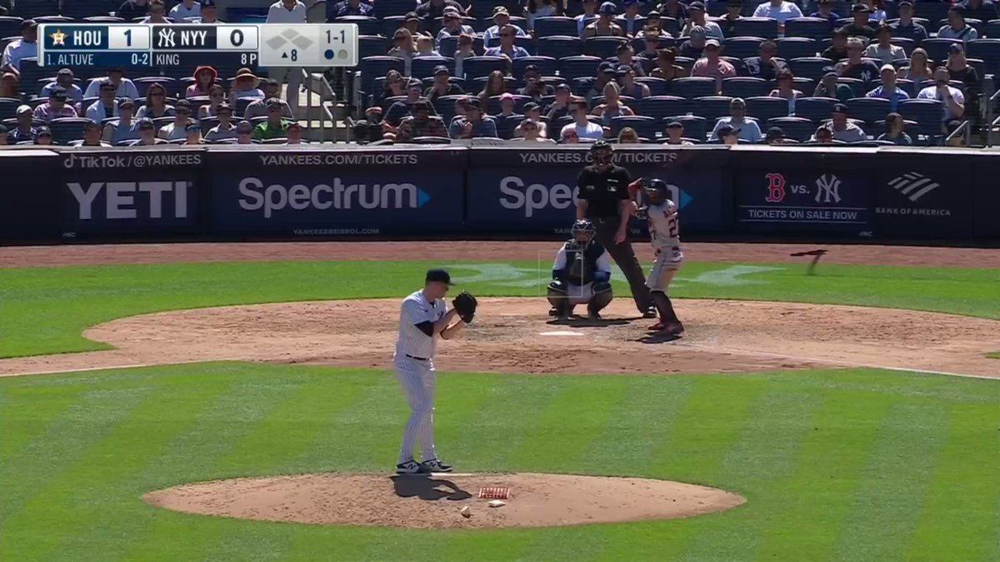
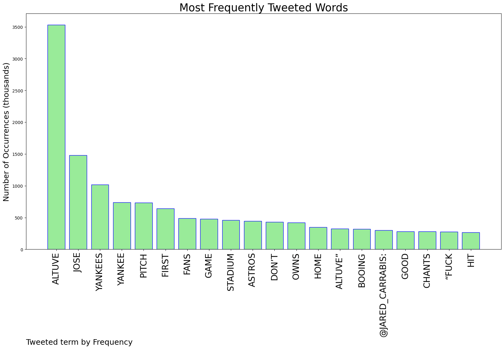
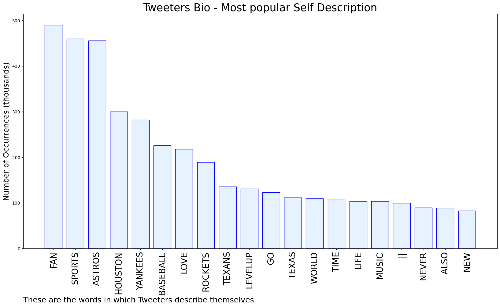
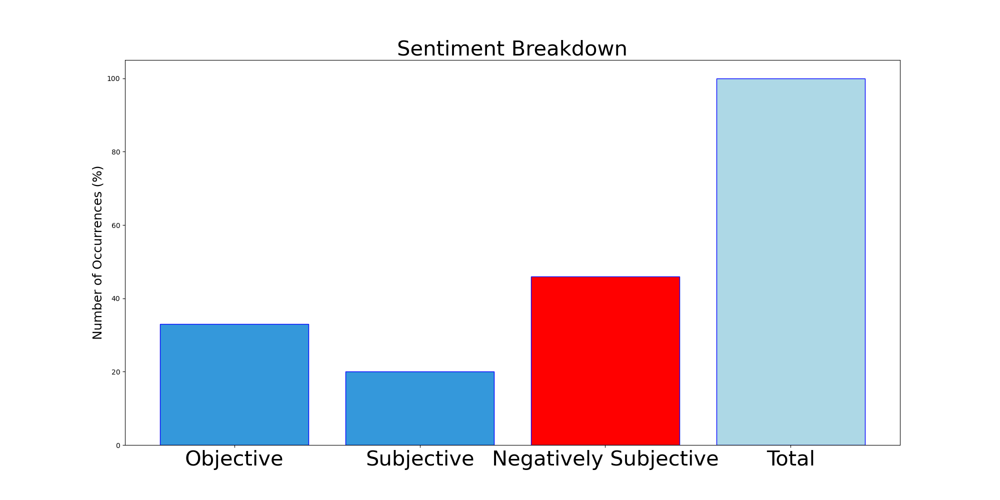

# MURCHIE85 TWITTER PROCESSING 
&#x1F34E; **TOPIC = "Altuve"**

## AUTOMATED RESEARCH SUMMARY

*note: Image pulled from web automatically, not connected to author.
  
<b> This report is AUTOMATED and not hand crafted, it is designed for pulling metrics on a given keyword or hashtag and performs a series of reporting and analysis.</b>

|                **Sample-Tweets**        |
| :-------------: |
| RT @CantH0LDMe: Altuve owns us lol |
| It's time for the Yankees to give ownership to Jose Altuve. Nothing to be ashamed of. |
| @priyaraomd That’s Springer and Altuve combined right there! Awesomness. 😆🎉⚾️ |

The most popular user is: **altuve_karin**

 RT @MYID2022: 💵Airdrop is live!

Participate in our Airdrop and earn 2 BUSD tokens for doing tasks.

Airdrop:
https://t.co/njJx7J7Kic

Aird…

## RELATED METRICS 
| Metric | Value |
| ------------- | ------------- |
| #1 Most tweeted to  | **Jared_Carrabis** |
| #2 Most tweeted to  | **astros** |
| #3 Most tweeted to  | **BenVerlander** |
| NewProfiles (less than 10 days) | 0.48%  |
| Tweeters with < 10 followers  | 4.28%|
| Tweeters with > 1000000 followers  | 0.12%  |

## MOST POPULAR TWEET TERMS 

| Popularity Rank  | Term |
| ------------- | ------------- |
| first  | **ALTUVE**  |
| second  | **JOSE**  |
| third  | **YANKEES** |
| fourth  | **YANKEE**  |
| fifth  | **PITCH**  |

## Twitter Bio Analysis
### SENTIMENT ANALYSIS

VIEWS WERE : **SUBJECTIVE**  (20.0%) & **NEGATIVELY-SUBJECTIVE** (46.67%) **OBJECTIVE** (33.33%)

### TWEET SAMPLE 
| Random value picked from array |
| ------------- |
|Altuve, you are the father!!!#levelup #fucktheyanks # |

### MOST RETWEETED 

| The most retweeted user is: **altuve_karin**  |
| ------------- |
| RT @MYID2022: 💵Airdrop is live!Participate in our Airdrop and earn 2 BUSD tokens for doing tasks.Airdrop:https://t.co/njJx7J7KicAird… |

### CONCLUSION & EXTERNAL ANALYSIS

*This is my [Adam McMurchie`s] opinion on the data from the tweets, it serves as no objective truth.Since the tweets themselves are a mixture of fact & opinion. 
Authors analytical summary on request.
**RECOMMENDATIONS** WILL BE UPDATED IN NEXT  24 HOURS  