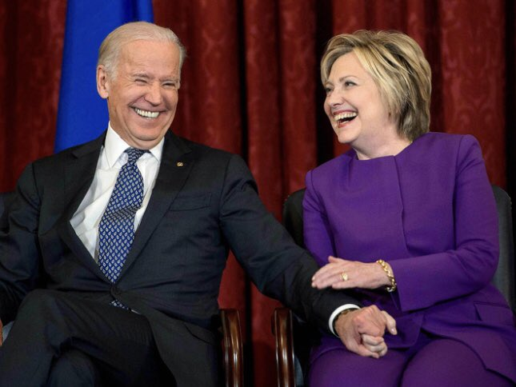
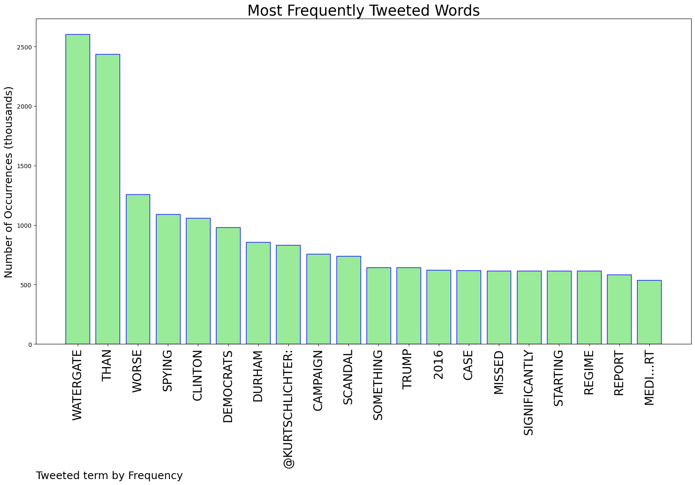
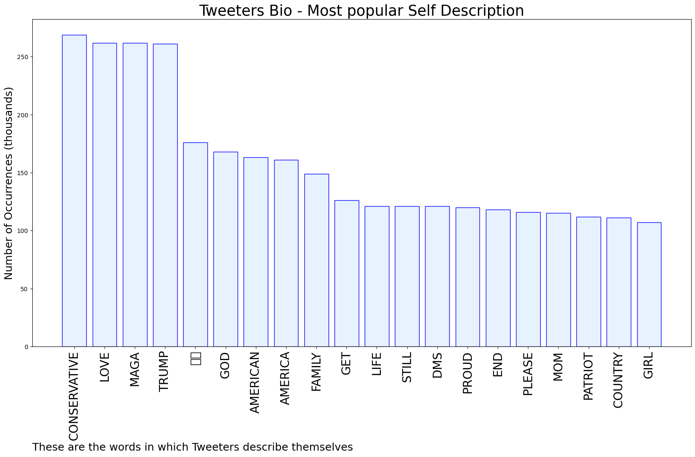
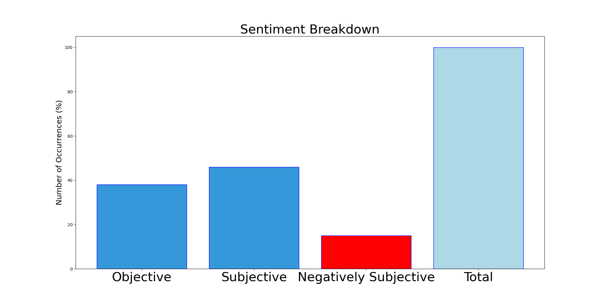

# MURCHIE85 TWITTER PROCESSING 
&#x1F34E; **TOPIC = "Watergate"**

## AUTOMATED RESEARCH SUMMARY

*note: Image pulled from web automatically, not connected to author.
  
<b> This report is AUTOMATED and not hand crafted, it is designed for pulling metrics on a given keyword or hashtag and performs a series of reporting and analysis.</b>

|                **Sample-Tweets**        |
| :-------------: |
| RT @KevinTober94: .@ThisWeekABC, @FaceTheNation &amp; @CNNSotu all ignored the bombshell Durham report that the Clinton campaign spied on Trump… |
| Good point @ScottAdamsSays what if there was a second half, like @PATPmovie II ‘Worse Than Watergate’ https://t.co/Uveh8VHKrw |
| RT @DonaldJTrumpJr: Where’s the “Worse Than Watergate” crew. Given that spying continued into DJT’s presidency, it is now literally Worse T… |

The most popular user is: **shiburicapital**

 RT @HolmesJosh: This is basically watergate at this point, right? Can we start treating this scandal with the appropriate amount of attenti…

## RELATED METRICS 
| Metric | Value |
| ------------- | ------------- |
| #1 Most tweeted to  | **KurtSchlichter** |
| #2 Most tweeted to  | **DonaldJTrumpJr** |
| #3 Most tweeted to  | **realLizUSA** |
| NewProfiles (less than 10 days) | 1.34%  |
| Tweeters with < 10 followers  | 3.26%|
| Tweeters with > 1000000 followers  | 0.12%  |

## MOST POPULAR TWEET TERMS 

| Popularity Rank  | Term |
| ------------- | ------------- |
| first  | **WATERGATE**  |
| second  | **THAN**  |
| third  | **WORSE** |
| fourth  | **SPYING**  |
| fifth  | **CLINTON**  |

## Twitter Bio Analysis
### SENTIMENT ANALYSIS

VIEWS WERE : **SUBJECTIVE**  (46.15%) & **NEGATIVELY-SUBJECTIVE** (15.38%) **OBJECTIVE** (38.46%)

### TWEET SAMPLE 
| Random value picked from array |
| ------------- |
|RT @TomBevanRCP: If true, this is worse-than-Watergate level stuff.  https://t.co/xyT7krpCgo |

### MOST RETWEETED 

| The most retweeted user is: **shiburicapital**  |
| ------------- |
| RT @HolmesJosh: This is basically watergate at this point, right? Can we start treating this scandal with the appropriate amount of attenti… |

### CONCLUSION & EXTERNAL ANALYSIS

*This is my [Adam McMurchie`s] opinion on the data from the tweets, it serves as no objective truth.Since the tweets themselves are a mixture of fact & opinion. 
Authors analytical summary on request.
**RECOMMENDATIONS** WILL BE UPDATED IN NEXT  24 HOURS  