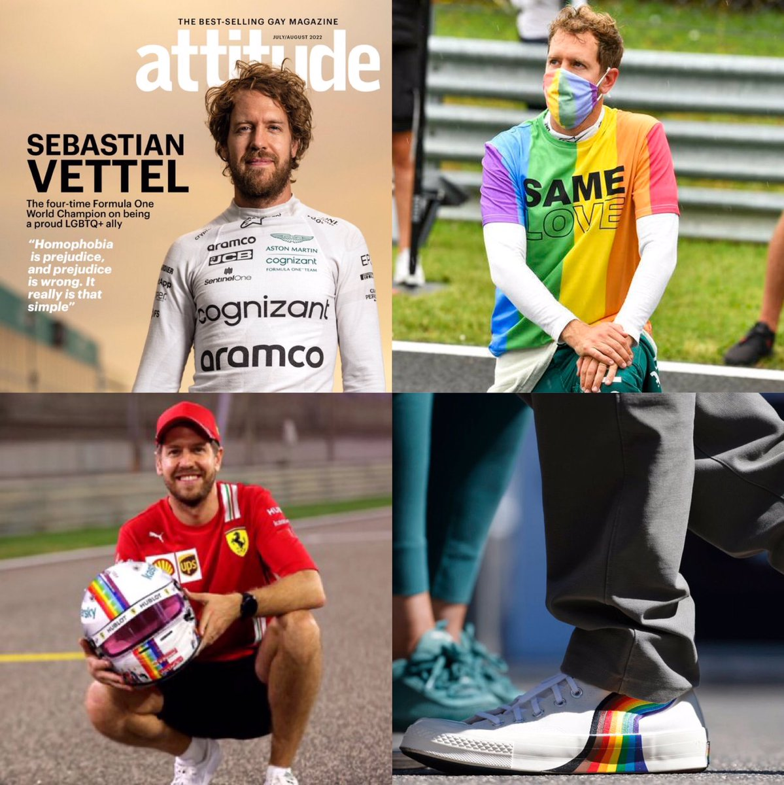
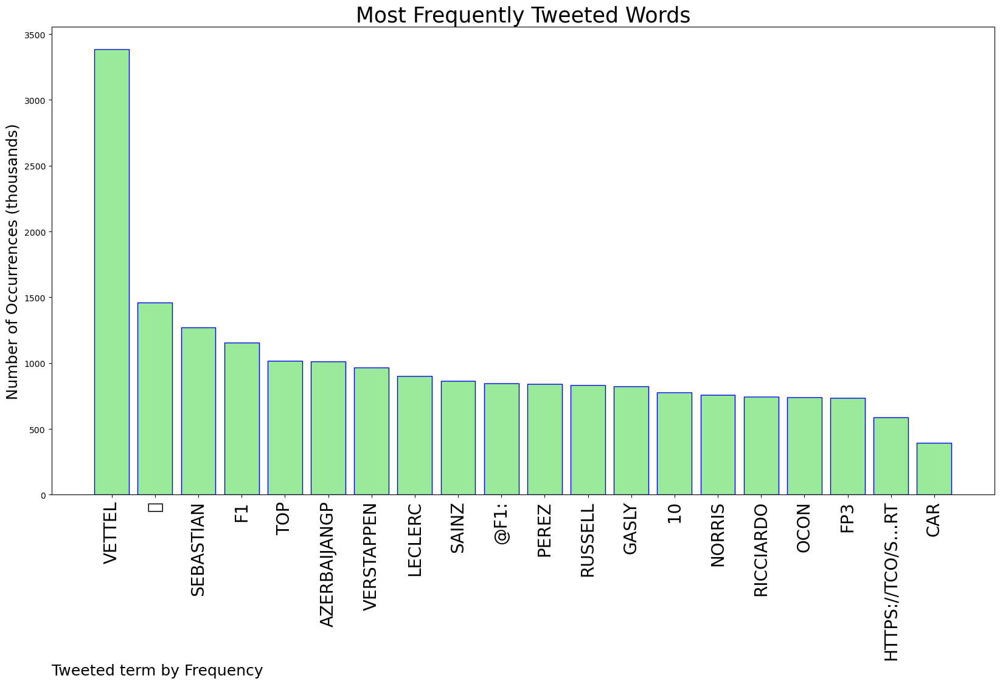
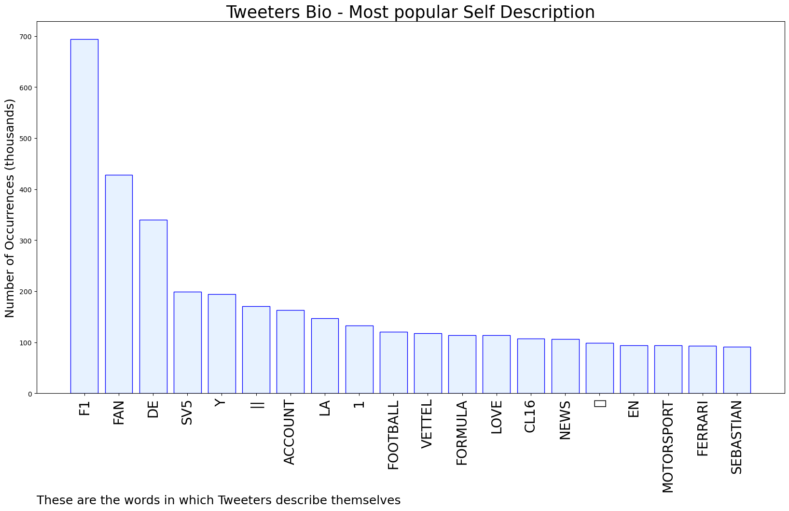

# MURCHIE85 TWITTER PROCESSING 
&#x1F34E; **TOPIC = "Vettel"**

## AUTOMATED RESEARCH SUMMARY

*note: Image pulled from web automatically, not connected to author.
  
<b> This report is AUTOMATED and not hand crafted, it is designed for pulling metrics on a given keyword or hashtag and performs a series of reporting and analysis.</b>

|                **Sample-Tweets**        |
| :-------------: |
| RT @MattyWTF1: What an unbelievable qualifying Sebastian Vettel is having 👏 |
| @BatteryVoltas And now Vettel |
| RT @brawngpf1team: Who is the best Red Bull Driver ever?RT for Sebastian VettelLike for Sir Max Verstappen https://t.co/V5DIm4iYmL |

The most popular user is: **HAMVETRAI**

 RT @ScuderiaFerrari: Official: Sebastian Vettel is a @ScuderiaFerrari driver! 
2015 line-up together with Kimi Raikkonen! #WelcomeSeb

## RELATED METRICS 
| Metric | Value |
| ------------- | ------------- |
| #1 Most tweeted to  | **F1** |
| #2 Most tweeted to  | **Vettel_AMR** |
| #3 Most tweeted to  | **rIane890** |
| NewProfiles (less than 10 days) | 0.78%  |
| Tweeters with < 10 followers  | 6.48%|
| Tweeters with > 1000000 followers  | 0.14%  |

## MOST POPULAR TWEET TERMS 

| Popularity Rank  | Term |
| ------------- | ------------- |
| first  | **VETTEL**  |
| second  | **🏁**  |
| third  | **SEBASTIAN** |
| fourth  | **F1**  |
| fifth  | **TOP**  |

## Twitter Bio Analysis
### SENTIMENT ANALYSIS

VIEWS WERE : **SUBJECTIVE**  (33.33%) & **NEGATIVELY-SUBJECTIVE** (6.67%) **OBJECTIVE** (60.0%)

### TWEET SAMPLE 
| Random value picked from array |
| ------------- |
|@RealFerasA @SkySportsF1 He brings pr back? He’s literally talking about safety of the cars/drivers? Did you not se… https://t.co/k6QMfbLO6d |

### MOST RETWEETED 

| The most retweeted user is: **HAMVETRAI**  |
| ------------- |
| RT @ScuderiaFerrari: Official: Sebastian Vettel is a @ScuderiaFerrari driver! 2015 line-up together with Kimi Raikkonen! #WelcomeSeb |

### CONCLUSION & EXTERNAL ANALYSIS

*This is my [Adam McMurchie`s] opinion on the data from the tweets, it serves as no objective truth.Since the tweets themselves are a mixture of fact & opinion. 
Authors analytical summary on request.
**RECOMMENDATIONS** WILL BE UPDATED IN NEXT  24 HOURS  