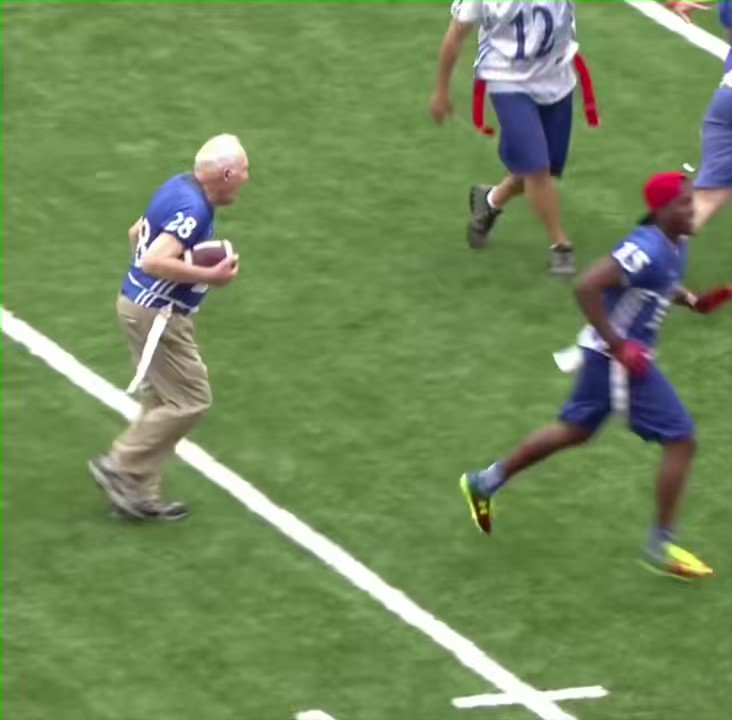
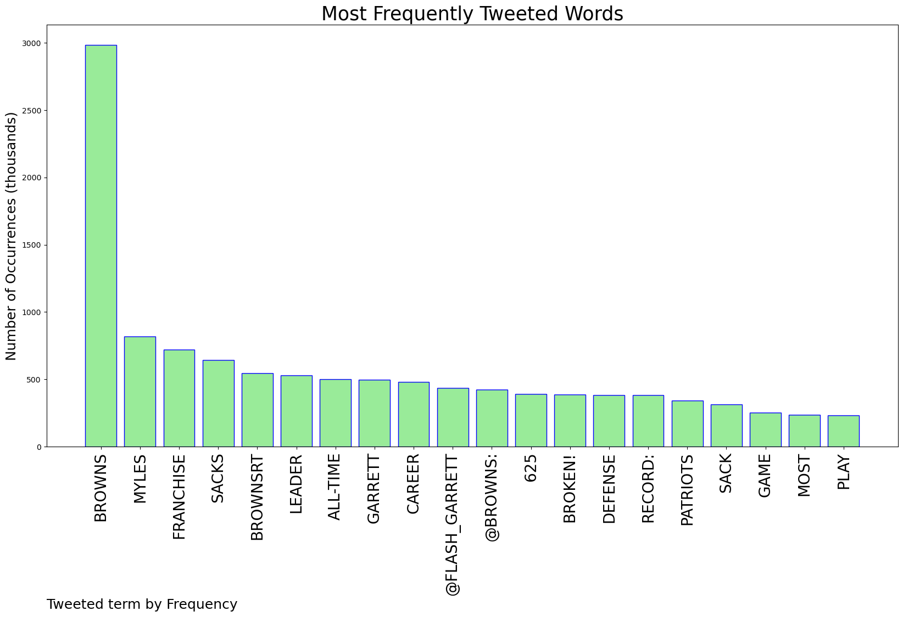
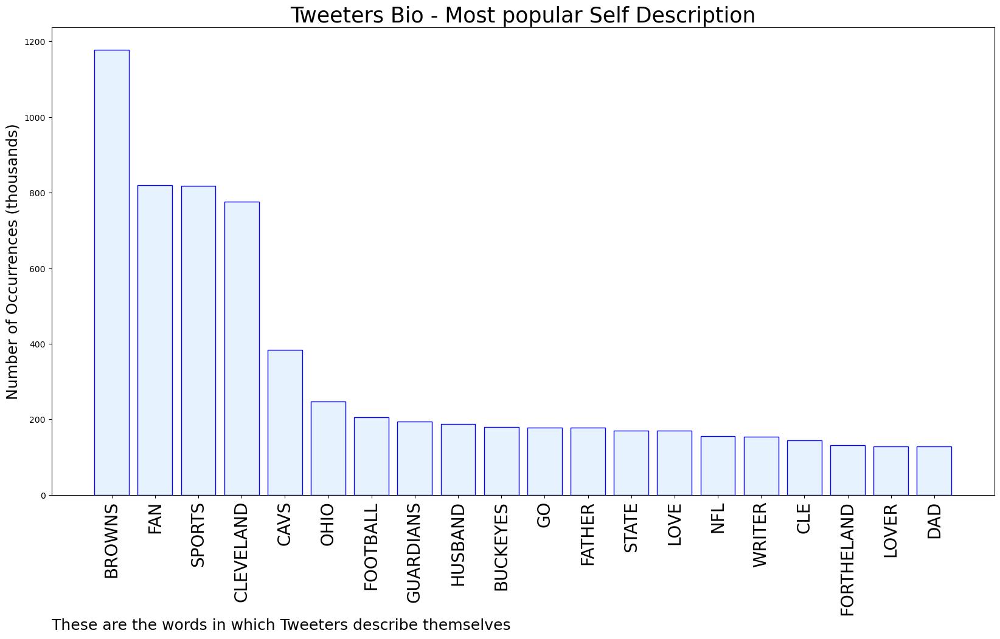
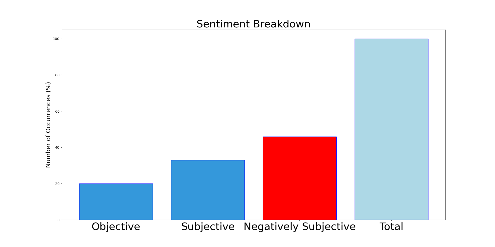

# MURCHIE85 TWITTER PROCESSING 
&#x1F34E; **TOPIC = "#Browns"**

## AUTOMATED RESEARCH SUMMARY

*note: Image pulled from web automatically, not connected to author.
  
<b> This report is AUTOMATED and not hand crafted, it is designed for pulling metrics on a given keyword or hashtag and performs a series of reporting and analysis.</b>

|                **Sample-Tweets**        |
| :-------------: |
| RT @7BellsRacing: Anyone else just plain FRUSTRATED with the #Browns like I am. They aren't playing with any motivation/Heart! Frustrating!… |
| RT @ezlazar: Hell of a call there by Patricia on split-zone handoff to Rhamondre on third-and-ten. #Browns completely fooled. #Patriots go… |
| So much for "Brissett is automatic on the sneak" talk. #Browns |

The most popular user is: **roblav23**

 RT @DollarDogNick: The #Browns run defense  https://t.co/cJHMsCPrLv

## RELATED METRICS 
| Metric | Value |
| ------------- | ------------- |
| #1 Most tweeted to  | **Browns** |
| #2 Most tweeted to  | **Flash_Garrett** |
| #3 Most tweeted to  | **StainbrookNFL** |
| NewProfiles (less than 10 days) | 0.62%  |
| Tweeters with < 10 followers  | 3.16%|
| Tweeters with > 1000000 followers  | 0.12%  |

## MOST POPULAR TWEET TERMS 

| Popularity Rank  | Term |
| ------------- | ------------- |
| first  | **BROWNS**  |
| second  | **MYLES**  |
| third  | **FRANCHISE** |
| fourth  | **SACKS**  |
| fifth  | **BROWNSRT**  |

## Twitter Bio Analysis
### SENTIMENT ANALYSIS

VIEWS WERE : **SUBJECTIVE**  (33.33%) & **NEGATIVELY-SUBJECTIVE** (46.67%) **OBJECTIVE** (20.0%)

### TWEET SAMPLE 
| Random value picked from array |
| ------------- |
|This #Browns defense makes me absolutely sick. |

### MOST RETWEETED 

| The most retweeted user is: **roblav23**  |
| ------------- |
| RT @DollarDogNick: The #Browns run defense  https://t.co/cJHMsCPrLv |

### CONCLUSION & EXTERNAL ANALYSIS

*This is my [Adam McMurchie`s] opinion on the data from the tweets, it serves as no objective truth.Since the tweets themselves are a mixture of fact & opinion. 
Authors analytical summary on request.
**RECOMMENDATIONS** WILL BE UPDATED IN NEXT  24 HOURS  