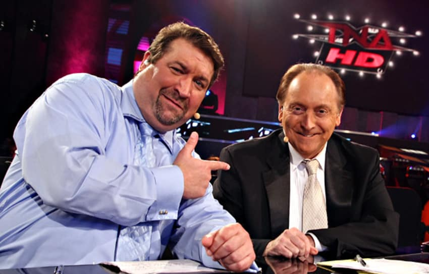
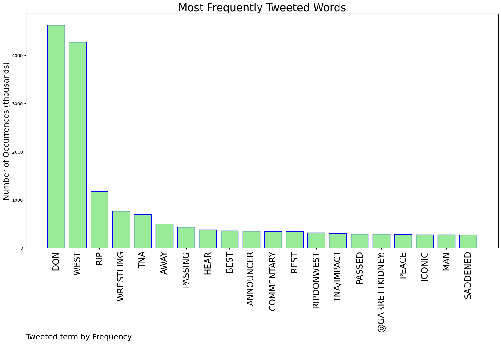
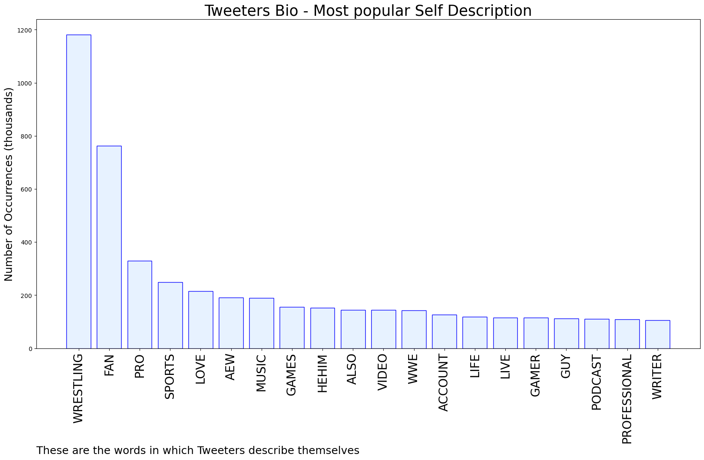
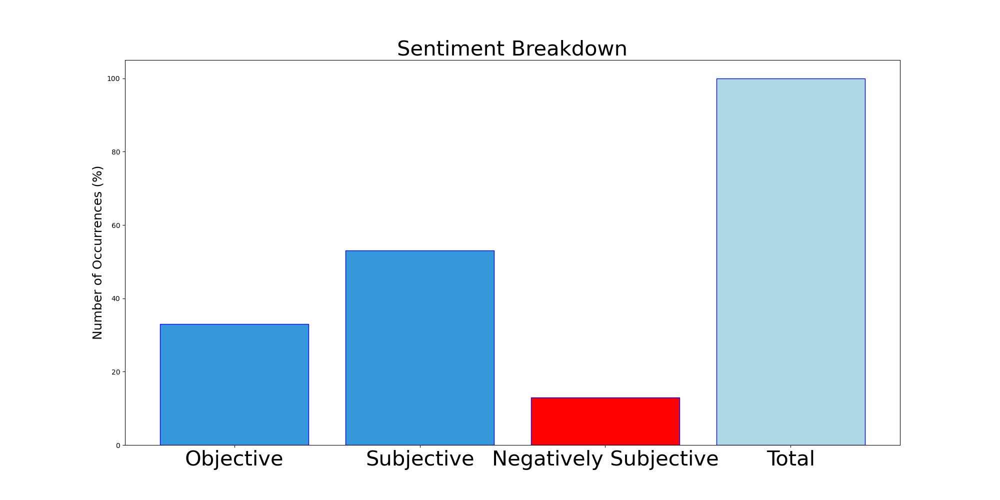

# MURCHIE85 TWITTER PROCESSING 
&#x1F34E; **TOPIC = "Don West"**

## AUTOMATED RESEARCH SUMMARY

*note: Image pulled from web automatically, not connected to author.
  
<b> This report is AUTOMATED and not hand crafted, it is designed for pulling metrics on a given keyword or hashtag and performs a series of reporting and analysis.</b>

|                **Sample-Tweets**        |
| :-------------: |
| RT @SeanRossSapp: My favorite call of all time was from Don West and there's not a close number 2 |
| RT @Fightful: Former TNA/IMPACT Announcer Don West Passes Away https://t.co/roKOf2oPSW |
| RT @vintagepuro: In terms of mind-blowing moves, probably one of the Top 5 most iconic sequences of the 21st century. Elix Skipper &amp; Christ… |

The most popular user is: **don_sharp23**

 RT @lindyli: Elon Musk let Andrew Tate back on Twitter and he got himself arrested

Elon let Kanye West back on Twitter and he destroyed hi…

## RELATED METRICS 
| Metric | Value |
| ------------- | ------------- |
| #1 Most tweeted to  | **garrettkidney** |
| #2 Most tweeted to  | **Fightful** |
| #3 Most tweeted to  | **WrestlingCovers** |
| NewProfiles (less than 10 days) | 0.1%  |
| Tweeters with < 10 followers  | 1.08%|
| Tweeters with > 1000000 followers  | 0.02%  |

## MOST POPULAR TWEET TERMS 

| Popularity Rank  | Term |
| ------------- | ------------- |
| first  | **DON**  |
| second  | **WEST**  |
| third  | **RIP** |
| fourth  | **WRESTLING**  |
| fifth  | **TNA**  |

## Twitter Bio Analysis
### SENTIMENT ANALYSIS

VIEWS WERE : **SUBJECTIVE**  (53.33%) & **NEGATIVELY-SUBJECTIVE** (13.33%) **OBJECTIVE** (33.33%)

### TWEET SAMPLE 
| Random value picked from array |
| ------------- |
|Not how the year should have ended rest in power Don West https://t.co/nNTaZDhPt9 |

### MOST RETWEETED 

| The most retweeted user is: **don_sharp23**  |
| ------------- |
| RT @lindyli: Elon Musk let Andrew Tate back on Twitter and he got himself arrestedElon let Kanye West back on Twitter and he destroyed hi… |

### CONCLUSION & EXTERNAL ANALYSIS

*This is my [Adam McMurchie`s] opinion on the data from the tweets, it serves as no objective truth.Since the tweets themselves are a mixture of fact & opinion. 
Authors analytical summary on request.
**RECOMMENDATIONS** WILL BE UPDATED IN NEXT  24 HOURS  