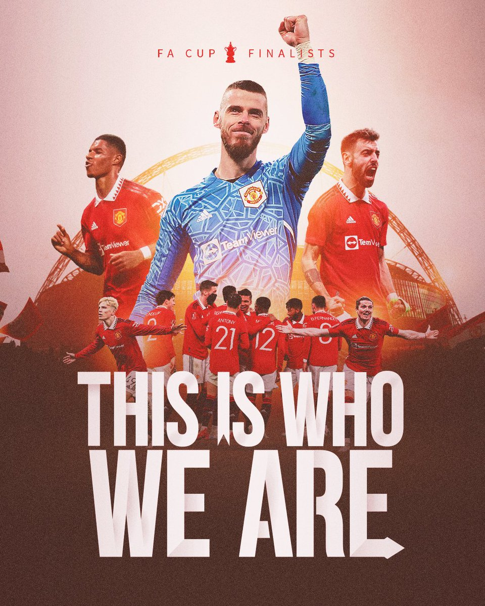
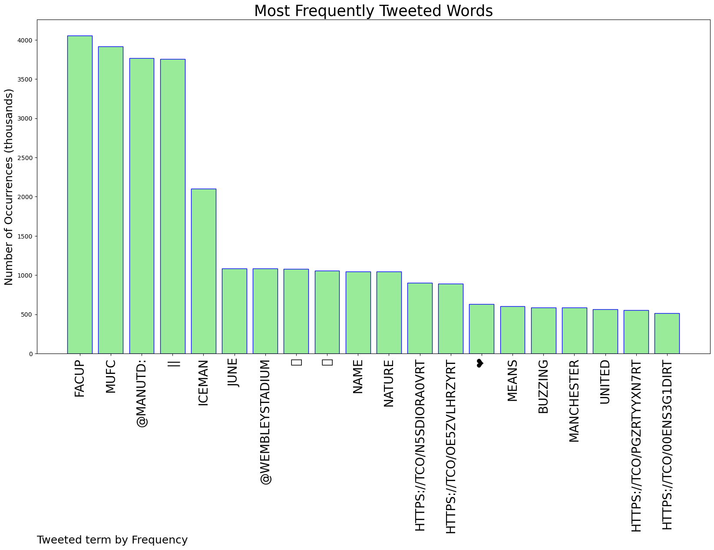
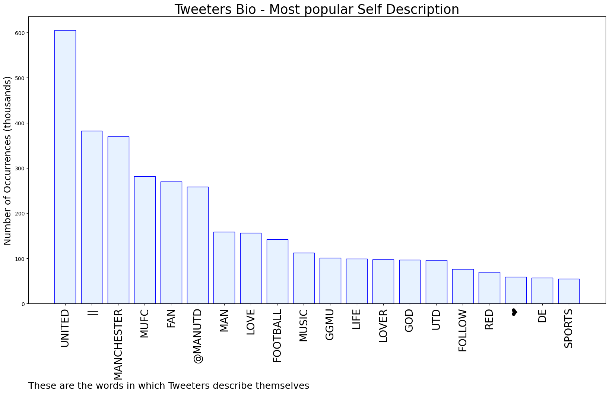

# MURCHIE85 TWITTER PROCESSING 
&#x1F34E; **TOPIC = "#FACup"**

## AUTOMATED RESEARCH SUMMARY

*note: Image pulled from web automatically, not connected to author.
  
<b> This report is AUTOMATED and not hand crafted, it is designed for pulling metrics on a given keyword or hashtag and performs a series of reporting and analysis.</b>

|                **Sample-Tweets**        |
| :-------------: |
| RT @ManUtd: LINDELOF WINS IT FOR UNITED! 🤩Brighton: ✅✅✅✅✅✅❌United: ✅✅✅✅✅✅✅#MUFC || #FACup |
| RT @ManUtd: BUZZING. #MUFC || #FACup https://t.co/PgZRtYyXn7 |
| RT @ManUtd: 🥶 Iceman by name, Iceman by nature. #MUFC || #FACup https://t.co/OE5zVlhrZY |

The most popular user is: **nife__simi**

 RT @ManUtd: See you in June, @WembleyStadium 👋

#MUFC || #FACup https://t.co/n5sdIora0V

## RELATED METRICS 
| Metric | Value |
| ------------- | ------------- |
| #1 Most tweeted to  | **ManUtd** |
| #2 Most tweeted to  | **wembleystadium** |
| #3 Most tweeted to  | **BSchweinsteiger** |
| NewProfiles (less than 10 days) | 0.18%  |
| Tweeters with < 10 followers  | 12.78%|
| Tweeters with > 1000000 followers  | 0.12%  |

## MOST POPULAR TWEET TERMS 

| Popularity Rank  | Term |
| ------------- | ------------- |
| first  | **FACUP**  |
| second  | **MUFC**  |
| third  | **@MANUTD:** |
| fourth  | **||**  |
| fifth  | **ICEMAN**  |

## Twitter Bio Analysis
### SENTIMENT ANALYSIS

VIEWS WERE : **SUBJECTIVE**  (20.0%) & **NEGATIVELY-SUBJECTIVE** (6.67%) **OBJECTIVE** (73.33%)

### TWEET SAMPLE 
| Random value picked from array |
| ------------- |
|RT @ManUtd: Who are your first five penalty takers? 💭 #MUFC || #FACup https://t.co/oLUDefmvq4 |

### MOST RETWEETED 

| The most retweeted user is: **nife__simi**  |
| ------------- |
| RT @ManUtd: See you in June, @WembleyStadium 👋#MUFC || #FACup https://t.co/n5sdIora0V |

### CONCLUSION & EXTERNAL ANALYSIS

*This is my [Adam McMurchie`s] opinion on the data from the tweets, it serves as no objective truth.Since the tweets themselves are a mixture of fact & opinion. 
Authors analytical summary on request.
**RECOMMENDATIONS** WILL BE UPDATED IN NEXT  24 HOURS  