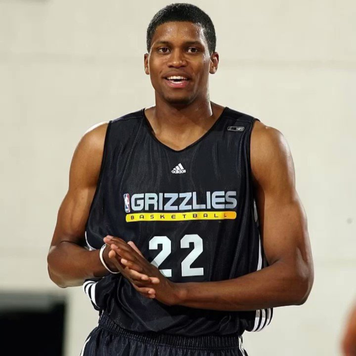
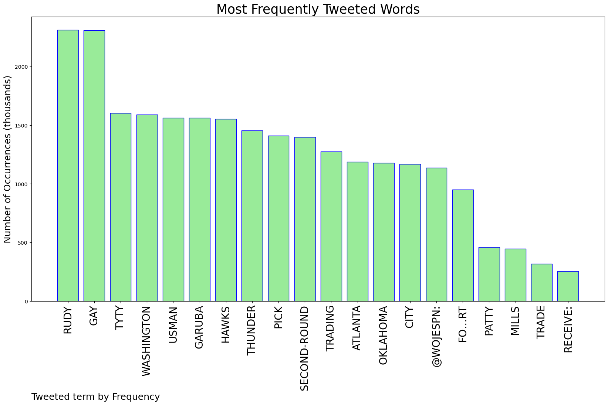
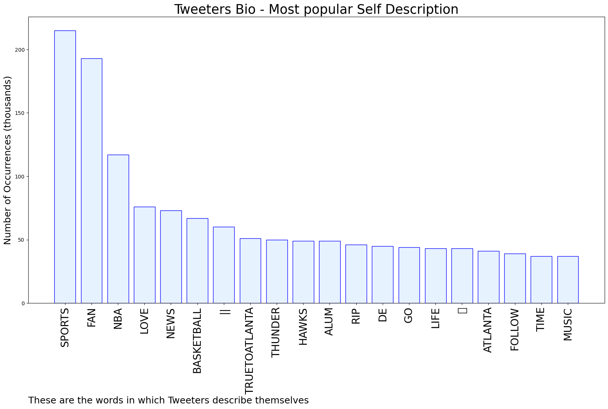
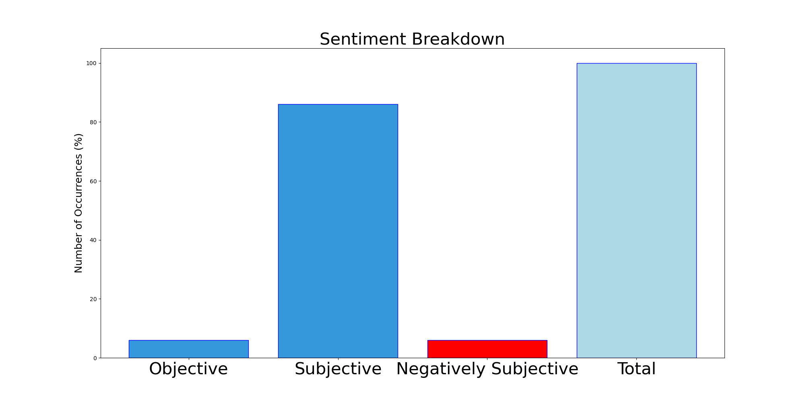

# MURCHIE85 TWITTER PROCESSING 
&#x1F34E; **TOPIC = "Rudy Gay"**

## AUTOMATED RESEARCH SUMMARY

*note: Image pulled from web automatically, not connected to author.
  
<b> This report is AUTOMATED and not hand crafted, it is designed for pulling metrics on a given keyword or hashtag and performs a series of reporting and analysis.</b>

|                **Sample-Tweets**        |
| :-------------: |
| RT @wojespn: The Atlanta Hawks are trading TyTy Washington, Usman Garuba,  Rudy Gay and a second-round pick to the Oklahoma City Thunder fo… |
| @wojespn @FredKatz exciting times. Rudy Gay finally makes his way to OKC. 6 years too late |
| In: Taylor Hendricks, John Collins, Taylor Hendricks, Keyonte George, Brice Sensabaugh, Joey HauserOut: Udoka Azu… https://t.co/i2gVQq0DuJ |

The most popular user is: **carreon_rudy**

 RT @YaBoyBr3tt: Rev up those printers and start putting no straights allowed at the gay clubs

## RELATED METRICS 
| Metric | Value |
| ------------- | ------------- |
| #1 Most tweeted to  | **wojespn** |
| #2 Most tweeted to  | **LegionHoops** |
| #3 Most tweeted to  | **TheHoopCentral** |
| NewProfiles (less than 10 days) | 0.08%  |
| Tweeters with < 10 followers  | 2.96%|
| Tweeters with > 1000000 followers  | 0.23%  |

## MOST POPULAR TWEET TERMS 

| Popularity Rank  | Term |
| ------------- | ------------- |
| first  | **RUDY**  |
| second  | **GAY**  |
| third  | **TYTY** |
| fourth  | **WASHINGTON**  |
| fifth  | **USMAN**  |

## Twitter Bio Analysis
### SENTIMENT ANALYSIS

VIEWS WERE : **SUBJECTIVE**  (86.67%) & **NEGATIVELY-SUBJECTIVE** (6.67%) **OBJECTIVE** (6.67%)

### TWEET SAMPLE 
| Random value picked from array |
| ------------- |
|Rudy gay def bout to get a buyout |

### MOST RETWEETED 

| The most retweeted user is: **carreon_rudy**  |
| ------------- |
| RT @YaBoyBr3tt: Rev up those printers and start putting no straights allowed at the gay clubs |

### CONCLUSION & EXTERNAL ANALYSIS

*This is my [Adam McMurchie`s] opinion on the data from the tweets, it serves as no objective truth.Since the tweets themselves are a mixture of fact & opinion. 
Authors analytical summary on request.
**RECOMMENDATIONS** WILL BE UPDATED IN NEXT  24 HOURS  