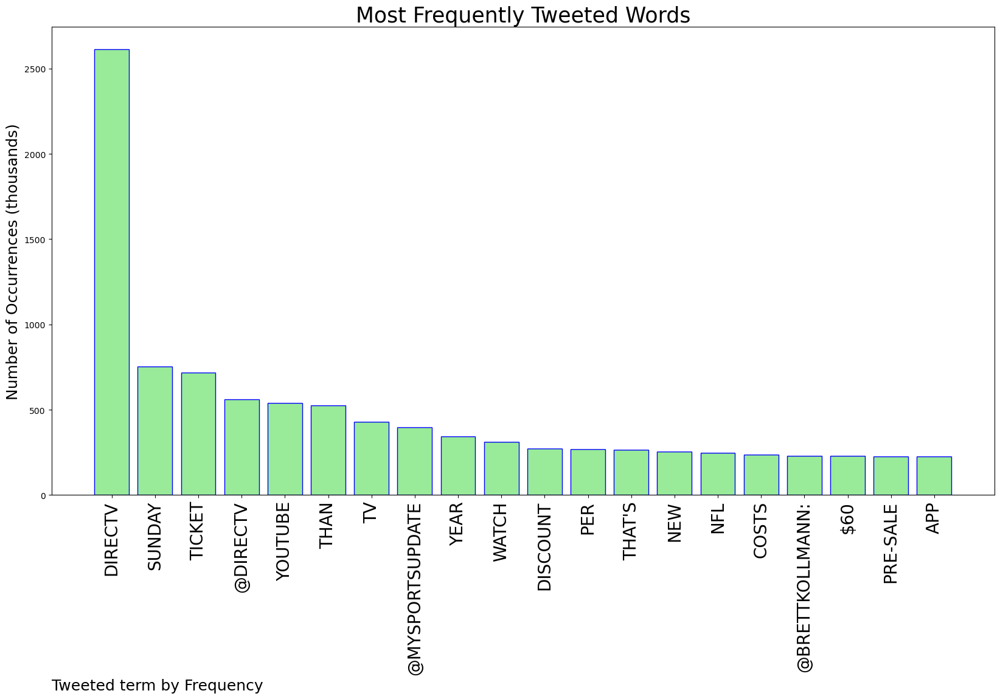
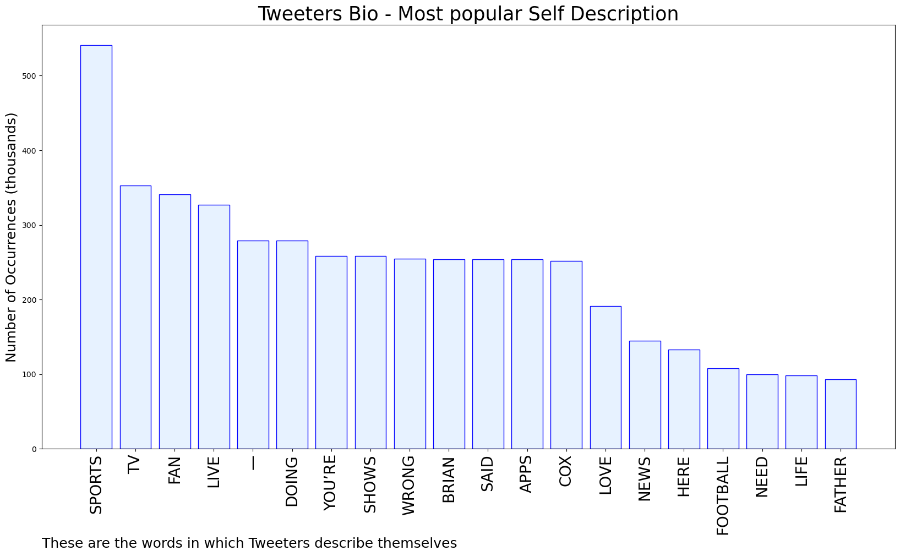

# MURCHIE85 TWITTER PROCESSING 
&#x1F34E; **TOPIC = "DirecTV"**

## AUTOMATED RESEARCH SUMMARY

*note: Image pulled from web automatically, not connected to author.
  
<b> This report is AUTOMATED and not hand crafted, it is designed for pulling metrics on a given keyword or hashtag and performs a series of reporting and analysis.</b>

|                **Sample-Tweets**        |
| :-------------: |
| RT @ApstFortune: God bless her 🥰Pls follow: @ApstFortuneAirpeace   Section 77   Falz   Secret Invasion   Beastie Boys   DirecTV   RedZo… |
| Sunday Ticket going to be much more on YouTube than DirecTV. But the four-game view is going to be possible. https://t.co/OszVDijRLj |
| RT @Hourglass_Wait: 2/ "The Next Crypto Gem"  will be one of the new shows @bspoketv will premier on DIRECTV’s WOW TV Channel 234 channel t… |

The most popular user is: **JeffLar96922327**

 RT @DC_Draino: Remember when DirecTV, which is 70% owned by AT&amp;T, cancelled OAN after Dem Reps. Eshoo &amp; McNerney threatened them w/investig…

## RELATED METRICS 
| Metric | Value |
| ------------- | ------------- |
| #1 Most tweeted to  | **DIRECTV** |
| #2 Most tweeted to  | **MySportsUpdate** |
| #3 Most tweeted to  | **BrettKollmann** |
| NewProfiles (less than 10 days) | 0.06%  |
| Tweeters with < 10 followers  | 10.9%|
| Tweeters with > 1000000 followers  | 0.16%  |

## MOST POPULAR TWEET TERMS 

| Popularity Rank  | Term |
| ------------- | ------------- |
| first  | **DIRECTV**  |
| second  | **SUNDAY**  |
| third  | **TICKET** |
| fourth  | **@DIRECTV**  |
| fifth  | **YOUTUBE**  |

## Twitter Bio Analysis
### SENTIMENT ANALYSIS

VIEWS WERE : **SUBJECTIVE**  (40.0%) & **NEGATIVELY-SUBJECTIVE** (13.33%) **OBJECTIVE** (46.67%)

### TWEET SAMPLE 
| Random value picked from array |
| ------------- |
|Can’t believe Directv Stream is one of the few ways I can watch Midwest baseball. Had to go up in price to see my c… https://t.co/oLXxAd5cOO |

### MOST RETWEETED 

| The most retweeted user is: **JeffLar96922327**  |
| ------------- |
| RT @DC_Draino: Remember when DirecTV, which is 70% owned by AT&amp;T, cancelled OAN after Dem Reps. Eshoo &amp; McNerney threatened them w/investig… |

### CONCLUSION & EXTERNAL ANALYSIS

*This is my [Adam McMurchie`s] opinion on the data from the tweets, it serves as no objective truth.Since the tweets themselves are a mixture of fact & opinion. 
Authors analytical summary on request.
**RECOMMENDATIONS** WILL BE UPDATED IN NEXT  24 HOURS  